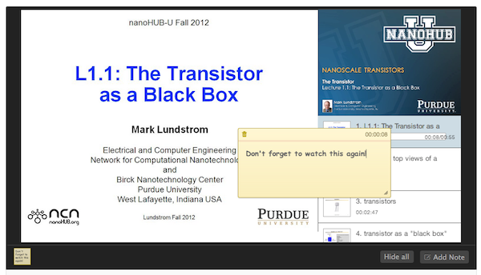
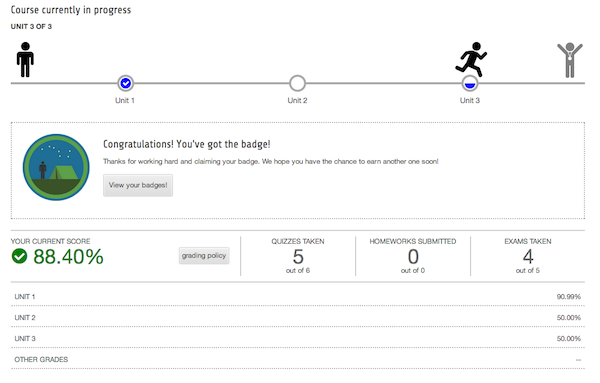
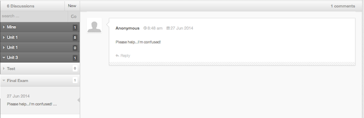
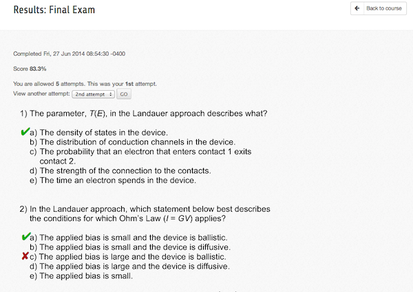
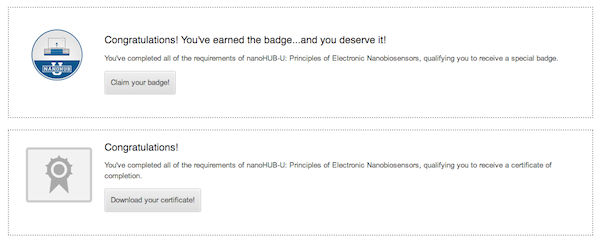

<!--
status: imported
source: core/components/com_courses/site/help/en-GB/basics.phtml
imported: 2026-09-09
-->
# The Basics

## Why enroll?

The courses environment offers instructors and students many features to help facilitate the most engaging and interactive learning experience possible. And we're adding new features all the time. Many of these feature, like in-depth instructor videos, announcements, and more, are available right away, just by browsing the available courses. But, some features require an extra level of personalization, and thus require enrollment in the course. Just to give you a taste, some of the exciting featurese available after enrollment include:

- 
  ## Lecture notes
  These are personalized notes, just for you. And they're time coded!
- 
  ## Detailed progress
  This tells you exactly where you are and how you're doing.
- 
  ## Interactive discussion
  Ask questions...get help. It's that simple!
- 
  ## Assessments
  Make sure you're on track by taking assessments. This may also qualify you for a badge or certificate!
- 
  ## Badges and certificates
  Show off your work. Now everyone knows how smart you are!

So, why not get started today?
