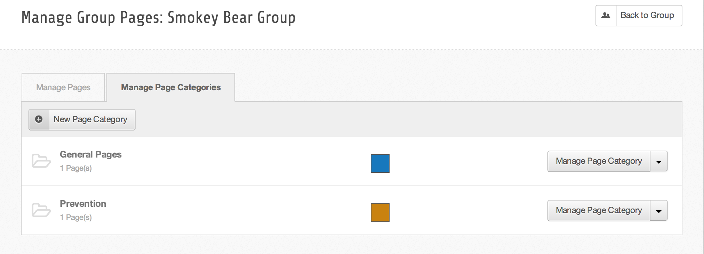
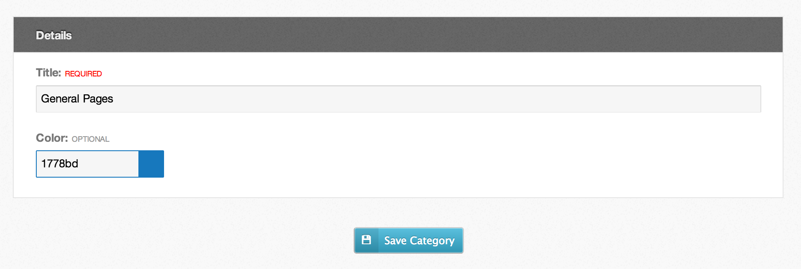

<!--
status: imported
source: core/components/com_groups/site/help/en-GB/categories.phtml
imported: 2026-09-09
-->
# Group Page Categories

Page categories are a simple easy to use way to group related pages together.

> **Note:** Categories are NOT hierarchical.

---

## Adding Page Categories

1. Navigate to the page manager.
2. Click on the "Manage Page Categories" tab.
3. Here you will see any current page categories.
4. Click the "New Page Category" button. Fill in the name field, color is optonal, then click "Save Category".

*Group Category Manager*

---

## Editing Page Categories

1. Navigate to the page manager.
2. Click on the "Manage Page Categories" tab.
3. Here you will see any current page categories.
4. Click on the "Manage Page Category" button for the category you wish to edit.
5. Change the name or color settings, then click the "Save Category" button to finish.

*Edit Page Category*

---

## Assigning Page Categories

Putting a page into a page category is done through the edit page interface.
