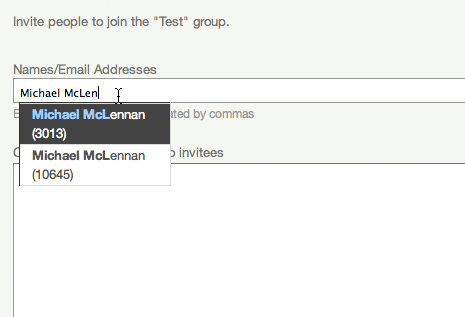
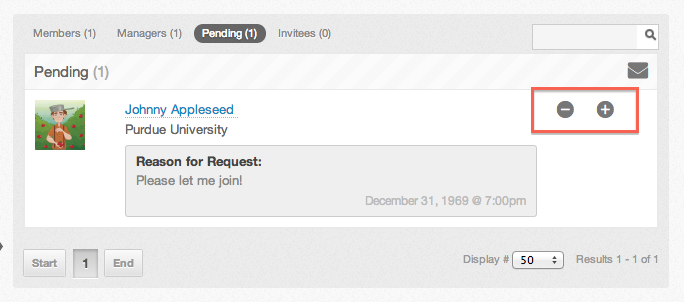
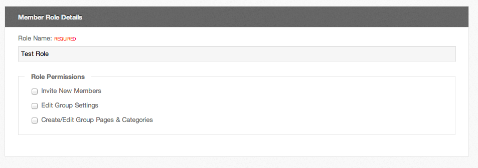
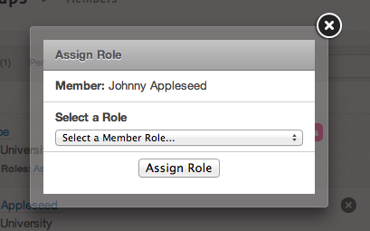

<!--
status: imported
source: core/components/com_groups/site/help/en-GB/membership.phtml
imported: 2026-09-09
-->
# Group Membership

Group Managers have the ability to manage group membership, including inviting new members, approving & denying membership requests, promoting members to managers, and creating member roles.

## Inviting new Members

Group managers can invite both hub users and unregistered users to join their group.

1. From the "My Groups" section on your "my HUB" page, select the group.
2. Click Show Manager Controls and click Invite Members.
3. Type in the name of the user you would like to invite (notice that the auto completer assists in finding users) or the email address of the person.
4. You may include a message with your invitation in appropriate box.
5. Click "Invite" and they will receive the invite in their email.
6. Verify that the invitation have been sent to the correct people.

---

## Approving & Denying Membership Requests

1. Go to the main group page and click on the "Members" tab at the left side.
2. Then Click on the "Pending" section in that area.
3. You will see all pending membership requests for the group. Here you can also see the reason the user entered when requesting membership.
4. Click on either of the buttons in the red box to approve or deny the users request.

---

## Promoting Members to Managers

Groups can have multiple managers. As a group manager, you can promote other group members or demote other managers.

> **Warning:** NOTE: A group must have at least one manager at all times.

1. Go to the main group page and click on the "Members" tab at the left side.
2. Click on the promote icon(indicated by the arrow pointing up) next to the name of the person you would like to promote to manager status.

---

## Member Roles

Member roles are a way to organize members of a group into teams. Member roles now have the ability to assign a small set of permissions to each role.

1. Go to the main group page and click on the "Members" tab at the left side.
2. Click on the "Add a Member Role" button in the top right.
3. You must enter a role name since it is required. You can choose to assign one or many other permissions to this role by clicking on the checkboxes.
4. Click submit to save the role.

---

## Assigning Member Roles

> **Warning:** NOTE: A group must have at least one role to assign to a group member.

1. Go to the main group page and click on the "Members" tab at the left side.
2. Click the link "Assign Role" below the user you want to assign a role for.
3. Select the role you wish to assign from the dropdown and click "Assign Role".

