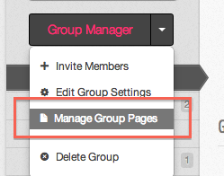
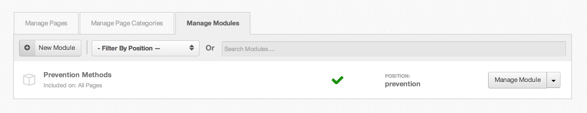
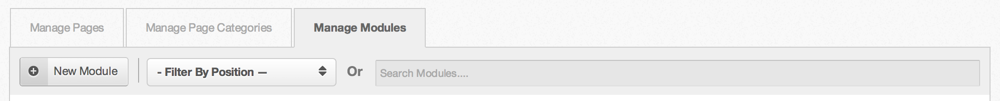
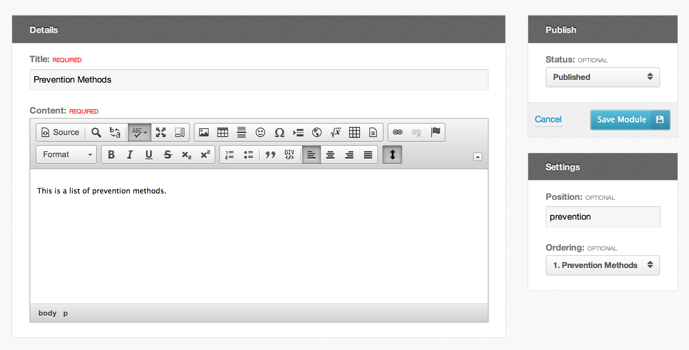
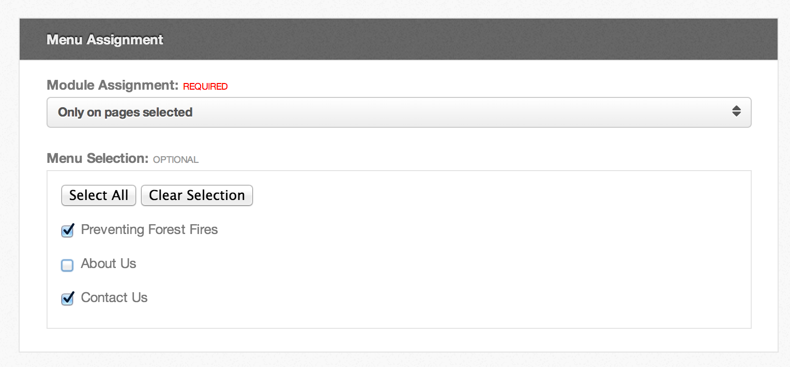

<!--
status: imported
source: core/components/com_groups/site/help/en-GB/modules.phtml
imported: 2026-09-09
-->
# Group Page Modules

Page modules are a way to create blocks of reusable content that you would like to include in multiple pages.

> **Warning:** Page modules are a feature that can only be used by Super Groups. Contact the HUB owner if you are interested in becoming a Super Group.

---

## Accessing the Module Manager

The module manager is restricted to group managers and [group roles](#member-roles) with permissions allowing page editing.

1. Click on the "Manage Group Pages" link in the group manager toolbar, to get to the page manager
2. Then click on the "Manage Modules" tab to view the module manager.



*Group Manager Toolbar*



*Group Module Manager*

---

## Searching & Filtering Modules

With the new module manager, you are now able to filter and search group modules. You can filter pages based on position and search on module title.



*Module Filtering and Searching*

---

## Adding Modules

1. Navigate to the module manager, as described above.
2. Click the "New Module" button in the toolbar
3. Fill in all required fields and click the "Save Page" button in the right column.
4. You now have a new group module!!

---

## Editing Module

1. Navigate to the module manager.
2. Click on either the "Manage Module" button or hover over the arrow next to the button to see more options, including "Edit Module".
3. One of the new features with the module manager is the page content WYSIWYG editor. It now uses CKEditor and HTML to manage your page content.
4. Modify any of the previously entered values, then click the "Save Page" button in the right column.
5. You have edited a group module!!



*Edit Group Module*

---

## Using Modules in Group Pages (Group Includes)

Including a module into a page can happen one of two ways, both using a group include.

1. By Position:
   ```

   ```
2. By Module Title
   ```

   ```

---

## Assigning Modules to Pages

"Module Assignment" allows you to create or edit group modules, and decide on which pages in your group they will appear. In order for a module to be considered available for display, it must be included in that page through a group include tag.



*Module Assignment*

---

## Publishing/Unpublishing Modules

1. Navigate to the module manager.
2. You can publish/unpublish modules directly on the module manager, by clicking on the green checkmark or the red ban cirle icon.
3. You can also publish/unpublish by editing a module and changing its published state and then saving the module.

---

## Reordering Modules

1. Navigate to the module manager.
2. You can reorder a module through the edit module interface. Simply change its ordering in the dropdown and save the module.
