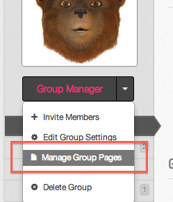
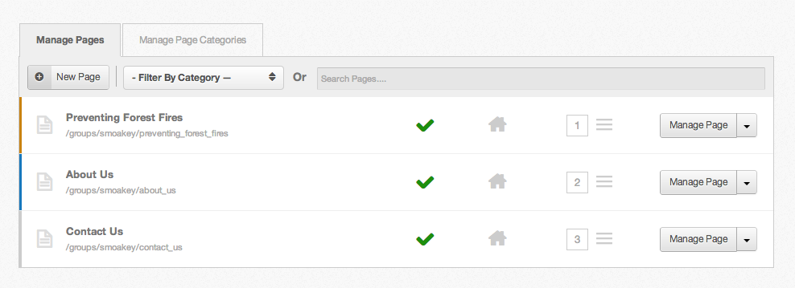
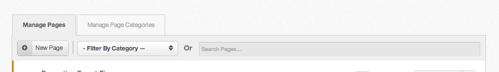
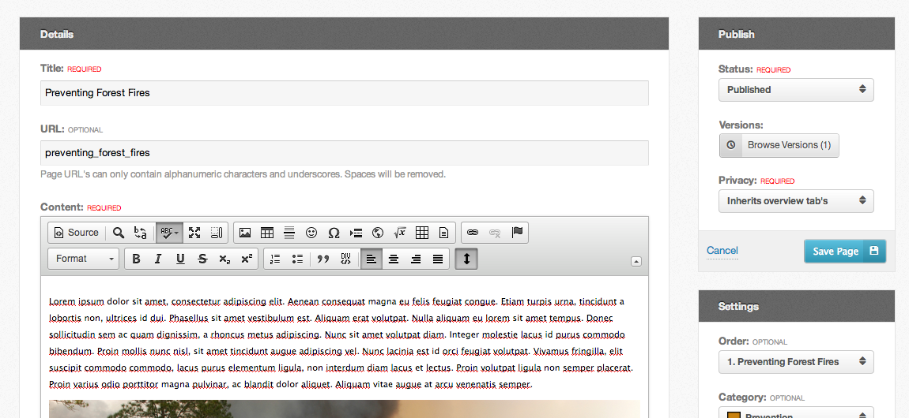
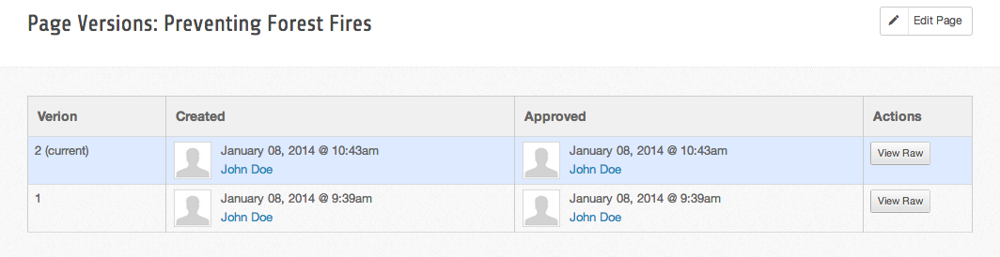
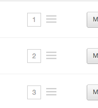
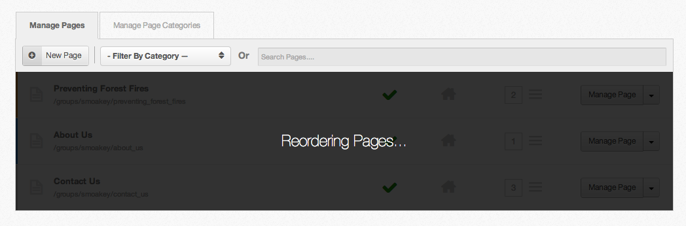
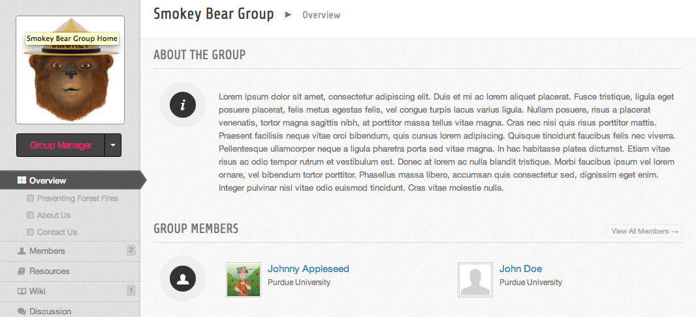
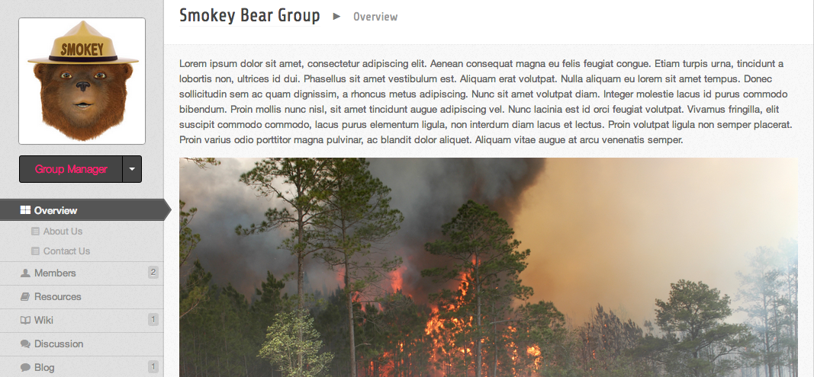

<!--
status: imported
source: core/components/com_groups/site/help/en-GB/pages.phtml
imported: 2026-09-09
-->
# Group Pages

## Accessing the Page Manager

The page manager is restricted to group managers and [group roles](#member-roles) with permissions allowing page editing.

1. Click on the "Manage Group Pages" link in the group manager toolbar, to get to the page manager

*Group Manager Toolbar*

*Group Page Manager*

## Searching & Filtering Pages

With the new page manager, you are now able to filter and search group pages. You can filter pages based on page category and search on page title.

*Page Filtering and Searching*

## Adding Pages

Groups pages are a great way to add extra content pages to your group. Add as many pages as you would like.

1. Navigate to the page manager, as shown above.
2. Click the "New Page" button in the toolbar
3. Fill in all required fields and click the "Save Page" button in the right column.
4. You now have a new group page!!

## Editing Pages

1. Navigate to the page manager.
2. Click on either the "Manage Page" button or hover over the arrow next to the button to see more options, including "Edit Page".
3. One of the new features with the page manager is the page content WYSIWYG editor. It now uses CKEditor and HTML to manage your page content.
4. Modify any of the previously entered values, then click the "Save Page" button in the right column.
5. You have edited a group page!!

*Edit Group Page*

## Uploading & Inserting Images/Files

All images uploaded through the group can be accessed via the edit interface or page manager and can be inserted into any group page.

### Uploading Assets

1. Navigate to the groups "Manage Pages" interface.
2. Click the "Upload Images/Files" button in the header on the right; a popup should come up displaying a file browser.
3. From here you can upload, rename, move, and delete images or files.

### Inserting Assets

1. Inserting an image or file into a group page is easy though the WYSIWYG editor.
2. When editing any group page, click on the image or link icon buttons in the editor toolbar.
3. If you know the url to the image/file, you can enter it in the url field, otherwise click "browse server".
4. This popup should look familiar, its the same popup for uploading assets. As you can see, you can also upload assets here.
5. Find the image/file you want to use, located in the "uploads" folder. Click on the row for that image/file. You should see a number of buttons, the "Insert File" button will close the popup and update the url field with the file chosen. You should also see a preview of the image if thats what your inserting.
6. Now just click "Ok" and you should see it appear in the editor.

### Editing Assets

1. You can edit any image/file by double clicking the image/file in the editor.
2. In the popup you can update the url field directly or click the "browse server" button to pick from your uploaded assets.
3. Once you've selected the image/file you want to insert click "Ok" the the image/file should be updated in the editor.

## Page Versions

Everytime a group page is saved, and the page content has changed, a new page version is created to prevent overriding other editors changes.

1. Navigate to the page manager.
2. Hover over the down arrow next to the "Manage Page" button. A dropdown should show you a number of options, one being "Version Histroy".
3. Clicking that link will take you to a page showing all the versions of that page, who created each version and when, who approved each version and when (if needed approval). There is also a button to view the raw HTML code of that page version.

*Group Page Versions*

## Publishing/Unpublishing Pages

1. Navigate to the page manager.
2. You can publish/unpublish pages directly on the page manager, by clicking on the green checkmark or the red ban cirle icon.
3. You can also publish/unpublish by editing a page and changing its published state and then saving the page.

## Reordering Pages

1. Navigate to the page manager.
2. You can reorder pages directly on the page manager, by clicking and dragging a page up or down.
3. You can also reorder a page through the edit page interface. Simply change its ordering in the dropdown and save the page.

*Page Reordering Grabber*

*Group Pages Reordering*

## Group Home Page

It is now possible to override the default group overview page shown below, with any group page.

1. Navigate to the page manager. Open the group page manager
2. You can set or unset the group home page directly from the page manager, by clicking the home icon. When the icon is yellow, that means that page is set as the home page.
3. You can also set the group home page through the edit page interface. Change the "Home Page" option under "Settings" to the desired value and save the page.

*Default Overview Page*

*Group Overview Page Overridden*
