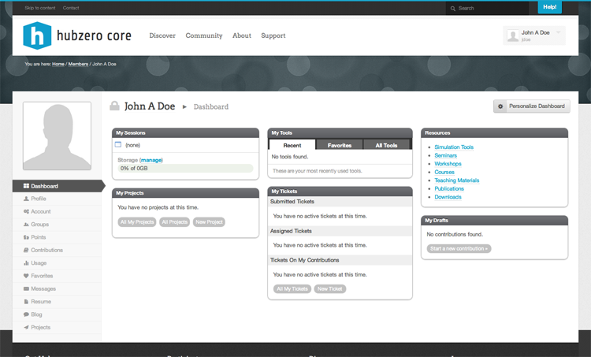
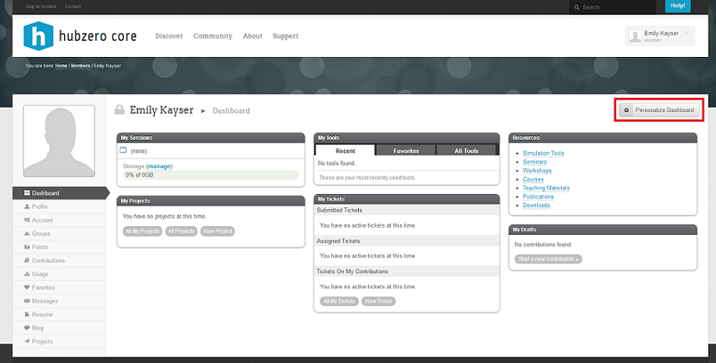
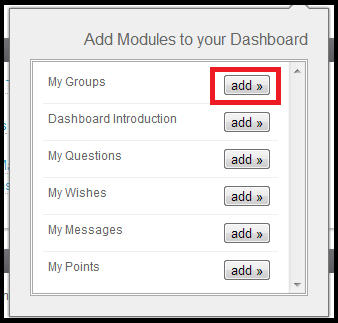
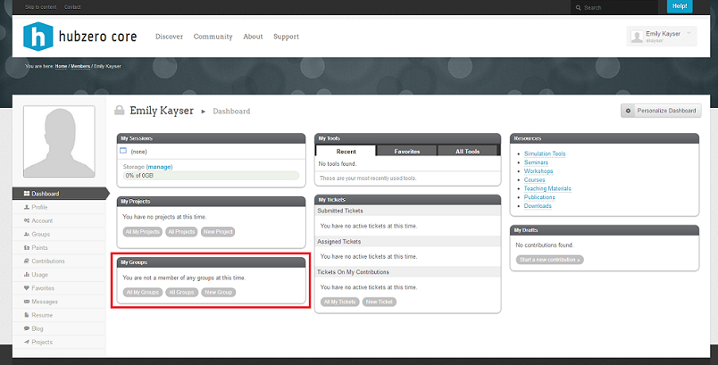
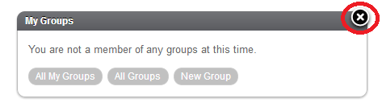
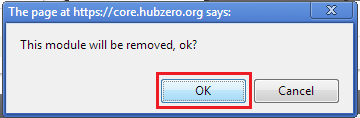
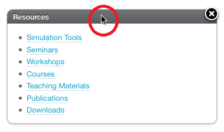
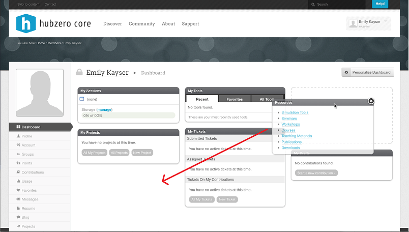

<!--
status: imported
source: core/components/com_members/site/help/en-GB/dashboard.phtml
imported: 2026-09-09
-->
# Member Dashboard

The Member Dashboard section is the user's landing page after logging in successfully. It has a number of widgets that contain items for easy access, for example the "My Sessions" widget which lists any of your current tool sessions and also shows your storage space usage.

---

## Personalizing Your Dashboard

You have the option to personalize your Dashboard by adding, removing, or rearranging modules. This customization feature allows you to fit the Dashboard to your personal needs. Once it has been personalized, it will appear how you arranged it at each login.

## To add a module to your Dashboard:

\1. Place your mouse pointer on the Personalize Dashboard button in the upper right hand corner of the screen. This button allows you to add a module.

\2. A box will appear with a list of modules available. Click the "add" button next to the module you would like added to your Dashboard.

After clicking "add", the new module will appear on your dashboard.

## To remove a module to your Dashboard:

\1. Place your mouse pointer over the upper right hand corner of the box, and click the X that appears.

\2. A message will appear asking you to confirm the removal. Click OK to confirm.

## To rearrange your modules:

\1. Place your mouse on the top of the module you wish to move until a cursor appears.

\2. Press and hold down the button on the mouse or other pointing device to grab the module.

\3. Drag the module to the desired location, and drop it by releasing the button.

