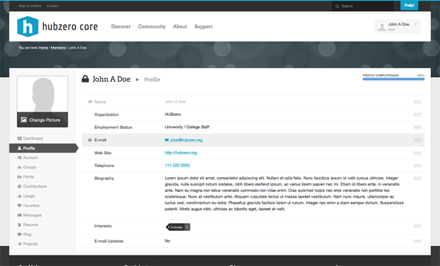
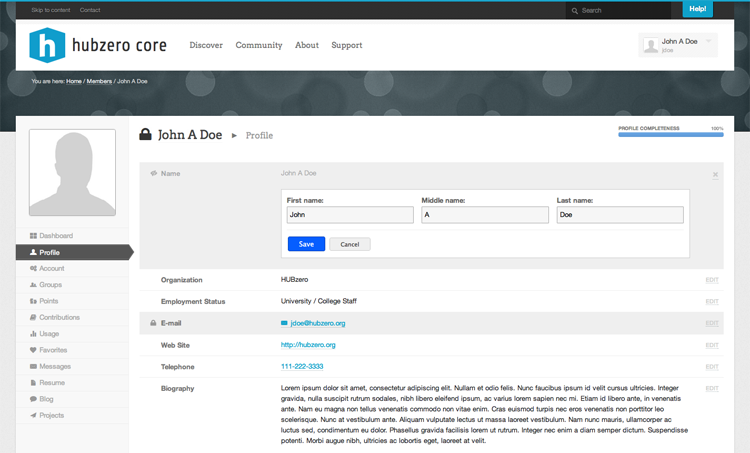
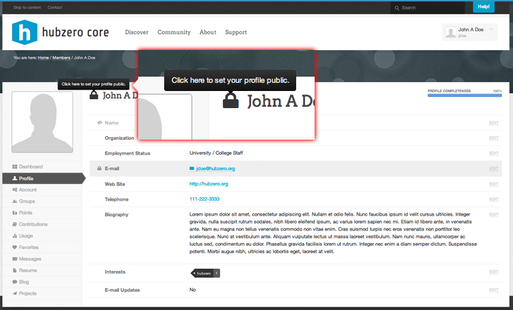
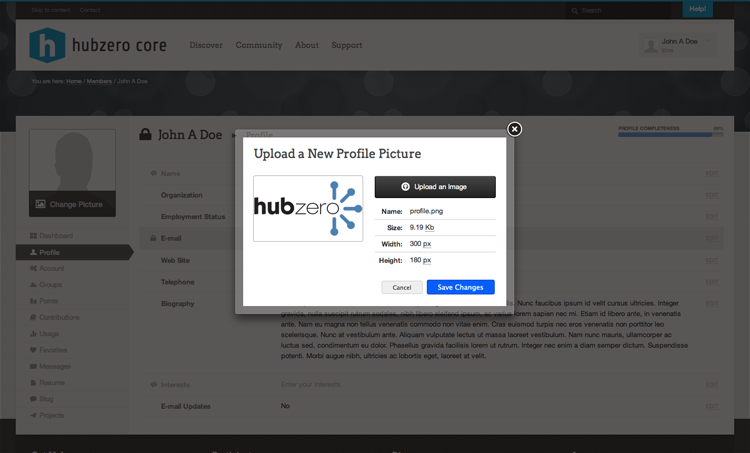

<!--
status: imported
source: core/components/com_members/site/help/en-GB/profile.phtml
imported: 2026-09-09
-->
# Member Profile

The Member Profile section contains specific details about the user, ranging from their name to email address, phone number, and personal website.

---

## Editing Your Profile

The Member Profile has a new "edit in place" feature to help users edit their profile easier and faster. To edit your profile, first navigate to your Member Profile. Your should see a screen similar to the picture above. Simply click on the edit link along the right side of any profile field to start editing that field. A hidden pane should slide down and you should see fields to edit that specific field of your profile. This is also where you can set the privacy level for that specific field. When your done editing click the Save Button and your profile will be updated. Clicking the Cancel Button will disregard your changes.

---

## Profile Privacy

All Member accounts on the HUB are created with a default privacy setting of "Public". To edit your Profile Privacy setting, first navigate to your Member Profile. Next to your name you should see a lock icon. A dark colored icon means that your Profile Privacy is set to public. A light colored icon means your Profile Privacy is set to private. You can toggle your Profile Privacy by simply clicking on the lock icon.

*\*\*Note: You will see the lock icon next to your name on every section of your Member Area, but you must navigate to the Member Profile section within your Member area in order to toggle your privacy setting.*

---

## Uploading/Updating your Profile Picture

All Member accounts on the HUB will be created with a default Profile Picture that is a silhouette. To edit your Profile Picture, first navigate to your Member Profile. You should see a semi-transparent black button over your current Profile Picture that says "Change Picture". Clicking that link will bring up a popup to upload a new photo or remove your current one (if its not set to the default silhouette) and should look like the image below.

To Upload a new picture click on the black button that says "Upload an Image". Your computer should display a file browser to select an image. After you select an image the file will be automatically uploaded and once complete should be displayed in the preview area within the popup. If you are happy with the newly uploaded image click the "Save Changes" Button and your profile should refresh with the new profile picture set.

*\*\*Note: You will see your profile picture on every section of your Member area, but you must navigate to the Profile section with your Member area first in order to upload, update, or remove your profile picture.*
