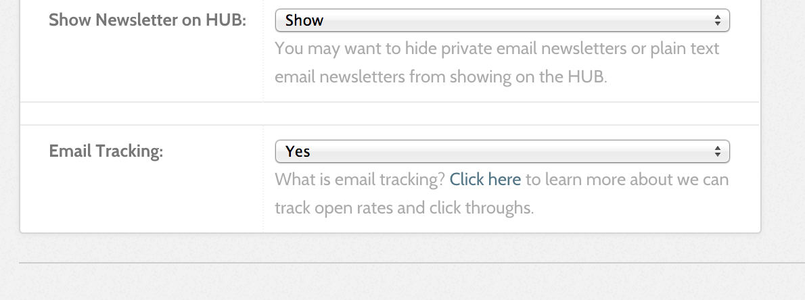

<!--
status: imported
source: core/components/com_newsletter/site/help/en-GB/emailtracking.phtml
imported: 2026-09-09
-->
# How Email Tracking Works

When the HUB sends out an email newsletter, we embed a tiny invisible image at the bottom of the email message. This image sometimes called a "Tracker" or "Web Beacon" is unique to each newsletter mailing.

When the newsletter is opened by a recipient, this "Tracker" is downloaded from our server and we count that as a 'open'.

We also track your newsletter clicks by directing the links in your newsletters to a central location, where we are able to capture that click, and then redirect the user to their final and desired destination.

By default is email tracking is set to 'on', but you can choose to turn off newsletter tracking at any time.

## Can I use my own Tracking Code

Yes you can! Just make sure to turn email tracking off on the HUB for that newsletter. Just make sure to insert the other tracking code into the outgoing newsletter. We dont strip any 3rd party tracking code before sending.
