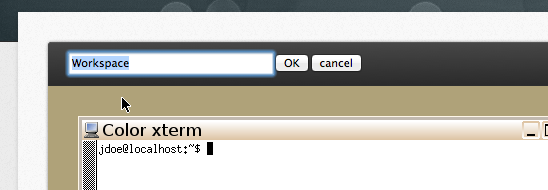
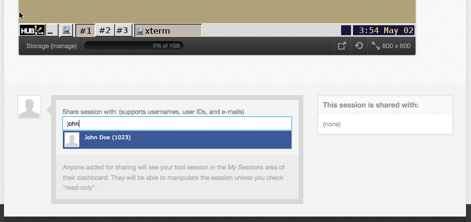

<!--
status: imported
source: core/components/com_tools/site/help/en-GB/sessions.phtml
imported: 2026-09-09
-->
# Tools Sessions

1. [Renaming Tool Sessions](#renamesession)
2. [Sharing Tool Sessions](#sharesession)

## Renaming Tool Sessions

You can rename a simulation session by simple double-clicking the session title just above the active tool area. The title will then become a text box where you can input any title you wish. Press the TAB key or ENTER key to save changes or press ESC to cancel.

## Sharing Tool Sessions

Have some interesting results from a simulation that you'd like someone else to see? Share the session!

Enter one or more login names in the form beneath the tool session and click on the Share button. Anyone added for sharing will see your tool session listed on their own My Sessions area on their dashboard page. Just as you would click a link to resume a tool session, they can click the link and access your session. Many people can access a single session at the same time and discuss the results on a conference call.

> **Note:** If you don't want others to have control of the tool, be sure to select the Read-Only checkbox before sharing the session.

