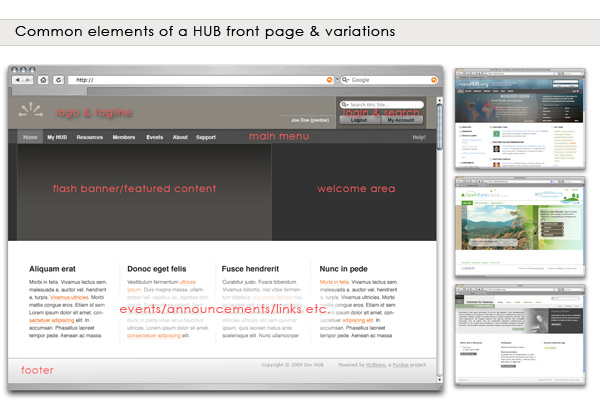

<!--
status: rewritten
reviewed-against: 2.4-main @ ab49f763b0
reviewed: 2026-09-09
screenshots: stale
source: https://help.hubzero.org/documentation/240/webdevs/templates/designing
source-id: 3507
-->
# Designing

Decisions you should make before you write any markup. A hub template is not
a blank page: it inherits a grid, a set of element styles, an icon font and
the markup of some sixty components, and the design work is mostly about
deciding how much of that to keep.



> **Note:** That diagram dates from before Hubzero 1.0 and the small examples
> beside it are hubs as they looked around 2009. Treat it as a sketch of which
> *regions* a front page has, not as a picture of what a hub looks like now.
> The shipped `kimera` and `lucent` templates are the current reference.

## Start from a shipped template

Copy one and change it. Building from an empty directory means reproducing
`kimera`'s `index.php` and its 27-file `less/` tree by hand, and the first
thing you will discover is that the components assume classes you have not
defined.

```bash
php core/bin/muse scaffolding copy template core/kimera to app/mytemplate
```

`kimera` is the fuller starting point and shows the override-heavy approach.
`lucent` is leaner and its LESS is organised into `tokens/`, `theme/` and
`template/` layers, which is easier to re-colour. Read both.

## What the framework decides for you

Four things are not really yours to design, because component markup depends
on them:

- **The 12-column grid.** `.grid` / `.col` / `.span6`, defined in
  [`core/assets/less/grid.less`](../../../core/assets/less/grid.less). Component
  views use it directly. See [Elements](13-elements.md).
- **`.section` / `.aside` / `.subject`.** The main-column-plus-sidebar
  arrangement that most components render into. Your template supplies the
  widths; the components supply the markup.
- **Notification classes.** `.passed`, `.info`, `.help`, `.warning`, `.error`
  are emitted by `jdoc:include type="message"` and by components directly.
- **Icons.** Components print `<span class="icon-edit">` and
  `Html::asset('icon', 'edit')`. Both need styles from the template. See
  [Fontcons](12-fontcons.md).

You can restyle all of these. You cannot rename them without breaking
components, and you cannot skip them without leaving parts of the hub unstyled.

## Decide the positions first

The module positions your `index.php` includes are the contract between the
template and whoever configures the hub. Changing them later means re-siting
every module on a live site, so settle them early.

`kimera` and `lucent` agree on `notices`, `helppane`, `search`, `user3`,
`left`, `right` and `endpage`, so a hub that switches between them keeps most
of its modules. They already disagree about the rest: `kimera` has
`breadcrumbs`, `footer` and `welcome`, `lucent` has `html-head`. Inventing your
own names is allowed, but it strands every module placed in a position you
dropped.

Whatever you choose, declare it in `<positions>` in
[`templateDetails.xml`](10-packaging.md) so the administrator can pick it from
a list, and give each one a `TPL_{TEMPLATE}_POSITION_{NAME}` string so it reads
as English.

## Decide what is a parameter

Anything a hub might want to change without editing files belongs in the
manifest's `<config>` block rather than in a stylesheet. `kimera` parameterises
its header light/dark, a background pattern, two accent colours and their
opacities; `kameleon` parameterises eighteen colour themes. Both serve the
result through a PHP stylesheet — `css/theme.php` and `css/themes/custom.php` —
that reads `$this->params` and prints CSS.

That is the pattern to copy when a colour has to be configurable. Everything
else should be plain CSS.

## Decide how far the overrides go

The heaviest part of a hub template is not `index.php`; it is `html/`.
`kimera` ships 32 override files, almost all of them per-component
stylesheets — `html/com_projects/projects.css`, `html/com_resources/resources.css`
and so on — that restyle a component's own CSS to match the template.
`lucent` ships none and accepts the components' default look.

Decide which of those two you are doing before you start, because it is the
difference between a week's work and a month's. See
[Output overrides](09-overrides.md).

## Things that are easy to forget

- **Print.** `kimera` has `less/_print.less`; a hub's resource pages get
  printed.
- **The error, offline and component layouts.** `error.php` renders when the
  application throws, `offline.php` when the site is switched off, and
  `component.php` inside every modal and popup. A template that only styles
  `index.php` looks unfinished in three places nobody tests.
- **Dark and high-contrast.** `kimera` carries `less/_dark.less`.
- **Right-to-left.** `kameleon` carries `less/_rtl.less`; no site template
  does.
- **The site name is text, not an image.** `kimera`'s masthead prints
  `Config::get('sitename')` inside an `<h1>` and lets the stylesheet replace it
  with a logo. Hubs change their name in Global Configuration and their logo in
  CSS, so neither should be hardcoded in `index.php`.

## Then build it

- [Structure](03-structure.md) — the files you need.
- [Page layout](06-layouts.md) — writing `index.php`.
- [Cascading style sheets](07-css.md) — how the stylesheets load.
- [Packaging](10-packaging.md) — the manifest.
