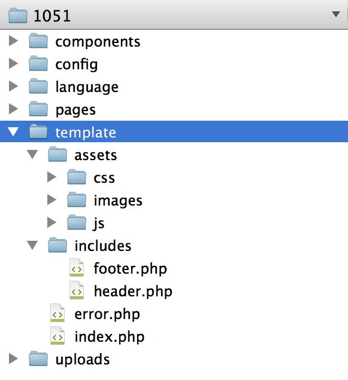
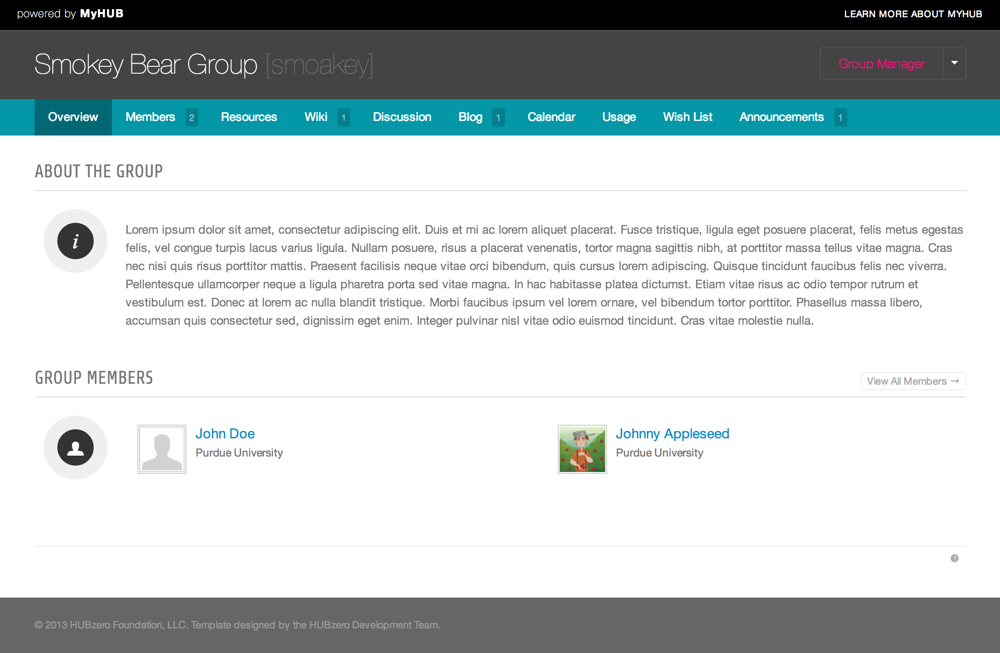
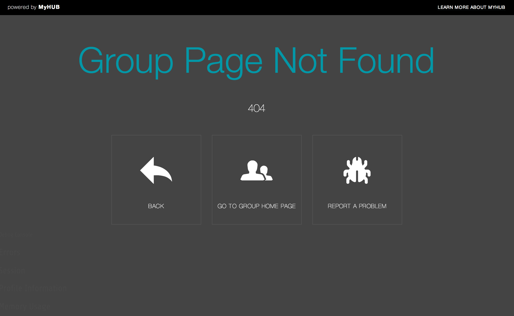

<!--
status: imported
source: https://help.hubzero.org/documentation/240/webdevs/supergroups/templating_system
source-id: 3520
modified: 2014-09-10
imported: 2026-09-09
-->
# Templating System

## Overview

A new templating system has been added to help Super groups create a better web presence. When a super group is created, a default template is created and placed in the groups filespace.

> **Note:** The only file needed for a super group template to work is /{web_root}/site/groups/{group_id}/template/index.php

## File Structure

Below shows the desired file directory structure for super groups. Following this pattern will allow HUB owners and developers to add new developments and find bugs easier.

## Default Template

A default template is created for each super group. This can be used as a base for the super groups template.

## Error Template

Super groups have the ability use a custom error template (error.php), which can include a stylesheet (error.css) or scripts to display a custom error page.

## Template Includes

The following group include tags can be used within a template to display the content, the menu, the member/manager toolbar, modules, or include a Google Analytics tracking code.

- `<group:include type="content" />`
- `<group:include type="content" scope="before" />`
  - `<group:include type="menu" />`

    - `<group:include type="toolbar" />`

      - `<group:include type="modules" postion="{position}" />`

        - `<group:include type="modules" title="{title}" />`

          - `<group:include type="googleanayltics" account="{account}" />`

            - `<group:include type="script" base="" source="{file_path}" />`

              - `<group:include type="stylesheet" base="" source="{file_path}" />`

> **Note:** For Script & Stylesheet group includes you can specify a base param of "template" which will automatically prepend "/template/assets/js" or "/template/assets/css" to the source. If no base is specified, it will look for the file in the groups "uploads" directory.
