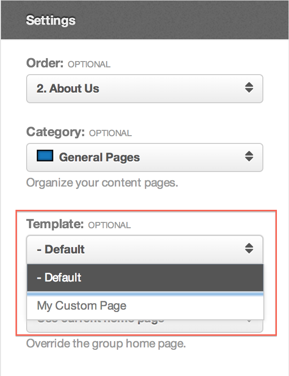

<!--
status: rewritten
reviewed-against: 2.4-main @ ab49f763b0
reviewed: 2026-09-09
screenshots: stale
source: https://help.hubzero.org/documentation/240/webdevs/supergroups/page_templates
source-id: 3521
modified: 2014-09-10
-->
# Page templates

Most of a super group's pages render through the same template file. When one
page, or a family of pages, needs a different layout, put a second file in the
group's `template/` directory and the renderer picks it up.

The mechanism is the candidate list in
[`Components\Groups\Helpers\Template::_fetch()`](../../../core/components/com_groups/helpers/template.php),
described in [Templating system](01-templating_system.md#how-the-file-is-chosen).
This chapter is about the four ways a page can claim a file of its own.

## Where the files go

```
app/site/groups/<gidNumber>/template/
```

All of them sit directly in `template/`, beside `index.php`. Subdirectories
are not searched.

Put them there on the server, or through the group's
[repository](../14-supergroups-gitlab/README.md). The group's file browser
reaches only `uploads`, for every group, so there is no way to upload a
template file from the site.

## The four ways

| File | Applies to |
|---|---|
| `<name>.php` with a **Template Name** header | Any page whose **Template** setting names it |
| `page-<alias>.php` | The one page with that alias |
| `page-<id>.php` | The one page with that numeric id |
| `page.php` | Every group page that has not claimed one of the above |

They are tried in that order, then `default.php`, then `index.php`. The first
file that exists wins.

`page.php` is worth calling out: it applies to group *pages* only. A plugin
tab — Wiki, Calendar, Forum — has no active page, so it renders through
`default.php` or `index.php` no matter what `page.php` contains.

### A template named after the page

The About Us page, alias `about-us` and id 6, uses `page-about-us.php` if
that file exists, otherwise `page-6.php`. Nothing else is needed; the page
does not have to be edited.

Prefer the alias. The id is assigned by the database and means nothing to
anyone reading the directory later.

### A named template several pages can share

A file becomes a named template by declaring a name in a comment near the top:

```php
<?php
/*
Template Name: My Custom Page
*/
```

[`Components\Groups\Helpers\View::getPageTemplates()`](../../../core/components/com_groups/helpers/view.php)
reads every `.php` file in `template/` and matches `Template Name:` up to the
end of the line, case-insensitively. Anything after the colon is the label.
The file may be called whatever you like — the label is what the interface
shows, and the filename is what gets stored on the page.

Two files never appear in the list, whatever they declare: `index.php` and
`default.php`.

## Choosing one

The **Template** control is on the page's own edit form, in the **Settings**
section, below **Comments**:

1. On the group, choose **Group Manager** → **Manage Group Pages**.
2. Select **Manage Page** on the page you want, or **New Page**.
3. Under **Settings**, set **Template**.
4. Select **Save Page**.

The list holds **- Default** plus one entry per named template. Leaving it on
**- Default** falls back to the `page-*` / `page.php` / `index.php` chain
above.



> **Note:** That screenshot predates the current form. The **Settings**
> section now reads Category, Parent, Order, Comments, Template, and the home
> page override shown under the drop-down is no longer there. The **Template**
> control itself still looks and behaves as pictured.

The control only exists on a super group's pages, and on the site form only
when the template directory holds at least one named template. The
administrator's page form at **Users** → **Groups** shows it for every super
group, empty list or not.

## What the file receives

A page template is loaded exactly as `index.php` is, so it sees the same four
properties — `$this->group`, `$this->page`, `$this->tab` and
`$this->content` — and may use every
[`<group:include>` tag](01-templating_system.md#include-tags). Most page
templates are a copy of `index.php` with one part swapped out, so it is
usually worth moving the shared header and footer into `template/includes/`
and including them from both.

## Include tags inside a page's content

The tags a *template* may use are not the tags a *page* may use. Content
written in the page editor is rendered by a plain
[`Components\Groups\Helpers\Document`](../../../core/components/com_groups/helpers/document.php),
whose allowed list is only:

- `<group:include type="modules" position="{position}" />`
- `<group:include type="module" title="{title}" />`
- `<group:include type="script" base="" source="{path}" />`
- `<group:include type="stylesheet" base="" source="{path}" />`

`content`, `menu`, `toolbar` and `googleanalytics` are template-only; used in
page content they render as an HTML comment saying the include is not allowed
there. `base` works as it does in a template: `template` resolves under
`template/assets/js` or `template/assets/css`, anything else is a path
segment under the group directory, and an omitted `base` looks in `uploads`.

> **Warning:** The attribute for a position is `position`. Older
> documentation spelled it `postion` and paired `type="modules"` with a
> `title`, which matches no renderer.

## Overriding the wrapper

Whatever renders the page body, com_groups wraps it in its own view. A super
group can replace that wrapper by dropping a file of the same name into
`template/pages/`; that directory is searched before the component's own.

The wrapper is
[`site/views/pages/tmpl/_view.php`](../../../core/components/com_groups/site/views/pages/tmpl/_view.php).
It emits `<div class="group-page page-<alias>">` around the content and, below
it, the byline and the comment thread. Overriding it is the way to change
those without touching core.
