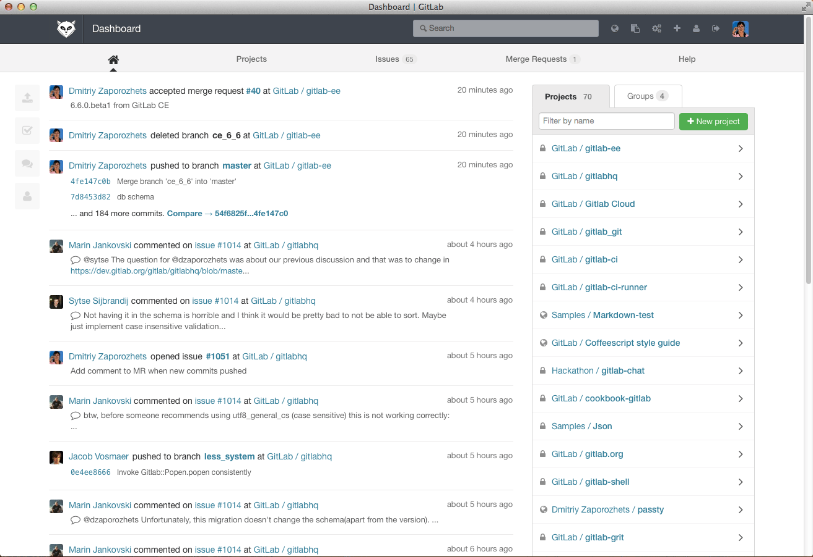

<!--
status: rewritten
reviewed-against: 2.4-main @ 348f0057c2
reviewed: 2026-09-10
screenshots: stale
source: https://help.hubzero.org/documentation/240/webdevs/supergroups_gitlab
source-id: 3527
modified: 2014-09-10
-->
# Super groups with GitLab

A [super group](13-supergroups/README.md) is a directory of code on a
server. Editing that code on a live hub means editing production by hand.
The alternative the CMS supports is to keep each group's directory in a
[GitLab](https://about.gitlab.com/) repository: developers work on a copy,
propose changes as merge requests, and an administrator pulls the approved
result into the hub from the administrator interface.

This section covers what the CMS does, what a hub has to configure, and how a
developer works against a group that is managed this way.

Reach for it when a super group's code is written by more than one person, or
by anyone who should not have a shell account on the production hub, or when
you want to be able to say what changed and put it back. Do not reach for it
for a group whose template one person edits twice a year: the arrangement
needs a GitLab that somebody runs, accounts granted by hand, and a hub with
`application_env` set to production before the CMS will create anything at
all. [What it costs](#what-it-costs) is the honest list.

## What ships and what does not

GitLab is a separate application. Nothing in this repository runs one, and no
hub gets one by installing the CMS. What ships is a client:

- [`core/components/com_groups/helpers/gitlab.php`](../../core/components/com_groups/helpers/gitlab.php)
  — a small REST client over Guzzle that can search for and create GitLab
  groups and projects and protect a branch.
- The super group tasks in
  [`admin/controllers/manage.php`](../../core/components/com_groups/admin/controllers/manage.php)
  — creating the project when a group is saved, and the **Update Groups Code**
  and **Merge Groups Code** screens.
- Shell scripts in
  [`admin/assets/scripts/`](../../core/components/com_groups/admin/assets/scripts)
  that do the git work on the server.

The integration is **off by default** and does nothing until a hub sets
**Repo Management**, a **Repo URL** and a **Repo API Key**. Even then the
project-creation half only runs on a hub whose `application_env` starts with
`production`.

Everything on the GitLab side — accounts, forks, merge requests, review, the
web interface — is that application's, not the hub's. This section says
plainly which parts of the old workflow could be checked against this code
and which could not.

## The chapters

| Chapter | What it covers |
|---|---|
| [Why GitLab](#why-gitlab) | What the arrangement buys, and what the hub actually enforces |
| [Setup](#setup) | The hub-side options, and what happens when a group is saved |
| [Developing](#developing) | The fork, clone, merge request and pull cycle |



> **Note:** That screenshot shows GitLab 6, from 2014. No current GitLab looks
> anything like it, and the picture is of GitLab's own project rather than of
> a hub. Treat it as historical.
## Why GitLab

A super group's code is a directory on the hub's server. Without a repository,
changing it means someone editing production files over SSH, and the only
record of what changed is the file system. Keeping the directory in a GitLab
repository moves the writing somewhere else and turns each change into
something that can be read before it lands.

### Nobody needs an account on the hub's server

The developer works on their own machine, or a development hub, against a
clone. They never log in to the production hub. The only thing that reaches
production is a `git pull`, run from the administrator interface by someone
who already had administrative access.

### Changes are read before they land

Two things enforce the review, one in GitLab and one in the hub:

- When the hub creates a group's project it protects the `master` branch, so
  only GitLab users with the right role can merge into it. That call is
  `protectBranch()` in
  [`helpers/gitlab.php`](../../core/components/com_groups/helpers/gitlab.php).
- The hub only ever pulls. There is no path from the administrator interface
  that pushes a change into a group's repository, apart from the very first
  commit that creates it.

So a change arrives on the hub only if someone merged it in GitLab and then an
administrator pulled it.

> **Note:** Whether merge requests are actually reviewed, by whom, and how
> long that takes is a policy each hub sets in GitLab. Nothing in the CMS
> enforces a review; it enforces only that the hub does not write to the
> repository.

### Developers work on a copy

The usual arrangement is that each developer forks the group's project and
works in their fork, so nothing they do can affect the live group or another
developer until a merge request is accepted. Forking is a GitLab feature; the
hub knows nothing about it and does not create forks.

### Updates are a screen, not a deployment

Once a hub is configured, any administrator who can reach **Users** →
**Groups** can pull new code for one group or several at once, look at what
would change, and then merge it. The screens are described in
[Developing](#pulling-the-changes-into-the-hub).

Merging also runs the group's [migrations](13-supergroups/06-migrations.md),
so a schema change travels with the code that needs it.

### The rest is GitLab

Issue tracking, a wiki per project, the code browser, protected branches
beyond `master`, review rules, CI — all of that is GitLab's, available to
whoever administers it, and outside anything this repository can confirm.

### What it costs

- **A GitLab to run.** The hub is a client of one; it does not provide one.
- **Accounts, by hand.** The CMS creates no GitLab users and links no hub
  account to a GitLab account. Access is granted in GitLab by whoever
  administers it.
- **Production only.** The hub creates a group's project only when
  `application_env` starts with `production`. On a development hub, saving a
  super group creates the directory and the database and stops there.
## Setup

Three parties have something to do before a super group can be developed
through GitLab: the hub, whoever administers the GitLab, and the developer.
Only the first is done in this software.

### Hub setup

1. Go to **Users** → **Groups** and select **Options**.
2. Open the **Super Groups** tab.
3. Set **Repo Management** to yes.
4. Put the GitLab **API endpoint** in **Repo URL** — the base the client
   appends `groups` and `projects` to, so a v4 API is
   `https://gitlab.example.org/api/v4`.
5. Put an access token in **Repo API Key**.
6. Select **Save & Close**.

The token is sent as a `PRIVATE-TOKEN` header on every call, and searches ask
GitLab for objects at access level 40 and above, so the token needs at least
**Maintainer** on whatever it is expected to find or create. The source says
so in as many words.

That is the whole of the hub-side configuration. There is nothing else to
install.

> **Note:** The client is created with TLS certificate verification turned
> off (`'verify' => false` in
> [`helpers/gitlab.php`](../../core/components/com_groups/helpers/gitlab.php)),
> which lets it talk to a GitLab with a self-signed certificate — and means it
> will not notice one it should have refused.

> **Important:** Older documentation had a hub administrator generate an SSH
> key for `www-data`, add it to a GitLab account, and SSH once to accept the
> host key. None of that is needed here. The hub pushes over HTTPS, using a
> remote of the form `https://oauth2:<token>@<host>/<path>` built from the
> project's `http_url_to_repo`. There is no SSH from the hub to GitLab.

#### Checking it

Saving a super group calls `validate()` first, which checks the option, the
URL and the key, then asks GitLab for `personal_access_tokens/self`. The
messages you may see are:

| Message | Meaning |
|---|---|
| *Gitlab is not setup properly for managing super group repositories…* | **Repo Management** is off, or the URL or key is empty |
| *The Gitlab API key was rejected. Check the Repo API Key in the Groups configuration.* | GitLab answered 401 |

> **Warning:** That first warning appears on **every** super group save on a
> hub that has not configured GitLab, including hubs that never intend to.
> It is noise, not a fault with the group. Recorded in
> It is recorded with the project.
### What the hub does when a super group is saved

Everything below happens in `_handSuperGroupGitlab()` in
[`admin/controllers/manage.php`](../../core/components/com_groups/admin/controllers/manage.php),
after the group's directory and database have been created, and only when
`application_env` starts with `production`. On a development or staging hub
the whole step is skipped.

1. **Find or create a GitLab group** named `hub-<first label of the hub's
   host name>` — `hub-example` for `example.org`. If the search returns more
   than one match the save stops with an error.
2. **Find or create a project** in it named `sg_<group alias>`, with issues,
   merge requests, wiki and snippets enabled and the hub group's description
   as its own.
3. **Stop if the group directory already has a `.git`.** Setup runs once.
4. **Push the directory** by running
   [`gitlab_setup.sh`](../../core/components/com_groups/admin/assets/scripts/gitlab_setup.sh):
   `git init`, a `master` branch tracking `origin`, an exclude list, `git add`,
   an initial commit authored as *&lt;site name&gt; Groups
   &lt;groups@&lt;host&gt;&gt;*, `git remote add origin`, and
   `git push -u origin master`.
5. **Protect `master`**, so merges into it need the right role in GitLab.

Two paths are excluded from the repository by that script, and should stay
excluded: `uploads/*`, which holds whatever the group's members upload, and
`config/db.php`, which holds the group's database password.

> **Note:** A super group that already exists and has no repository gets one
> the next time an administrator saves it, on a production hub with the
> options set. There is no separate migration step and no need to ask anyone
> to run one.

### Staging hubs

A hub whose `application_env` starts with `staging` behaves differently in one
place: selecting **Update Groups Code** for a group that has no `.git`
directory runs
[`gitlab_setup_stage.sh`](../../core/components/com_groups/admin/assets/scripts/gitlab_setup_stage.sh),
which tars the group's directory as a backup beside it, empties the directory,
and clones the project into it.

> **Warning:** That script deletes the contents of the group's directory
> before cloning, `uploads` included — and `uploads` is not in the repository,
> so it is not restored by the clone. The tarball beside it is the only copy.
> Read the script before running it against anything you care about.

### GitLab setup

Creating accounts, granting people access to the hub's GitLab group, and
setting whatever review rules the hub wants are jobs in GitLab. The CMS never
creates a user, never links a hub account to a GitLab account, and never
grants anyone access to a project.

### Developer setup

Also GitLab's, not the hub's:

- An account, and membership of the project.
- An SSH key on that account, if you clone over SSH — added under the
  profile's **SSH Keys**. More than one key is fine, one per machine you work
  from. Cloning over HTTPS with a token instead works equally well.

Neither of those could be verified against this repository; they are how
GitLab works, not how the hub works.

### Known gaps in the integration

- The GitLab group name is derived two different ways. Creating a project uses
  the **first** label of the host name; the staging setup path uses the label
  before the top-level domain. On `example.org` those agree. On
  `www.example.org` the first gives `hub-www` and the second `hub-example`.
- `updateTask()` runs `gitlab_reset_remote.sh` when a repository's stored
  token no longer matches the configured one. That script does not exist in
  this repository.
- `gitlab_fetch.sh` and `gitlab_merge_and_migrate.sh` are in the scripts
  directory but nothing calls them, and they invoke `cli/muse.php`, a path
  that no longer exists — muse is `core/bin/muse`.
- `protectBranch()` calls `PUT /projects/:id/repository/branches/:branch/protect`.
  That is where the GitLab v3 API kept branch protection; current versions
  expose it elsewhere. Not verified against a live GitLab.
- Every response is assumed to be JSON that decodes to an array. A proxy
  error page or an HTML 404 from the URL in **Repo URL** produces a fatal
  error rather than a message.

All of these are recorded with the project.
## Developing

The cycle for a super group managed through GitLab is: work in a clone,
propose the change as a merge request, and have an administrator pull the
merged result into the hub.

The examples use `mygroup` as the group's alias, `hub-example` as the hub's
GitLab group and `theuser` as your GitLab user name. The project is
`sg_mygroup`, in the group `hub-example`; both names are built by the hub when
it creates the project, as described in [Setup](#setup).

> **Note:** Everything up to the last section happens in GitLab and in git.
> None of it is the CMS, and none of it could be verified against this
> repository. Use it as a description of the arrangement the CMS expects, and
> your own GitLab's documentation for the details.

### Fork the project

Find `hub-example / sg_mygroup` in GitLab and fork it. The fork is yours: you
can push to it freely without touching the group the hub pulls from.

### Clone your fork

```bash
git clone git@gitlab.example.org:theuser/sg_mygroup.git
cd sg_mygroup
```

Clone anywhere you like. A development hub is the convenient place, because
you can then point a super group at the working copy and see the result.

> **Note:** Older documentation gave a one-line clone that moved the files up
> and removed the directory. That was for cloning *into* a group directory
> that already existed. A plain clone is what you want.

### Add the upstream remote

Your fork does not track the group's real repository. Add it:

```bash
git remote add upstream git@gitlab.example.org:hub-example/sg_mygroup.git
git remote -v
```

```text
origin    git@gitlab.example.org:theuser/sg_mygroup.git (fetch)
origin    git@gitlab.example.org:theuser/sg_mygroup.git (push)
upstream  git@gitlab.example.org:hub-example/sg_mygroup.git (fetch)
upstream  git@gitlab.example.org:hub-example/sg_mygroup.git (push)
```

Keeping the fork in step with upstream is the part people skip and regret. Do
it before every push.

### What belongs in the repository

Everything the hub put there when it created the project: `template/`,
`components/`, `macros/`, `migrations/`, `pages/`, `language/`.

Two things are deliberately excluded and must stay out:

- `uploads/` — the group's own files, which belong to its members and are not
  code.
- `config/db.php` — the group's database password.

The hub writes both into `.git/info/exclude` when it sets the repository up.
That file is local to the clone the hub made; a fresh clone does not have it,
so take care not to add either path by hand.

### Work

Ordinary git. Commit as you go. The hub sets the repository up on `master`
and protects that branch, so `master` is what a merge request targets.

Schema changes belong in
[migrations](13-supergroups/06-migrations.md), in the group's top-level
`migrations` directory, so they run when the code is merged on the hub.

### Sync before you push

```bash
git fetch upstream
git checkout master
git merge upstream/master
```

Resolve any conflicts here, in your own clone, where it costs nothing. A merge
request from a fork that is behind is harder to review and may be sent back.

### Push and open a merge request

```bash
git push origin master
```

Then, in GitLab, open a merge request from your fork's `master` to
`hub-example/sg_mygroup`'s `master`. Write a description that says what
changed and why: the person approving it is reading the diff cold.

How long approval takes, and who does it, is your hub's policy. GitLab mails
you when the request is accepted or closed.

### Pulling the changes into the hub

The last step is a hub administrator's, in the administrator interface. The
screens are in **Users** → **Groups**.

1. Tick the super groups to update in the group list.
2. Select **Update Groups Code**. Nothing is changed yet: the hub fetches from
   the remote and lists the commits each group is behind by, or says *Your
   code is currently up to date!*
3. Look at the list. Each group with something to merge gets a **Merge
   Changes** tick box, ticked.
4. Select **Merge Groups Code**.

**Update Groups Code** is only on the toolbar when **Repo Management** is on
and the administrator holds the `core.manage` permission for `com_groups`.
Groups in the selection that are not super groups, or that have no `.git`
directory, are listed as failures and skipped.

The merge runs `muse group update -f` and then `muse group migrate -f` in the
group's directory. Concretely, for each group:

- Local modifications in the group's directory are **stashed** first, so
  anything edited on the server by hand is set aside rather than merged.
- A tag named `cmsrollbackpoint-<timestamp>` is written, so the state before
  the merge can be recovered.
- The merge is **fast-forward only**. A group whose directory has commits of
  its own will refuse to merge rather than produce a merge commit.
- The group's [migrations](13-supergroups/06-migrations.md) run afterwards,
  against the group's own database.

> **Warning:** The controller means to skip migrations when the update fails,
> but the test it uses never matches, so migrations run either way. Read the
> output of the merge instead of assuming it stopped. Recorded in
> It is recorded with the project.
### Rolling back

The rollback point the merge wrote is reachable from muse:

```bash
php core/bin/muse group update rollback --group=mygroup -f
```

That resets the group's directory to the most recent
`cmsrollbackpoint-` tag. It does not undo migrations; a schema change is
reversed by running its `down()`, with
`muse group migrate -d=down -f --group=mygroup --file=Migration….php`.

`php core/bin/muse group update status --group=mygroup` reports what the
working copy looks like without changing anything.
