<!--
status: imported
source: https://help.hubzero.org/documentation/240/installation/el8/install/submit
source-id: 3704
modified: 2016-12-16
imported: 2026-09-09
source-state: unpublished
-->
# Submit

## Introduction

The submit command provides a means for HUB end users to execute applications on remote resources. The end user is not required to have knowledge of remote job submission mechanics. Jobs can be submitted to traditional queued batch systems including PBS and Condor or executed directly on remote resources.

## Installation

```
sudo yum install -y hubzero-submit-pegasus
sudo yum install -y hubzero-submit-condor
sudo yum install -y hubzero-submit-common
sudo yum install -y hubzero-submit-server
sudo yum install -y hubzero-submit-distributor
sudo yum install -y hubzero-submit-monitors

sudo hzcms configure submit-server --enable
sudo service submit-server start
sudo chkconfig submit-server on
```

At completion of the `yum install` commands several files will be located in the directory `/opt/submit`. Excluding python files, the directory listing should like the following:

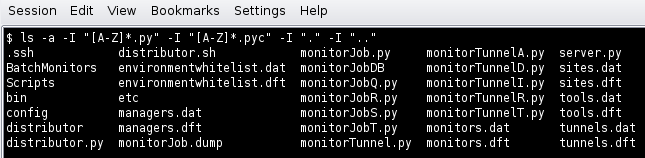

## Configuration

Submit provides a mechanism to execute jobs on machines outside the HUB domain. To accomplish this feat, some configuration is required on the HUB and some additional software must be installed and configured on hosts in remote domains. Before attempting to configure submit it is necessary to obtain access to the target remote domain(s). The premise is that a single account on the remote domain will serve as an execution launch point for all HUB end users. It is further assumes that access to this account can be made by direct ssh login or using an ssh tunnel (port forwarding).

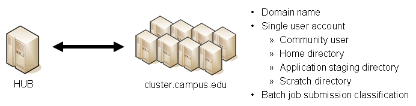

Having attained account access to one or more remote domains, it is possible to proceed with submit configuration. To get started, the ssh public generated by the installation should be transferred to the remote domain host(s).

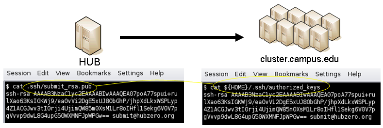

## HUB Configuration

The behavior of submit is controlled through a set of configuration files. The configuration files contain descriptions of the various parameters required to connect to a remote domain, exchange files, and execute simulation codes. There are separate files for defining remote sites, staged tools, multiprocessor managers, file access controls, permissible environment variables, remote job monitors, and ssh tunneling. Most parameters have default values and it is not required that all parameters be explicitly defined in the configuration files. A simple example is given for each category of configuration file.

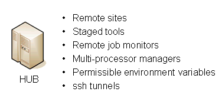

### Sites

Remote sites are defined in the file `sites.dat`. Each remote site is defined by a stanza indicating an access mechanism and other account and venue specific information. Defined keywords are

- [name] - site name. Used as command line argument (-v/--venue) and in tools.dat (destinations)
- venues - comma separated list of hostnames. If multiple hostnames are listed one site will chosen at random.
- tunnelDesignator - name of tunnel defined in tunnels.dat.
- siteMonitorDesignator - name of site monitor defined in monitors.dat.
- venueMechanism - possible mechanisms are ssh and local.
- remoteUser - login user at remote site.
- remoteBatchAccount - some batch systems requirement that an account be provided in addition to user information.
- remoteBatchSystem - the possible batch submission systems include CONDOR, PBS, SGE, and LSF. SCRIPT may also be specified to specify that a script will be executed directly on the remote host.
- remoteBatchQueue - when remoteBatchSystem is PBS the queue name may be specified.
- remoteBatchPartition - slurm parameter to define partition for remote job
- remoteBatchPartitionSize - slurm parameter to define partition size, currently for BG machines.
- remoteBatchConstraints - slurm parameter to define constraints for remote job
- parallelEnvironment - sge parameter
- remoteBinDirectory - define directory where shell scripts related to the site should be kept.
- remoteApplicationRootDirectory - define directory where application executables are located.
- remoteScratchDirectory - define the top level directory where jobs should be executed. Each job will create a subdirectory under remoteScratchDirectory to isolated jobs from each other.
- remotePpn - set the number of processors (cores) per node. The PPN is applied to PBS and LSF job description files. The user may override the value defined here from the command line.
- remoteManager - site specific multi-processor manager. Refers to definition in managers.dat.
- remoteHostAttribute - define host attributes. Attributes are applied to PBS description files.
- stageFiles - A True/False value indicating whether or not files should be staged to remote site. If the the job submission host and remote host share a file system file staging may not be necessary. Default is True.
- passUseEnvironment - A True/False value indicating whether or not the HUB 'use' environment should passed to the remote site. Default is False. True only makes sense if the remote site is within the HUB domain.
- arbitraryExecutableAllowed - A True/False value indicating whether or not execution of arbitrary scripts or binaries are allowed on the remote site. Default is True. If set to False the executable must be staged or emanate from /apps. (deprecated)
- executableClassificationsAllowed - classifications accepted by site. Classifications are set in appaccess.dat
- members - a list of site names. Providing a member list gives a layer of abstraction between the user facing name and a remote destination. If multiple members are listed one will be randomly selected for each job.
- state - possible values are enabled or disabled. If not explicitly set the default value is enabled.
- failoverSite - specify a backup site if site is not available. Site availability is determined by site probes.
- checkProbeResult - A True/False value indicating whether or not probe results should determine site availability. Default is True.
- restrictedToUsers - comma separated list of user names. If the list is empty all users may garner site access. User restrictions are applied before group restrictions.
- restrictedToGroups - comma separated list of group names. If the list is empty all groups may garner site access.
- logUserRemotely - maintain log on remote site mapping HUB id, user to remote batch job id. If not explicitly set the default value is False.
- undeclaredSiteSelectionWeight - used when no site is specified to choose between sites where selection weight > 0.
- minimumWallTime - minimum walltime allowed for site or queue. Time should be expressed in minutes.
- maximumWallTime - maximum walltime allowed for site or queue. Time should be expressed in minutes.
- minimumCores - minimum number of cores allowed for site or queue.
- maximumCores - maximum number of cores allowed for site or queue.
- pegasusTemplates - pertinent pegasus templates for site, rc, and transaction files.

An example stanza is presented for a site that is accessed through ssh.

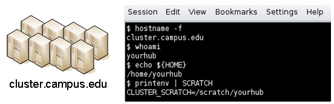

```
[cluster]
venues = cluster.campus.edu
remotePpn = 8
remoteBatchSystem = PBS
remoteBatchQueue = standby
remoteUser = yourhub
remoteManager = mpich-intel64
venueMechanism = ssh
remoteScratchDirectory = /scratch/yourhub
siteMonitorDesignator = clusterPBS
```

### Tools

Staged tools are defined in the file `tools.dat`. Each staged tool is defined by a stanza indicating an where a tool is staged and any access restrictions. The existence of a staged tool at multiple sites can be expressed with multiple stanzas or multiple destinations within a single stanza. If the tool requires multiprocessors a manager can also be indicated. Defined keywords are

- [name] - tool name. Used as command line argument to execute staged tools. Repeats are permitted to indicate staging at multiple sites.
- destinations - comma separated list of destinations. Destination may exist in sites.dat or be a grid site defined by a ClassAd file.
- executablePath - path to executable at remote site. The path may be given as an absolute path on the remote site or a path relative to remoteApplicationRootDirectory defined in sites.dat.
- restrictedToUsers - comma separated list of user names. If the list is empty all users may garner tool access. User restrictions are applied before group restrictions.
- restrictedToGroups - comma separated list of group names. If the list is empty all groups may garner tool access.
- environment - comma separated list of environment variables in the form e=v.
- remoteManager - tool specific multi-processor manager. Refers to definition in managers.dat. Overrides value set by site definition.
- state - possible values are enabled or disabled. If not explicitly set the default value is enabled.

An example stanza is presented for a staged tool maintained in the yourhub account on a remote site.

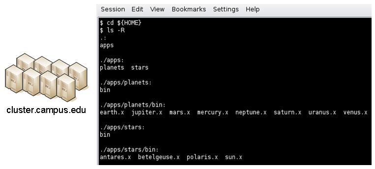

```
[earth]
destinations = cluster
executablePath = ${HOME}/apps/planets/bin/earth.x
remoteManager = mpich-intel

[sun]
destinations = cluster
executablePath = ${HOME}/apps/stars/bin/sun.x
remoteManager = mpich-intel
```

### Monitors

Remote job monitors are defined in the file `monitors.dat`. Each remote monitor is defined by a stanza indicating where the monitor is located and to be executed. Defined keywords are

- [name] - monitor name. Used in sites.dat (siteMonitorDesignator)
- venue - hostname upon which to launch monitor daemon. Typically this is a cluster headnode.
- venueMechanism - monitoring job launch process. The default is ssh.
- tunnelDesignator - name of tunnel defined in tunnels.dat.
- remoteUser - login user at remote site.
- remoteBinDirectory - define directory where shell scripts related to the site should be kept.
- remoteMonitorCommand - command to launch monitor daemon process.
- state - possible values are enabled or disabled. If not explicitly set the default value is enabled.

An example stanza is presented for a remote monitor tool used to report status of PBS jobs.

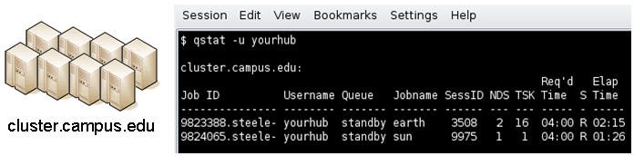

```
[clusterPBS]
venue = cluster.campus.edu
remoteUser = yourhub
remoteMonitorCommand = ${HOME}/SubmitMonitor/monitorPBS.py
```

### Multi-processor managers

Multiprocessor managers are defined in the file `managers.dat`. Each manager is defined by a stanza indicating the set of commands used to execute a multiprocessor simulation run. Defined keywords are

- [name] - manager name. Used in sites.dat and tools.dat.
- computationMode - indicate how to use multiple processors for a single job. Recognized values are mpi, parallel, and matlabmpi. Parallel application request multiprocess have there own mechanism for inter process communication. Matlabmpi is used to enable the an Matlab implementation of MPI.
- preManagerCommands - comma separated list of commands to be executed before the manager command. Typical use of pre manager commands would be to define the environment to include a particular version of MPI amd/or compiler, or setup MPD.
- managerCommand - manager command commonly mpirun. It is possible to include strings that will be sustituted with values defined from the command line.
- postManagerCommands - comma separated list of commands to be executed when the manager command completes. A typical use would be to terminate an MPD setup.
- mpiRankVariable - define environment variable set by manager command to define process rank. Recognized values are: MPIRUN_RANK, GMPI_ID, RMS_RANK, MXMPI_ID, MSTI_RANK, PMI_RANK, and OMPI_MCA_ns_nds_vpid. If no variable is given an attempt is made to determine process rank from command line arguments.
- environment - comma separated list of environment variables in the form e=v.
- moduleInitialize - initialize module script for sh
- modulesUnload - modules to be unloaded clearing way for replacement modules
- modulesLoad - modules to load to define mpi and other libraries
- state - possible values are enabled or disabled. If not explicitly set the default value is enabled.

An example stanza is presented for a typical MPI instance. The given command should be suitable for `/bin/sh` execution. 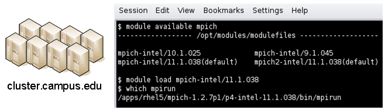

```
[mpich-intel]
preManagerCommands = . ${MODULESHOME}/init/sh, module load mpich-intel/11.1.038
managerCommand = mpirun -machinefile ${PBS_NODEFILE} -np NPROCESSORS
```

The token NPROCESSORS is replaced by an actual value at runtime.

### File access controls

Application or file level access control is described by entries listed in the file `appaccess.dat`. The ability to transfer files from the HUB to remote sites is granted on a group basis as defined by white and black lists. Each list is given a designated priority and classification. In cases where a file appears on multiple lists, the highest priority takes precedence. Simple wildcard operators are allowed the in the filename declaration allowing for easy listing of entire directories. Each site lists acceptable classification(s) in `sites.dat. Defined keywords are`

- `[group] - group name.`
- `whitelist - comma separated list of paths. Wildcards allowed.`
- `blacklist - comma separated list of paths. Wildcards allowed.`
- `priority - higher priority wins`
- `classification - apps or user. user class are treated are arbitrary executables.`
- `state - possible values are enabled or disabled. If not explicitly set the default value is enabled.`

`An example file giving permissions reminiscent of those defined in earlier submit releases is presented here`

```
[public]
whitelist = /apps/.*
priority = 0
classification = apps

[submit]
whitelist = ${HOME}/.*
priority = 0
classification = home
```

`The group public is intended to include all users. Your system may use a different group such as users for this purpose. The definitions shown here allow all users access to files in /apps where applications are published. Additionally members of the submit group are allowed to send files from their $HOME directory.`

### `Environment variables`

`Legal environment variables are listed in the file environmentwhitelist.dat. The objective is to prevent end users from setting security sensitive environment variables while allowing application specific variables to be passed to the remote site. Environment variables required to define multiprocessor execution should also be included. The permissible environment variables should be entered as a simple list - one entry per line. An example file allowing use of a variables used by openmp and mpich is presenter here.`

```
# environment variables listed here can be specified from the command line with -e/--env option. Attempts to specify other environment variables will be ignored and the values will not be passed to the remote site.

OMP_NUM_THREADS
MPICH_HOME
```

### `Tunnels`

`In some circumstances, access to clusters is restricted such that only a select list of machines is allowed to communicate with the cluster job submission node. The machines that are granted such access are sometimes referred to as gateways. In such circumstances, ssh tunneling or port forwarding can be used to submit HUB jobs through the gateway machine. Tunnel definition is specified in the file tunnels.dat. Each tunnel is defined by a stanza indicating gateway host and port information. Defined keywords are`

- `[name] - tunnel name.`
- `venue - tunnel target host.`
- `venuePort - tunnel target port.`
- `gatewayHost - name of the intermediate host.`
- `gatewayUser - login user on gatewayHost.`
- `localPortOffset - local port offset used for forwarding. Actual port is localPortMinimum + localPortOffset`

`An example stanza is presented for a tunnel between the HUB and a remote venue by way of an accepted gateway host.`

```
[cluster]
venue = cluster.campus.edu
venuePort = 22
gatewayHost = gateway.campus.edu
gatewayUser = yourhub
localPortOffset = 1
```

## Initialization Scripts and Log Files

The submit server and job monitoring server must be started as daemon processes running on the the submit host. If ssh tunneling is going to be used an addition server must be started as a daemon process. Each daemon process writes to a centralized log file facilitating error recording and debugging.

### Initialize daemon scripts

Scripts for starting the server daemons are provided and installed in `/etc/init.d`. The default settings for when to start and terminate the scripts are adequate.

### Log files

Submit processes log information to files located in the `/var/log/submit` directory tree. The exact location varies depending on the vintage of the installation. Each process has its own log file. The three most important log files are `submit-server.log`, `distributor.log`, and `monitorJob.log`.

#### submit.log

The `submit-server.log` file tracks when the submit server is started and stopped. Each connection from the submit client is logged with the command line and client ip address reported. All log entries are timestamped and reported by submit-server process ID (PID) or submit ID (ID:) once one has been assigned. Entries from all jobs are simultaneously reported and intermingled. The submit ID serves as a good search key when tracing problems. Examples of startup, job execution, and termination are given here. The job exit status and time metrics are also recorded in the MyQSL database JobLog table.

```
[Sun Aug 26 17:28:24 2012] 0: ###################################################
[Sun Aug 26 17:28:24 2012] 0: Backgrounding process.
[Sun Aug 26 17:28:24 2012] 0: Listening: protocol='tcp', host='', port=830
```

```
[Sun Sep 23 12:33:28 2012] (1154) ====================================================
[Sun Sep 23 12:33:28 2012] (1154) Connection to tcp://:830 from ('192.168.224.14', 38770)
[Sun Sep 23 12:33:28 2012] 0: Server will time out in 60 seconds.
[Sun Sep 23 12:33:28 2012] 0: Cumulative job load is 0.84.  (Max: 510.00)
[Sun Sep 23 12:33:28 2012] 1670: Args are:['/usr/bin/submit', '--local', '-p', '@@iv=-3:1.5:3', '/home/hubzero/user/hillclimb/bin/hillclimb1.py', '--seed', '10', '--initialvalue', '@@iv', '--lowerbound', '-3', '--upperbound', '3', '--function', 'func2', '--solutionslog', 'solutions.dat', '--bestresultlog', 'best.dat']
[Sun Sep 23 12:33:28 2012] 1670: Server stopping.
[Sun Sep 23 12:33:28 2012] 1670: Server(JobExecuter) exiting(2).
[Sun Sep 23 12:33:38 2012] (1154) ====================================================
[Sun Sep 23 12:33:38 2012] (1154) Connection to tcp://:830 from ('192.168.224.14', 38774)
[Sun Sep 23 12:33:38 2012] 0: Server will time out in 60 seconds.
[Sun Sep 23 12:33:38 2012] 1670: Job Status: venue=1:local status=0 cpu=0.030000 real=0.000000 wait=0.000000
[Sun Sep 23 12:33:38 2012] 1670: Job Status: venue=2:local status=0 cpu=0.040000 real=0.000000 wait=0.000000
[Sun Sep 23 12:33:38 2012] 1670: Job Status: venue=3:local status=0 cpu=7.050000 real=7.000000 wait=0.000000
[Sun Sep 23 12:33:38 2012] 1670: Job Status: venue=4:local status=0 cpu=0.080000 real=0.000000 wait=0.000000
[Sun Sep 23 12:33:38 2012] 1670: Job Status: venue=5:local status=0 cpu=0.020000 real=1.000000 wait=0.000000
[Sun Sep 23 12:33:38 2012] 1670: Job Status: venue= status=0 cpu=10.428651 real=9.561828 wait=0.000000
[Sun Sep 23 12:33:38 2012] 1670: Server(JobExecuter) exiting(0).
[Sun Sep 23 12:48:44 2012] (1154) ====================================================
```

```
[Sun Aug 26 17:28:17 2012] 0: Server(10836) was terminated by a signal 2.
[Sun Aug 26 17:28:17 2012] 0: Server(Listener) exiting(130).
```

#### distributor.log

The `distributor.log` file tracks each job as it progresses from start to finish. Details of remote site assignment, queue status, exit status, and command execution are all reported. All entries are timestamped and reported by submit ID. The submit ID serves as the key to join data reported in `submit-server.log`. An example for submit ID 1659 is listed here. Again the data for all jobs are intermingled.

```
[Sun Sep 23 00:04:21 2012] 0: quotaCommand = quota -w | tail -n 1
[Sun Sep 23 00:04:21 2012] 1659: command = tar vchf 00001659_01_input.tar --exclude='*.svn*' -C /home/hubzero/user/data/sessions/3984L .__local_jobid.00001659_01 sayhiinquire.dax
[Sun Sep 23 00:04:21 2012] 1659: remoteCommand pegasus-plan --dax ./sayhiinquire.dax
[Sun Sep 23 00:04:21 2012] 1659: workingDirectory /home/hubzero/user/data/sessions/3984L
[Sun Sep 23 00:04:21 2012] 1659: command = tar vrhf 00001659_01_input.tar --exclude='*.svn*' -C /home/hubzero/user/data/sessions/3984L/00001659/01 00001659_01.sh
[Sun Sep 23 00:04:21 2012] 1659: command = nice -n 19 gzip 00001659_01_input.tar
[Sun Sep 23 00:04:21 2012] 1659: command = /opt/submit/bin/receiveinput.sh /home/hubzero/user/data/sessions/3984L/00001659/01 /home/hubzero/user/data/sessions/3984L/00001659/01/.__timestamp_transferred.00001659_01
[Sun Sep 23 00:04:21 2012] 1659: command = /opt/submit/bin/submitbatchjob.sh /home/hubzero/user/data/sessions/3984L/00001659/01 ./00001659_01.pegasus
[Sun Sep 23 00:04:23 2012] 1659: remoteJobId = 2012.09.23 00:04:22.996 EDT:   Submitting job(s).
2012.09.23 00:04:23.002 EDT:   1 job(s) submitted to cluster 946.
2012.09.23 00:04:23.007 EDT:
2012.09.23 00:04:23.012 EDT:   -----------------------------------------------------------------------
2012.09.23 00:04:23.017 EDT:   File for submitting this DAG to Condor           : sayhi_inquire-0.dag.condor.sub
2012.09.23 00:04:23.023 EDT:   Log of DAGMan debugging messages                 : sayhi_inquire-0.dag.dagman.out
2012.09.23 00:04:23.028 EDT:   Log of Condor library output                     : sayhi_inquire-0.dag.lib.out
2012.09.23 00:04:23.033 EDT:   Log of Condor library error messages             : sayhi_inquire-0.dag.lib.err
2012.09.23 00:04:23.038 EDT:   Log of the life of condor_dagman itself          : sayhi_inquire-0.dag.dagman.log
2012.09.23 00:04:23.044 EDT:
2012.09.23 00:04:23.049 EDT:   -----------------------------------------------------------------------
2012.09.23 00:04:23.054 EDT:
2012.09.23 00:04:23.059 EDT:   Your Workflow has been started and runs in base directory given below
2012.09.23 00:04:23.064 EDT:
2012.09.23 00:04:23.070 EDT:   cd /home/hubzero/user/data/sessions/3984L/00001659/01/work/pegasus
2012.09.23 00:04:23.075 EDT:
2012.09.23 00:04:23.080 EDT:   *** To monitor the workflow you can run ***
2012.09.23 00:04:23.085 EDT:
2012.09.23 00:04:23.090 EDT:   pegasus-status -l /home/hubzero/user/data/sessions/3984L/00001659/01/work/pegasus
2012.09.23 00:04:23.096 EDT:
2012.09.23 00:04:23.101 EDT:   *** To remove your workflow run ***
2012.09.23 00:04:23.106 EDT:   pegasus-remove /home/hubzero/user/data/sessions/3984L/00001659/01/work/pegasus
2012.09.23 00:04:23.111 EDT:
2012.09.23 00:04:23.117 EDT:   Time taken to execute is 0.993 seconds
[Sun Sep 23 00:04:23 2012] 1659: confirmation: S(1):N Job
[Sun Sep 23 00:04:23 2012] 1659: status:Job N WF-DiaGrid
[Sun Sep 23 00:04:38 2012] 1659: status:DAG R WF-DiaGrid
[Sun Sep 23 00:10:42 2012] 0: quotaCommand = quota -w | tail -n 1
[Sun Sep 23 00:10:42 2012] 1660: command = tar vchf 00001660_01_input.tar --exclude='*.svn*' -C /home/hubzero/clarksm .__local_jobid.00001660_01 noerror.sh
[Sun Sep 23 00:10:42 2012] 1660: remoteCommand ./noerror.sh
[Sun Sep 23 00:10:42 2012] 1660: workingDirectory /home/hubzero/clarksm
[Sun Sep 23 00:10:42 2012] 1660: command = tar vrhf 00001660_01_input.tar --exclude='*.svn*' -C /home/hubzero/clarksm/00001660/01 00001660_01.sh
[Sun Sep 23 00:10:42 2012] 1660: command = nice -n 19 gzip 00001660_01_input.tar
[Sun Sep 23 00:10:42 2012] 1660: command = /opt/submit/bin/receiveinput.sh /home/hubzero/clarksm/00001660/01 /home/hubzero/clarksm/00001660/01/.__timestamp_transferred.00001660_01
[Sun Sep 23 00:10:42 2012] 1660: command = /opt/submit/bin/submitbatchjob.sh /home/hubzero/clarksm/00001660/01 ./00001660_01.condor
[Sun Sep 23 00:10:42 2012] 1660: remoteJobId = Submitting job(s).
1 job(s) submitted to cluster 953.
[Sun Sep 23 00:10:42 2012] 1660: confirmation: S(1):N Job
[Sun Sep 23 00:10:42 2012] 1660: status:Job N DiaGrid
[Sun Sep 23 00:11:47 2012] 1660: status:Simulation I DiaGrid
[Sun Sep 23 00:12:07 2012] 1660: Received SIGINT!
[Sun Sep 23 00:12:07 2012] 1660: waitForBatchJobs: nCompleteRemoteJobIndexes = 0, nIncompleteJobs = 1, abortGlobal = True
[Sun Sep 23 00:12:07 2012] 1660: command = /opt/submit/bin/killbatchjob.sh 953.0 CONDOR
[Sun Sep 23 00:12:07 2012] 1660: Job 953.0 marked for removal

[Sun Sep 23 00:12:07 2012] 1660: status:Simulation I DiaGrid
[Sun Sep 23 00:12:52 2012] 1660: status:Simulation D DiaGrid
[Sun Sep 23 00:12:52 2012] 1660: venue=1:localCONDOR:953.0:DiaGrid status=258 cputime=0.000000 realtime=0.000000 waittime=0.000000 ncpus=1
[Sun Sep 23 00:28:14 2012] 1659: status:DAG D WF-DiaGrid
[Sun Sep 23 00:28:14 2012] 1659: waitForBatchJobs: nCompleteRemoteJobIndexes = 1, nIncompleteJobs = 0, abortGlobal = False
[Sun Sep 23 00:28:14 2012] 1659: command = /opt/submit/bin/cleanupjob.sh /home/hubzero/user/data/sessions/3984L/00001659/01
[Sun Sep 23 00:28:15 2012] 1659:
**********************************************SUMMARY***********************************************

Job instance statistics           : /home/hubzero/user/data/sessions/3984L/00001659/01/work/pegasus/statistics/jobs.txt

****************************************************************************************************

[Sun Sep 23 00:28:15 2012] 1659: venue=1:localPEGASUS:946.0:WF-DiaGrid status=0 cputime=1.430000 realtime=2.000000 waittime=0.000000 ncpus=1
[Sun Sep 23 00:28:15 2012] 1659: venue=2:PEGASUS:952.0:DiaGrid status=0 cputime=0.003000 realtime=0.000000 waittime=681.000000 ncpus=1 event=/sayhi_inquire-sayhi-1.0
[Sun Sep 23 00:28:15 2012] 1659: venue=3:PEGASUS:954.0:DiaGrid status=0 cputime=0.003000 realtime=0.000000 waittime=631.000000 ncpus=1 event=/sayhi_inquire-inquire-1.0
```

#### monitorJob.log

The `monitorJob.log` file tracks the invocation and termination of each remotely executed job monitor. The remote job monitors are started on demand when job are submitted to remote sites. The remote job monitors terminate when all jobs complete at a remote site and no new activity has been initiated for a specified amount of time - typically thirty minutes. A typical report should look like:

```
[Sun Aug 26 17:29:16 2012] (1485) ***********************************
[Sun Aug 26 17:29:16 2012] (1485) * distributor job monitor started *
[Sun Aug 26 17:29:16 2012] (1485) ***********************************
[Sun Aug 26 17:29:16 2012] (1485) loading active jobs
[Sun Aug 26 17:29:16 2012] (1485) 15 jobs loaded from DB file
[Sun Aug 26 17:29:16 2012] (1485) 15 jobs loaded from dump file
[Sun Aug 26 17:29:16 2012] (1485) 4 jobs purged
[Sun Aug 26 17:29:16 2012] (1485) 11 monitored jobs
[Sun Aug 26 18:02:04 2012] (24250) Launching wf-diagrid
[Sun Aug 26 18:02:04 2012] (1485) 12 monitored jobs
[Sun Aug 26 18:02:15 2012] (1485) Update message received from wf-diagrid
[Sun Aug 26 18:03:15 2012] (1485) Update message received from wf-diagrid
[Sun Aug 26 18:06:43 2012] (1485) 13 monitored jobs
...
[Thu Sep 17 17:32:51 2011] (21095) Received SIGTERM!
[Thu Sep 17 17:32:51 2011] (21095) Send TERM to child ssh process
[Thu Sep 17 17:32:51 2011] (21095) distributor site monitor stopped
[Thu Sep 17 17:32:51 2011] (17348) Send TERM to child site steele process
[Thu Sep 17 17:32:51 2011] (17348) ***********************************
[Thu Sep 17 17:32:51 2011] (17348) * distributor job monitor stopped *
[Thu Sep 17 17:32:51 2011] (17348) ***********************************
```

It is imperative that the job monitor be running in order for notification of job progress to occur. If users report that their job appears to hang check to make sure the job monitor is running. If necessary take corrective action and restart the daemon.

#### monitorTunnel.log

The `monitorTunnel.log` file tracks invocation and termination of each ssh tunnel connection. If users report problems with job submission to sites accessed via an ssh tunnel this log file should be checked for indication of any possible problems.

## Remote Domain Configuration

For job submission to remote sites via ssh it is necessary to configure a remote job monitor and a set of scripts to perform file transfer and batch job related functions. A set of scripts can be used for each different batch submission system or in some cases they may be combined with appropriate switching based on command line arguments. A separate job monitor is need for each batch submission system. Communication between the HUB and remote resource via ssh requires inclusion of a public key in the authorized_keys file. 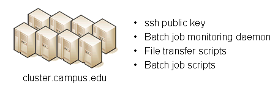

### Job monitor daemon

A remote job monitor runs a daemon process and reports batch job status to a central job monitor located on the HUB. The daemon process is started by the central job monitor on demand. The daemon terminates after a configurable amount of inactivity time. The daemon code needs to be installed in the location declared in the monitors.dat file. The daemon requires some initial configuration to declare where it will store log and history files. The daemon does not require any special privileges any runs as a standard user. Typical configuration for the daemon looks like this:

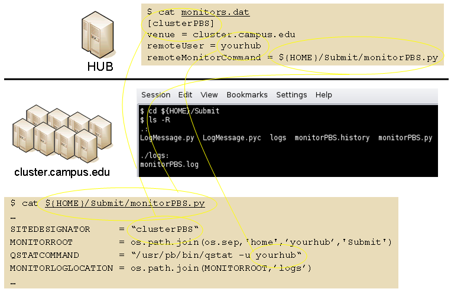

The directory defined by MONITORLOGLOCATION needs to be created before the daemon is started. Sample daemon scripts used for PBS, LSF, SGE, Condor, Load Leveler, and Slurm batch systems are included in directory `BatchMonitors`.

### File transfer and batch job scripts

The simple scripts are used to manage file transfer and batch job launching and termination. The location of the scripts is entered in `sites.dat`.

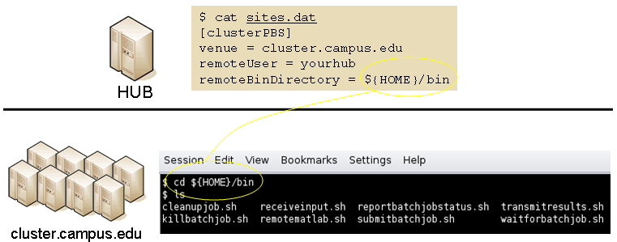

Examples scripts suitable for use with PBS, LSF, Condor, Load Leveler, and Slurm are included in directory `Scripts`. After modifications are made to `monitors.dat` the central job monitor must be notified. This can be accomplished by stopping and starting the `submon` daemon or a `HUP` signal can be sent to the `monitorJob.py` process.

#### File transfer - input files

Receive compressed tar file containing input files required for the job on `stdin`. The file transferredTimestampFile is used to determine what newly created or modified files should be returned to the HUB.

```
receiveinput.sh jobWorkingDirectory jobScratchDirectory  transferredTimestampFile
```

#### Batch job script - submission

Submit batch job using supplied description file. If arguments beyond job working directory and batch description file are supplied an entry is added to the remote site log file. The log file provides a record relating the HUB end user to the remote batch job identifier. The log file should be placed at a location agreed upon by the remote site and HUB.

```
submitbatchjob.sh jobWorkingDirectory jobScratchDirectory jobDescriptionFile
```

The `jobId` is returned on `stdout` if job submission is successful. For an unsuccessful job submission the returned `jobId` should be `-1`.

#### File transfer - output files

Return compressed tar file containing job output files on `stdout`.

```
transmitresults.sh jobWorkingDirectory
```

#### File transfer - cleanup

Remove job specific directory and any other dangling files

```
cleanupjob.sh jobWorkingDirectory jobScratchDirectory jobClass
```

#### Batch job script - termination

Terminate given remote batch job. Command line arguments specify job identifier and batch system type.

```
killbatchjob.sh jobId jobClass
```

#### Batch job script - post process

For some jobClassses it is appropriate to preform standard post processing actions. An example of such a jobClass is Pegasus.

```
postprocessjob.sh jobWorkingDirectory jobScratchDirectory jobClass
```

## Access Control Mechanisms

By default tools and sites are configured so that access is granted to all HUB members. In some cases it is desired to restrict access to either a tool or site to a subset of the HUB membership. The keywords restrictedToUsers and restrictedToGroups provide a mechanism to apply restrictions accordingly. Each keyword should be followed by a list of comma separated values of userids (logins) or groupids (as declared when creating a new HUB group). If user or group restrictions have been declared upon invocation of submit a comparison is made between the restrictions and userid and group memberships. If both user and group restrictions are declared the user restriction will be applied first, followed by the group restriction.

In addition to applying user and group restrictions another mechanism is provided by the `executableClassificationsAllowed` keyword in the sites configuration file. In cases where the executable program is not pre-staged at the remote sites the executable needs to be transferred along with the user supplied inputs to the remote site. Published tools will have their executable program located in the `/apps/tools/revision/bin` directory. For this reason submitted programs that reside in `/apps` are assumed to be validated and approved for execution. The same cannot be said for programs in other directories. The common case where such a situation arises is when a tool developer is building and testing within the HUB workspace environment. To grant a tool developer the permission to submit such arbitrary applications the site configuration must allow arbitrary executables and the tool developer must be granted permission to send files from their `$HOME` directory. Discrete permission can be granted on a file by file basis in `appaccess.dat`.
