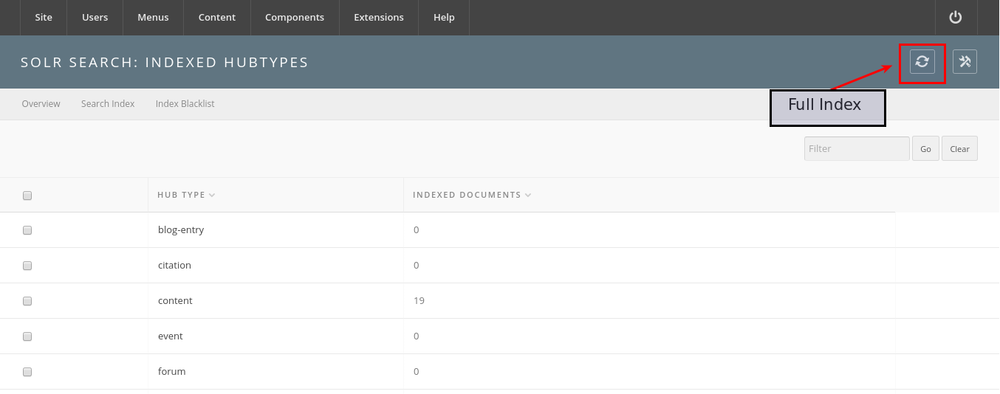
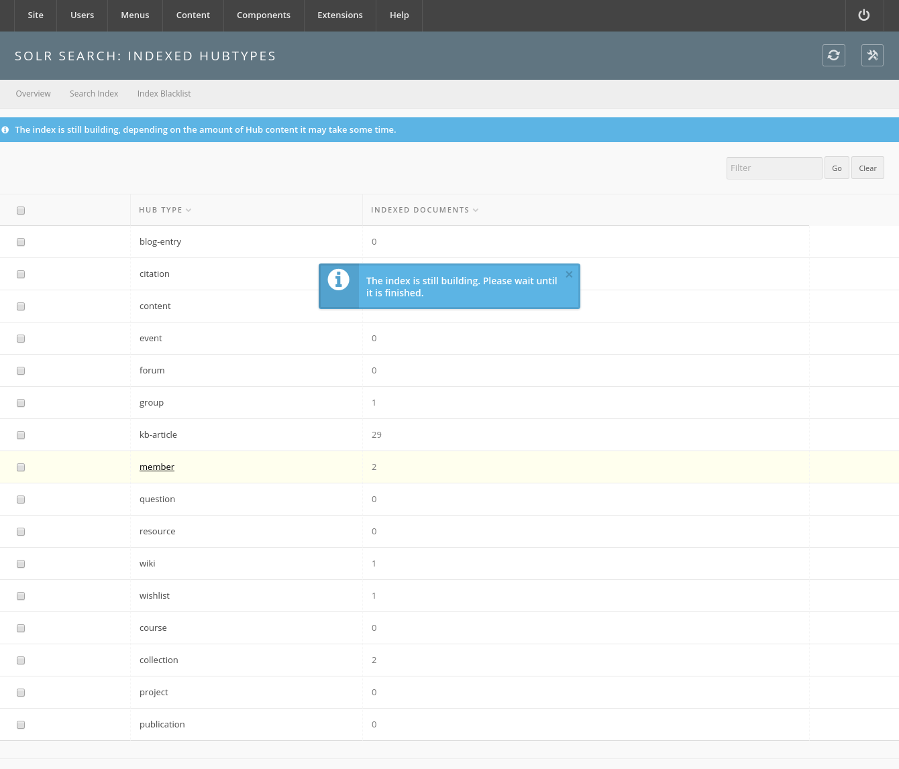
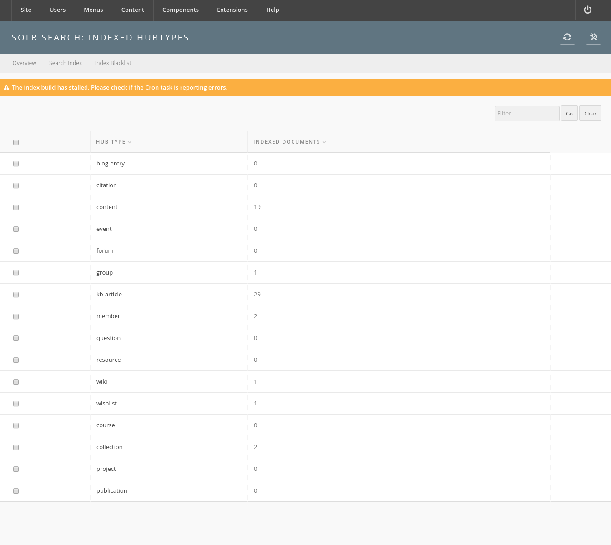

<!--
status: imported
source: https://help.hubzero.org/documentation/240/installation/el8/addons/solr
source-id: 3677
modified: 2017-01-10
imported: 2026-09-09
source-state: unpublished
-->
# Solr-powered Search

## Introduction

Apache Solr is a search engine platform which is relatively mature and has a lot of powerful and flexible configurations. There has been extensive work to implement it into the HUBzero CMS and is currently a work-in-progress.

Solr is an open-source, mature, and stable searching service that is built upon the Apache Lucene search engine. The service provides features which lend itself to scaling and has a rich open source community. It is a Java-based service which provides search results through HTTP. Many companies such as Instagram, eBay, and StubHub rely on Solr to provide advanced searching capabilities.

> **Warning:** The integration with Solr is currently under heavy development. It is **strongly recommended** to test on a QA / Stage host before using in a production environment.

## Installation & First Time Configuration

## Step 1: Install the hubzero-solr package

A system administrator must install the hubzero-solr RedHat or Debian Package using a package manager such as yum or aptitude. The package contains a version of Apache Solr and the configuration necessary for Solr to integrate with the CMS.

```
For RedHat / CentOS:
$    sudo yum install hubzero-solr
```

```
For Debian:
$    sudo apt-get install hubzero-solr
```

Once installed the service will need to be enabled.

```
$    sudo service hubzero-solr start
```

## Step 2: Configure Search Service in the CMS

The HUBzero CMS needs to know to use Solr Search instead of Basic Search. To do this, a Hub administrator will need to log into the Administrative Backend and Configure the Search Component.

You will need to set **Engine** to *Apache Solr.* Then click the "Solr tab".


The Solr tab's default settings will work for the open-source distribution.


> **Note:** HUBzero-hosted hubs are configured with different ports! The following scheme is used:

```
Development (dev.hub.org): 2090
Stage (stage.hub.org): 2091
Scan / QA (qa.hub.org): 2092
Production (hub.org): 2093
```

Click "Save and Close" to save the settings. If the hubzero-solr service is started and the correct settings were set in the steps above, the status screen should indicate that the search engine is responding.


If there were any issues with configuration, the following screen will appear.


This would be a point where a support ticket is filed for the system administrator to confirm that the service is running. Please include all configuration parameters contained in Step #3 when filing the ticket.

## Step 3: Enable the Search Background Worker

In order to keep the search index fresh, a background worker is implemented to process data from the CMS and push it into the Solr service.

> **Note:** Currently the background worker is implemented as a Cron task that is called once a minute. There is work being done to develop a daemon which listens to CMS events and processes data without relying on Cron.

To setup the Cron-based worker a Hub administrator must go into the Administrative Backend, go to Components, Cron, and add the Task as shown below:


Click "Save and Close".

## Step 4: Build the Initial Index

This implementation of Solr has hooks into the CMS which updates the index when a new record is added or marked for deletion. It will be necessary to add items which have been added before Solr was activated.



> **Note:** This operation should only need to be completed once. You will be unable to start this operation until it finishes for the first time.



The "Full Index" button populates a Queue which is periodically serviced by a worker. The worker will process the records and format for consumption by the Solr service. **This may take several hours to fully complete if the Hub has a lot of content.**

If an error with the worker occurs, a warning message such as this will appear.



## Search Breadth

Te question is “What can I search for?”. The answer is “anything you have access to contained within the list in Search Categories. To see all content within these categories perform a simple query using the wildcard character “\*” as shown below.


A better of what is currently inside Solr’s index can be viewed on the administrative backend by going to Components >> Search >> Search Index Tab. The number of index items is located to next to each type. Clicking on the name of the hub type will perform a search on that type, displaying all items that are within the index of that type.


For instance clicking “Resources” shows the following screen:


One can perform additional searching using the “Filter” bar on top of the results listing.
