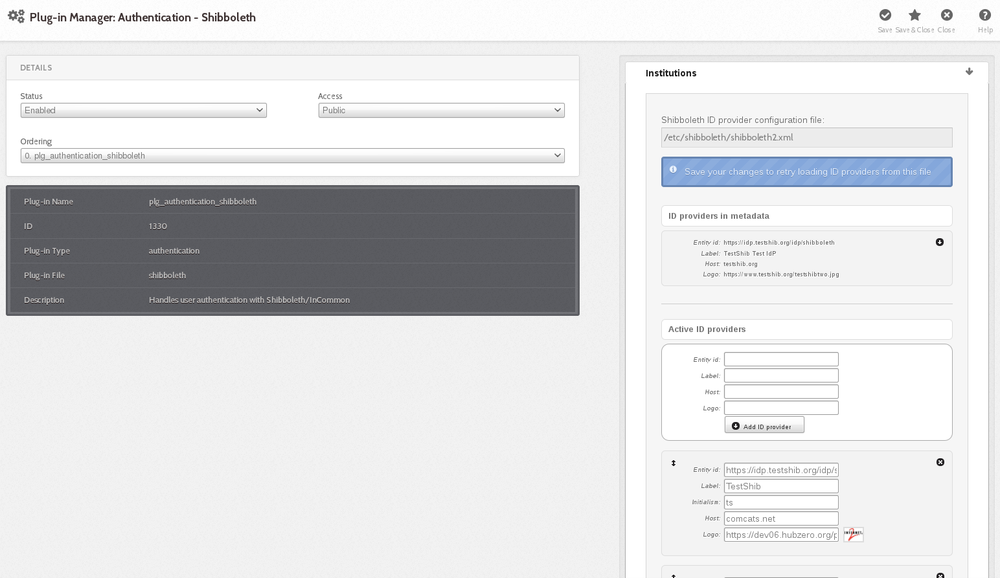

<!--
status: imported
source: https://help.hubzero.org/documentation/240/installation/el8/addons/shibboleth
source-id: 3678
modified: 2014-09-28
imported: 2026-09-09
source-state: unpublished
-->
# Shibboleth authentication

## Shibboleth Authentication is an unsupported feature of HUBzero. This documentation has not been verified against HUBzero 2.2 or RedHat. It is included here for completeness. Please send any corrections or feedback to support@hubzero.org

Installation

> **Note:** If installing on Debian GNU/Linux

```
# apt-get install hubzero-shibboleth
```

> **Note:** If installing on Redhat/CentOS Linux

```
# yum install hubzero-shibboleth
```

If you installed the hubzero-shibboleth package on Debian, you're set. The relevant packages were included as dependencies. The packages are:

`shibboleth2-sp-utils shibboleth2-sp-schemas libapache2-mod-shib2`

At the time of this writing, Shibboleth is not distributed in the core repositories for Redhat/CentOS. You can read about how to add a repo that has what you need here:

<https://wiki.shibboleth.net/confluence/display/SHIB2/NativeSPLinuxRPMInstall>

## Generate a private key

Use `shib-keygen` to generate `/etc/shibboleth/sp-key.pem`. Note that this utility may not be on your path unless you are root.

## Configure Shibboleth

[Shibboleth official quickstart documentation reference](https://wiki.shibboleth.net/confluence/display/SHIB2/NativeSPGettingStarted)

The main configuration file is located at `/etc/shibboleth/shibboleth2.xml`. There are some other files that might be of interest to you here, but the defaults are acceptable to get your hub working with InCommon.

In `shibboleth2.xml`:

- Update `<ApplicationDefaults entityID="{url}" ...>` so `{url}` is `https://{your hostname}/Shibboleth.sso`. This is your Shibboleth endpoint, designated later by the Apache configuration as the location where the shib2 module will manage communication with ID providers.
- Update `<Sessions ...handlerSSL="false" ...>` to `handlerSSL="true"`, if it is not already

## Configure Apache

[Shibboleth official Apache configuration reference](https://wiki.shibboleth.net/confluence/display/SHIB2/NativeSPApacheConfig)

Ensure that Apache is loading the module. Typically this means that there is a link in `mods-enabled` to `shib2.load` in `mods-available`

`ln -s /etc/apache2/mods-available/shib2.load /etc/apache2/mods-enabled`

If you do not have this directory structure you can also enable the module directly in the next step by adding this to your Apache configuration file:

`LoadModule mod_shib /usr/lib/apache2/modules/mod_shib2.so`

In the conf file defining your SSL host, (usually located in `/etc/apache2/sites-enabled`):

- If not already set in the SSL `<VirtualHost>` `UseCanonicalName on;`
- To enable shibd's endpoint, add: `<Location /Shibboleth.sso> SetHandler shib </Location>`
- HUBzero CMS routing will stomp on /Shibboleth.sso unless you change the mod_rewrite rules a bit.
  - You should have a line like: `RewriteRule (.*) index.php` probably preceded by a few 'RewriteCond's. Add a new condition to exempt the shib2-controlled path:
  `RewriteCond %{REQUEST_URI} !/Shibboleth.sso/.*$ [NC]`

Restart apache: `/etc/init.d/apache2 restart`

## Verify

From the same host (this is IP-restricted):

`wget -q --no-check-certificate https://localhost/Shibboleth.sso/Metadata -O - | tee /etc/shibboleth/sp-metadata.xml`

This command should write XML to the listed file (and stdout) wrapped in `<md:EntityDescriptor xmlns:md="urn:oasis:names:tc:SAML:2.0:metadata" ...>`

*If it does not, review the references above to troubleshoot.*

You may skip to "Configuring HUBzero CMS!" if you do not want to test interop more thoroughly with the TestShib ID provider, but I would recommend you do this test.

## Upload metadata to TestShib.org

- Copy the metadata generated above to some unique name, for example:

`cp /etc/shibboleth/sp-metadata ~/{your hostname}-sp-metadata.xml`

- Upload that file here: <https://www.testshib.org/register.html>. Uploading a file of the same name will overwrite it on the testshib server, should you need to make any adjustments.

## Change your local configuration to accept TestShib as an ID provider

- Visit this URL to get an appropriate test configuration XML file:

`https://www.testshib.org/cgi-bin/sp2config.cgi?dist=Others&hostname={your hostname from the Shibboleth Configuration step above})`

- Assuming that looks OK, copy the output over your existing /etc/shibboleth/shibboleth2.xml:
  `wget -q --no-check-certificate "https://www.testshib.org/cgi-bin/sp2config.cgi?dist=Others&hostname={your hostname}" -O /etc/shibboleth/shibboleth2.xml`

Restart services: `/etc/init.d/shibd restart && /etc/init.d/apache2 restart`

## Configuring HUBzero CMS

If you do not already have `plg_authentication_shibboleth` installed, this package installs a tarball in `$(PREFIX)/usr/lib/hubzero` that you may install using HUBzero CMS's package management interface at `/administrator`.

## Manage ID providers on HUBzero CMS's admin page

In `Extensions->Plugins`, select `Authentication - Shibboleth` 

Ideally it should look a lot like the screenshot in that it found testshib in your XML configuration. If so, you can click the down arrow by that entry to move it into your active provider list.

This may fail if, for example, `shibboleth2.xml` is not readable by the web user, or if you changed your configuration so that the file is located somewhere unexpected.

It is not necessary, however, for the web server to read this file. If you'd like you can simply enter the EntityID for testshib (<https://idp.testshib.org/idp/shibboleth>) in the white box with the button labeled "Add ID provider". Enter something, eg "TestShib" for the label.

Quick run-down of the fields here:

- Entity id: (required) corresponds to the corresponding entityId in shibboleth2.xml and must match exactly for things to work out.
- Label: (required) name to show on the log-in button of your hub for this provider
- Initialism: (optional) if you have more than ten supported ID providers, the log-in list becomes searchable, and in this case you can add a short name for institutions so that they will come up when the user types that as well as when they type a portion of the label. (For example, if you federated with the National Science Foundation you might add "NSF" here)
- Host: (optional) institutions may be pre-selected if the IP address of the user looks like it is in a particular network, eg, to follow the previous example, nsf.gov to pre-select the National Science Foundation
- Logo: (optional) also shown on the button. Enter a URL here to make a iconified copy of it. You may have better results in some cases if you resize to no more than 28px in either extent yourself.

Finally, you can select the order in which you would like the button to appear on the login page here. When you're done, click "Save & Close" in the top right. This will take you back to the screen where you can click the icon in the "Status" column to enable the plug-in.

## Try logging in!

(If you run into any problems here, there might be a clue in [TestShib's logs of its ID provider actions](https://idp.testshib.org/cgi-bin/idplog.cgi?lines=150&logname=idp-process.log))

Since TestShib doesn't release any attributes, you'll have to enter a name when you log in. Hopefully you can negotiate to get names and emails released to your hub with "real" ID providers, which you're now clear to do if everything worked out.

## Help?

- If you have a problem that you can't resolve that appears to be related to Shibboleth's machinery, please consult [the official documentation](https://wiki.shibboleth.net/confluence/display/SHIB2/Home) carefully.
- If you can't resolve the problem, there is a mailing list: <https://www.shibboleth.net/community/lists/>
- If the problem you are experiencing appears to be related not to the Shibboleth interchange mechanism but to something in the hub's implementation of the log-in procedure, visit <https://help.hubzero.org/support> to enter a support ticket describing the situation.
- Test that you can access https://idp.purdue.edu/idp/shibboleth or similar directly.
