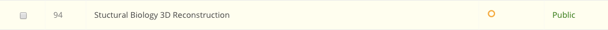
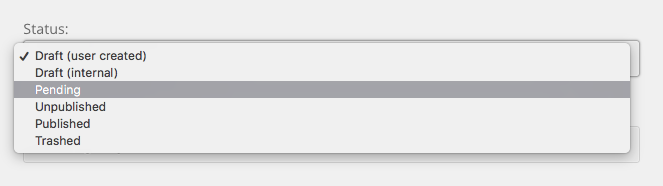

<!--
status: rewritten
reviewed-against: 2.4-main @ 35f103b1b3
reviewed: 2026-09-10
screenshots: stale
source: https://help.hubzero.org/documentation/240/managers/maintenance/approvingcontent
source-id: 3340
imported: 2026-09-09
-->
# Approving Content

When auto-approval is off, a resource or publication a user submits sits in a
pending state until an administrator publishes it. This page covers finding
that queue and clearing it.

Two components on the hub queue what users submit: **Resources** and
**Publications**. If your hub does not take submissions from members — a hub
that is a website with a tool or two on it, run by one office — the queues
stay empty and there is nothing here for you. If it does, this is the job
that has to be done promptly rather than well. A submitter who waits a week
to hear whether their dataset was accepted assumes the hub is abandoned.

> **Note:** This is not moderation of comments, forum posts or reviews.
> Those are not queued; they appear at once and are dealt with afterwards
> through the abuse reports on the [Support](03-tickets.md) screen. Approval
> here is a gate in front of publishing, and it applies only to resources and
> publications.

A worked scenario runs through the page: the hub has just been named in a
published paper, a dozen groups have registered, and eight datasets and two
tools are sitting in the queues on Monday morning.

## Turning auto-approval on or off

This is the decision that determines how much of the rest of the page you
ever do. **Auto-approve** is **No** on a stock hub, so everything a member
submits waits for you. That is the right default for a hub whose reputation
rests on what it publishes, and the wrong one for a hub whose members are all
known colleagues, where it just adds a day's delay to everything.

If your hub is somewhere between the two — trusted people plus the public —
leave **Auto-approve** at **No** and list the trusted accounts in
**Auto-approved Users** instead. Their submissions skip the queue; everyone
else's waits.

> **Warning:** Turning **Auto-approve** on publishes submissions the moment
> they are made, with no review, to whoever the access level allows. On a hub
> that has just been written about in a paper, that is also the moment it
> becomes worth somebody's while to submit something you would not want
> published. Turn it on for a closed hub, not an open one.

Both components that queue submissions carry the setting in their **Options**
(the **Options** button in the component's toolbar).

**Resources** — see the [generated parameter
list](../../reference/configuration/components/resources.md):

| Parameter | Label on screen | Default |
|---|---|---|
| `autoapprove` | **Auto-approve** | No |
| `autoapproved_users` | **Auto-approved Users** | empty |
| `autoapprove_content_check` | **Auto-approve Content Check** | No |
| `email_when_submitted` | **Notify Upon Submission** | `{config.mailfrom}` |
| `email_when_approved` | **Email When Published** | No |

**Auto-approved Users** is a list of usernames whose submissions skip the
queue even when **Auto-approve** is off. **Auto-approve Content Check**
requires an auto-approved front-end submission to actually have content before
it is accepted.

**Publications** — see the [generated parameter
list](../../reference/configuration/components/publications.md) — has the same
first two: **Auto-approve** and **Auto-approved Users**.

## Resource states

A resource's state is the `published` column, and the admin list's **Status**
filter offers every one of them:

| Value | Filter label |
|---|---|
| 2 | Draft (external) |
| 5 | Draft (internal) |
| 3 | **Pending** |
| 0 | Unpublished |
| 1 | Published |
| 4 | Trashed |
| -1 | Archived |

Only state 3 is the approval queue. The other unpublished states are drafts
the author has not submitted, or items an administrator has taken down.

## Clearing the queue

Monday morning, eight datasets waiting. This is the round trip:

1. Go to **Components → Resources**.
2. Set the **Status** filter to **Pending**.
3. Open each one by its title and read it. Approval is a publishing decision
   — the licence, the access level and whether the description says what the
   thing actually is are all yours to check, and nobody else will.
4. Tick the resources to approve and select **Publish** in the toolbar, or
   set the status on the edit form of the one you have open.
5. For anything you are not publishing, leave it pending and tell the
   submitter why. Unpublishing it instead takes it out of the **Pending**
   filter, and it is then in a state nobody is looking at.

Publishing is reversible: set a resource back to Unpublished and it leaves the
site, with nothing lost. Nothing on this screen deletes a submission.

Publishing stamps the publish-up date and, if **Email When Published** is on,
notifies the submitter. The resource then appears in browse and search for
anyone its access level allows.

Publishing requires the `core.edit.state` permission on `com_resources`. A
resource checked out by another administrator is skipped.

## Publications

Publications move through a curation workflow rather than a single pending
flag, and the admin list's **Status** filter names each stage:

| Value | Filter label | Meaning |
|---|---|---|
| 3 | draft | Author is still working |
| 4 | ready | Posted for review |
| 5 | pending approval | Awaiting an administrator |
| 7 | changes required | Sent back to the author |
| 1 | published | Live |
| 0 | unpublished | Taken down |
| 2 | deleted | Removed |

Publications take longer per item, so do them second. Go to **Components →
Publications**, filter to **pending approval**, and open a publication to
review it. The curation panel walks the manifest block by
block; each block is either approved or sent back, and a publication with any
block outstanding moves to **changes required** rather than **published**.

The `mod_mycuration` module gives curators a site-side list of the items
assigned to them, split into **Review** and **Pending changes**.

## Where the counts come from

The **Resources** dashboard panel counts each state directly:

<!--include: core/modules/mod_resources/helper.php:32-45-->
