<!--
status: imported
source: https://help.hubzero.org/documentation/240/managers/maintenance/tools
source-id: 3341
imported: 2026-09-09
-->
# Tools

## Tool Pipeline (a.k.a. Contribtool)

The tool pipeline is the process that manages the publishing process for tool resources on the hub. There are nine states of a tool within the tool pipeline:

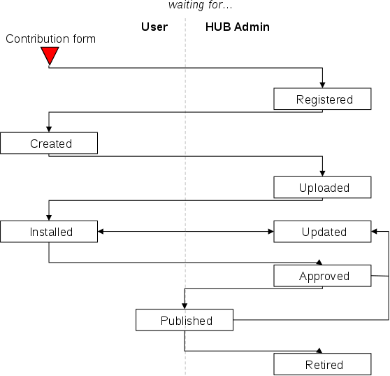

Each state is associated with a set of tasks that either the tool developer or the hub administrator must perform. We will refer to tasks the tool developer must perform as "user tasks", and tasks the hub administrator must perform as "admin tasks".

## Preparation

To accomplish many of the admin tasks, the user acting as the admin must be a part of the "apps" group. To be added to the "apps" group:

1. Login to the hub's administrative back end and find the "Groups" component.
2. Type "apps" into the search box.
3. Click on the number under the column "Total Members"
4. Type the admin's username into the Add input box, choose "Members" from the drop down menu, and push the "Add users" button.

## Registering a Project


The first step in the tool pipeline is for the tool developer to register the tool by filling out the tool contribution form. This is a user task. Go to the web page https://yourhub.org/contribute (substituting "yourhub.org" with the name of your hub). Use the "Getting Started" button in the upper right side of the web page to start the contribution process. On the left side of the web page, a list of contribution types will be shown. Choose the TOOLS contribution type.

The tool registration form will be presented. The form asks for some basic information regarding the name of the tool, a short description of the tool, and who can access the source code repository. There are also fields available to add restrictions on who can run the tool once it has been published, and who can access the Trac project area. All of the information on this page can be changed at a later date, except for the tool name. Once the tool name has been registered, it cannot be changed, so pick a good one. When the registration form has been completed, push the "Register Tool" button at the bottom of the page, and the state of the tool will be changed to "Registered"

## Registered to Created

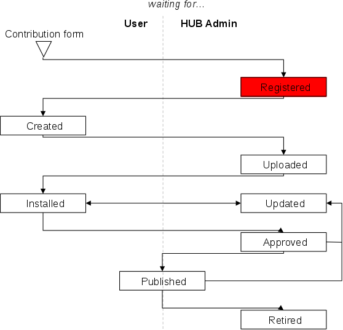

Once the tool has been registered by the tool developer, it is up to the administrator to create the project. Creating the project is an admin task. Start by going to the web page https://yourhub.org/tools/pipeline. This page lists out all tool contributions on the hub. Tools that require administrator attention are highlighted. If a tool has been registered by a tool developer, but there are no tool contributions listed on the tool pipeline web page, there may be a privileges related error. Make sure the administrator account being used is a member of the "apps" group. Instructions on how to do this are in the section labeled "Preparation".

The newly registered project should be highlighted on the tool pipeline web page. Choose this project by clicking on the tool name, which is a link to it's tool status page. The tool status page contains the tool information that the developer provided on the registration form and a set of Developer Tools on the left side of the web page. On the right side of the web page, the "What's next?" status is provided, which gives information regarding the steps that need to be completed before the tool can be published on the hub. Any tasks that have been checked off have been completed. Tasks that have an arrow next to them are tasks that can be completed now.

Special for the administrator, there is a section of "Administrator Controls" on the left side of the page, under the Developer Tools. To create the tool project, the admin must press the link labeled "Add Repo". This starts a process that creates a Subversion source code repository, Trac project wiki pages, and sets up access for the tool for the users listed on the development team. When the process has completed, the results are displayed for the administrator to see. A green box generally means nothing catastrophic has happened and the tool project are has been successfully created. In the case something fails, a red box will be displayed listing the errors encountered. Running the process multiple times by repeated presses of the "Add Repo" link generally has no harmful effects, in that if the pieces of the project area already exist, they will not be overwritten, and if they do not exist, they will be created.

The last step to creating the tool project area is to flip the status of the project from Registered to Created and pressing the "Apply change" button at the bottom of the Administrator controls.

## Created to Uploaded

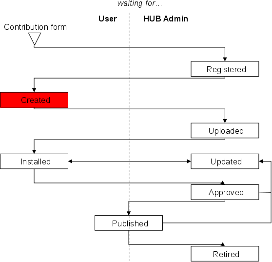

After the tool project has been created, the tool developer needs to upload their tool source code into the source code repository. This is a user task. Instruction listing out the commands involved with upload source code to the project's source code repository are easily accessible from the tool status page in the tool pipeline. Start by accessing the tool pipeline web page https://yourhub.org/tools/pipeline. Find the tool project on the tool pipeline web page, and click on the tool project's name. This is a link which leads to the tool status page. While in the Created state, the "What's next?" section on the right side of the web page contains a link to the instructions. We will review the requirements for installing a tool in the HUB environment and the process of doing so.

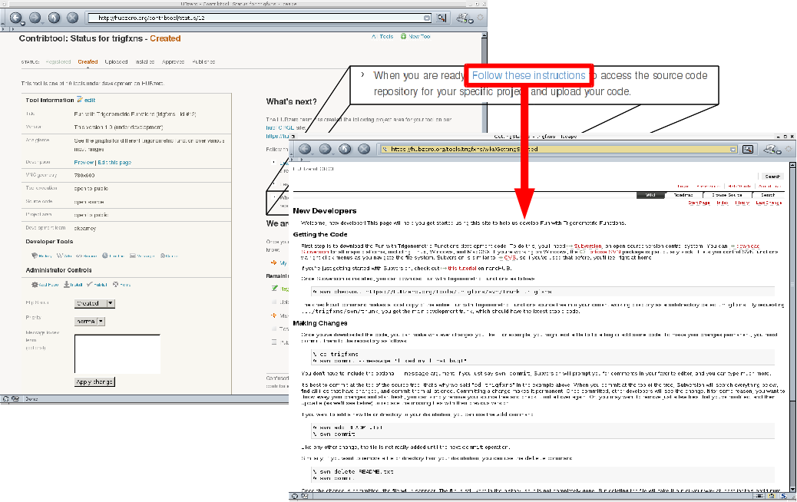

There are four requirement for installing a tool in the HUB environment:

1. Source code
2. Graphical User Interface
3. Makefile
4. Invoke script


Source code includes all files related to running the application with the tool.xml and possibly a wrapper script as the exceptions. Source code is needed as a part of the installation process. No binaries from the source code of the application should be stored in source code repository. It is alright to store binary data files, like images, in the source code repository, but in most other cases, storing binaries from the application instead of the actual source code leads to future compatibility problems, even when the binaries claim to be platform independent.


All tools need a graphical user interface. There are several toolkits available including Qt, GTK, wxWidgets, and Tcl/Tk. If your tool does not already have a graphical user interface, we suggest using Rappture (http://rappture.org). With Rappture, you can quickly develop a graphical user interface that can guide users through the process of running the tool and viewing results, all in one application. Rappture also include many hooks into the HUB infrastructure, which makes it a great choice for tool developers.


All tools need a Makefile. The Makefile holds the instructions for compiling and installing binary files. Even tools that do not have source code that needs to be compiled still need a Makefile.


All tools need an invoke script. Invoke scripts hold details about how to launch to the tool in the HUB environment. Generally, invoke scripts are very simple, one line calls to the HUB invoke script with a few options.

While generating the source code and graphical user interface are outside of the scope of this tutorial, details will be given later regarding creation of a typical Makefile and invoke script.

There are eight steps related to uploading source code to the source code repository.

1. Checkout a copy of the tool's source code repository.
2. Add source code to the src directory of the tool's repository.
3. Add a Makefile in the src directory of the tool's repository.
4. Add tool.xml to the Rappture directory of the tool's repository.
5. Check the middleware/invoke script.
6. Test the code in the workspace.
7. Clean the directories before committing.
8. Commit the changes from the local copy of the repository.

All of these steps can be performed from within the workspace.

The first step of uploading source code to the source code repository is to checkout a copy of the tool's source code repository. This can be done by using the svn checkout command.

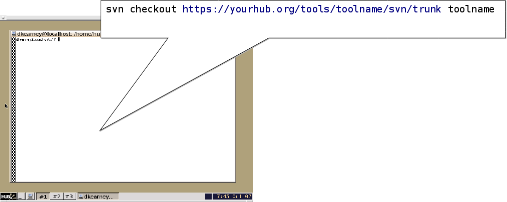

```
svn checkout https://yourhub.org/tools/toolname/svn/trunk toolname
```

In the example, replace "yourhub.org" with the name of the hub hosting the tool's source code repository. Also, substitute the term "toolname" with the shortname of the tool. Executing this command will download a copy of the tool's source code repository from the repository server, hosted on "yourhub.org", and place the copy on the machine where the command was executed. If the command was executed inside of a workspace, the copy of the tool's repository server will be made inside of the workspace. This copy will be referred to as the local copy of the tool's source code repository. The local copy of the repository will be stored in a directory, with the name substituted for "toolname".

The second step of uploading source code to the source code repository is to add source code to the src directory of the tool's repository. This can be done with the svn add command. This step involves (1) changing directories into the local copy of the repository, here referred to as toolname, (2) copying source code files into the src directory, and (3) lastly using the svn add command to notify the local repository that files need to be added to the source code repository.

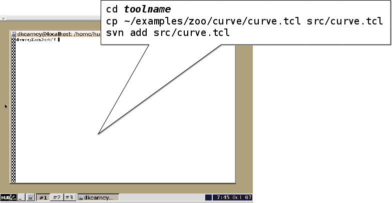

```
Line    Example:
  1       cd toolname
  2       cp /apps/rappture/examples/zoo/curve/curve.tcl src/curve.tcl
  3       svn add src/curve.tcl
```

All files will need to be added to the source code repository. They can be done one by one, as shown above, or by directory.

The third step of uploading source code to the source code repository is to add a Makefile to the src directory. The svn add command will be used to complete this task. If a Makefile does not exists, one can easily be created using a text editor. In the workspace, the gedit program is a convenient text editor. From within the toolname directory, issue the command:

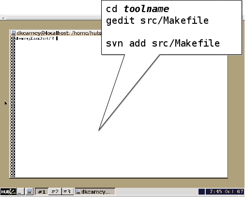

```
gedit src/Makefile
```

If no Makefile exists, add the following text to the file.

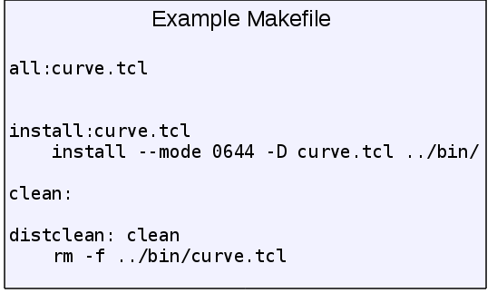

```
Line    Example:
  1       all: curve.tcl
  2
  3       install: curve.tcl
  4           install --mode 0644 -D curve.tcl ../bin/
  5
  6       clean:
  7
  8       distclean: clean
  9           rm -f ../bin/curve.tcl
```

In this example, the source code is a single tcl script named curve.tcl. Since the source code does not need to be compiled in this case, the "all" target is empty. If there was source code to be compiled, line 2 would be tabbed in once and include a compile line like "gcc -o curve curve.c". The install target, starting on line 3, is responsible for installing the executables and related scripts into the ../bin directory. Executables should be placed in the bin directory. Line 4 is the action of the install target. It uses the shell program named "install" to move the files from the src directory to the bin directory, and appropriately set the permissions of the file. The clean target, on line 6, is responsible for removing files temporary files, usually left over from compilation. The distclean target, on like 8, calls the clean target from line 6, and then removes the tcl script that was placed in the bin directory by the install target. The distclean target is responsible for removing any files that were generated be install target. After running the distclean target, the local repository should be in the same state as when it was first checked out.

Once the Makefile has been created, save the file and exit the gedit program. Lastly run the svn add command on the file src/Makefile to add it to the local copy of the source code repository.

The fourth step of uploading source code to the source code repository is to add the tool.xml file to the Rappture directory. To add the tool.xml file to the local copy of the source code repository, first copy the file into the Rappture directory, then use the svn add command to notify the local copy of the repository that a file needs to be added.

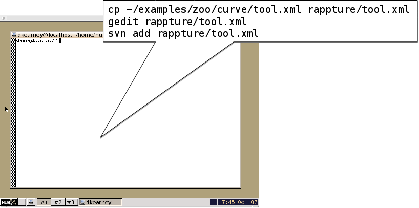

```
Line    Example:
  1       cp /apps/rappture/examples/zoo/curve/tool.xml
            rappture/tool.xml
  2       svn add rappture/tool.xml
```

The fifth step of uploading source code to the source code repository is to check the middleware/invoke script. Inside of the middleware directory, there should exist a file named invoke. If the file does not exist, use gedit to create it, then add it to the repository using the svn add command, just as was done for the Makefile in step 3. The invoke script is responsible for setting up the tool environment and launching the tool when a user clicks the Launch button from the tool resource page. The default invoke script looks like this:

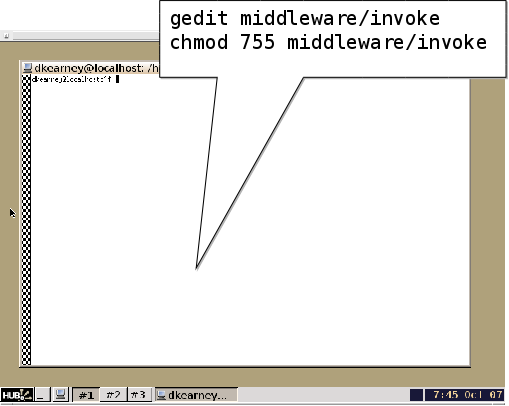

```
Line    Example:
  1       #!/bin/sh
  2
  3       /apps/rappture/invoke_app "$@" -t toolname
```

In the example above, the invoke script calls the HUB invoke script located at /apps/rappture/invoke_app. On older hub setups, /apps/rappture/invoke_app is a file that only supports launching rappture applications. On newer hub setups, /apps/rappture/invoke_app is a link to /apps/invoke/current/invoke_app, which is capable of launching all rappture applications and a majority of non-rappture applications.

The invoke_app script accepts a number of flagged options. Some of the more popular ones include:

```
-r  Rappture version (current, dev)
-t  tool name
-T  tool root directory
-e  environment variable to set
-p  add a path to the PATH environment variable
-C  command to launch the tool
-A  additional arguments to add to the command for launching the tool
-c  commands to start in the background before launching the tool, like filexfer
```

The example above takes advantage of the -t flag to tell invoke_app that the name of the tool is "toolname". The invoke_app script contains more details about the available flags and how to use them.

The last task of this step is to ensure the middleware invoke script has execute permissions. This is accomplished by using the shell's chmod command:

```
chmod 755 middleware/invoke
```

The sixth step of uploading source code to the source code repository is to test the tool in a workspace. If the tool runs properly in a workspace when started from an invoke script, it is very likely that it will run properly when installed in the hub environment. Testing the code in the workspace also exercises the Makefile and invoke script, ensuring they are also functioning properly. Here are the commands:

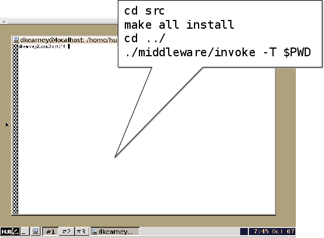

```
Line    Example:
  1       cd src
  2       make all install
  3       cd ../
  4       ./middleware/invoke -T $PWD
```

In the above example, the code is compiled and installed by (1) changing directories into the src directory, and (2) issuing the command "make all install". The shell command "make" looks for a file named Makefile, and runs the targets specified as its arguments. In this case, it runs the all and install targets. Next (3) change directories back to the tool's root directory and run the middleware/invoke script, providing the option "-T $PWD". Recall from earlier, the -T option specifies the tool root directory. The $PWD environment variable hold the present working directory, which in this case also happens to be the tool's root directory. When the Rappture GUI appears, press the simulate button to make sure the tool runs correctly.

It is important that this step is successfully completed by the tool developer. This is the same sequence of events that the administrator will do when installing the tool in the HUB environment. Any failures encountered while running this step will most likely be encountered again when installing the tool in the HUB environment, so they should be resolved prior to changing the tool status to Uploaded in the tool pipeline.

The seventh step of uploading source code to the source code repository is to clean up the local copy of the repository before committing. This will again utilize the Makefile located in the src directory. Here are the commands:

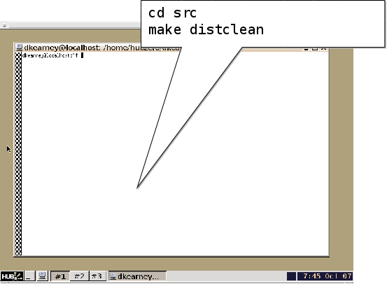

```
Line    Example:
  1       cd src
  2       make distclean
  3       cd ../
```

Earlier the Makefile was setup with a distclean target to clean up all files generated from the installation of the tool's source file. In this example, the distclean target of Makefile is called to do the cleanup of the previous install. It is important to clean up the repository before committing to avoid placing unnecessary binary and other temporary files into the source code repository stored on the repository server.

The eighth and last step of uploading source code to the source code repository is to commit the changes from the local copy of the repository to the repository server. This is accomplished by using the command svn commit. The svn commit command accepts the --message flag along with a message. With every commit to the repository, a message should be included detailing what is being committed. This will help later when searching for specific versions of the tool in the source code repository. Commits can be made from any directory in the local copy of the repository, but will only include files and directories underneath the present working directory. For this reason it is usually convenient to commit from the local copy of the repository's root (top) directory. Here is an example commit command with a message:

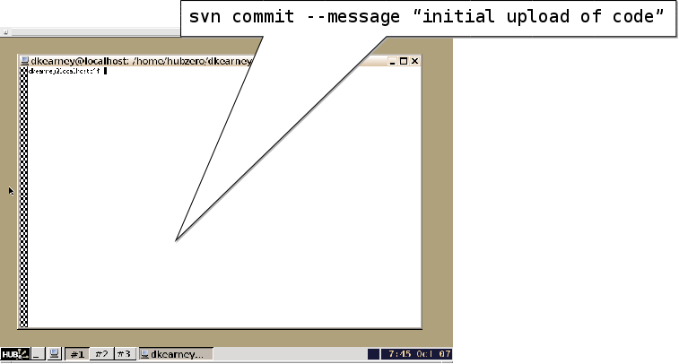

```
svn commit --message "initial upload of code"
```

After issuing the svn commit command, a prompt may appear requesting a username and password. Enter the username and password credentials for the HUB hosting the tool's source code repository.

Once the tool's source code has been uploaded to the repository server, the tool's status can be changed to Uploaded. Go to the tool's status web page in the tool pipeline, it can be found through the tool pipeline web page:

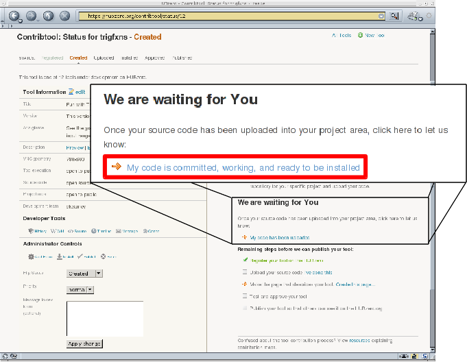

```
https://yourhub.org/tools/pipeline.
```

To make sure the source code was successfully committed, use the Timeline link under the Developer Tools section on the left side of the web page. The Timeline link will open a web page with the tool's project area. Note that the tool's project area may have restricted access that requires the user to login. The timeline lists out the most recent changes to the source code repository. The most recent changes for uploaded code should be listed at the top. Make sure the uploaded code is listed in the Timeline.

Back on the tool's status web page in the tool pipeline, there should be a "We are waiting for You" section under the "What's next?" section on the right side. When ready to change the status of the tool from Created to Uploaded, click the link labeled "My code is committed, working and ready to be installed". Clicking the link will change the status.

## Uploaded to Installed

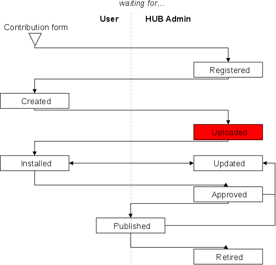

Once the tool has been uploaded by the tool developer, it can be installed in the HUB environment. This is an admin task. Navigate to the tool's status web page in the tool pipeline. Under the Administrator Controls section, on the left side of the web page, will be a link labeled Install. Clicking the Install link will start the installation background process which performs an svn checkout of the tool's source code repository into the /apps directory. The next step requires that the administrator login to the system, become the "apps" user, and compile the code. This can all be accomplished within a workspace.

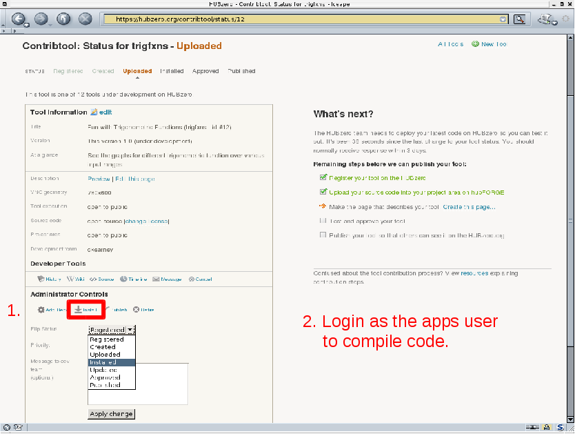

Inside of a workspace issue the following commands in an xterm:

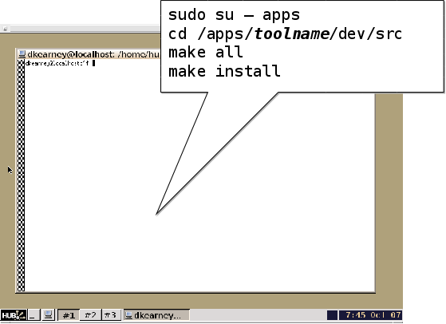

```
Line    Example:
  1       sudo su - apps
  2       cd /apps/toolname/dev/src
  3       make all
  4       make install
```

Become the apps user by using the shell's sudo command. If there are errors while becoming the apps user, go back to the beginning of this tutorial and ensure the login account being used is a member of the "apps" group. Change directories to the tool's installed dev directory, /apps/toolname/dev. Inside of the src directory, run the "make all" and "make install" commands to compile and install the code.

When the source code has been compiled and installed, go back to the tool's status page in the tool pipeline, flip the status from Uploaded to Installed, and press the Apply change button. Pressing the Apply change button will update the tool status web page.

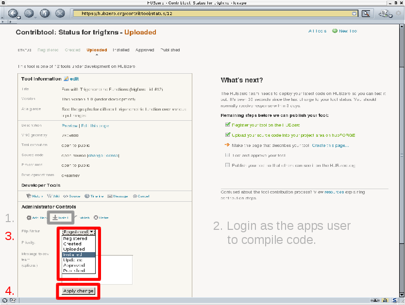

On the updated page, a Launch tool link will be made available, on the right side of the page, in the "What's next?" section. Click the Launch tool link and verify that the tool properly launches and runs.

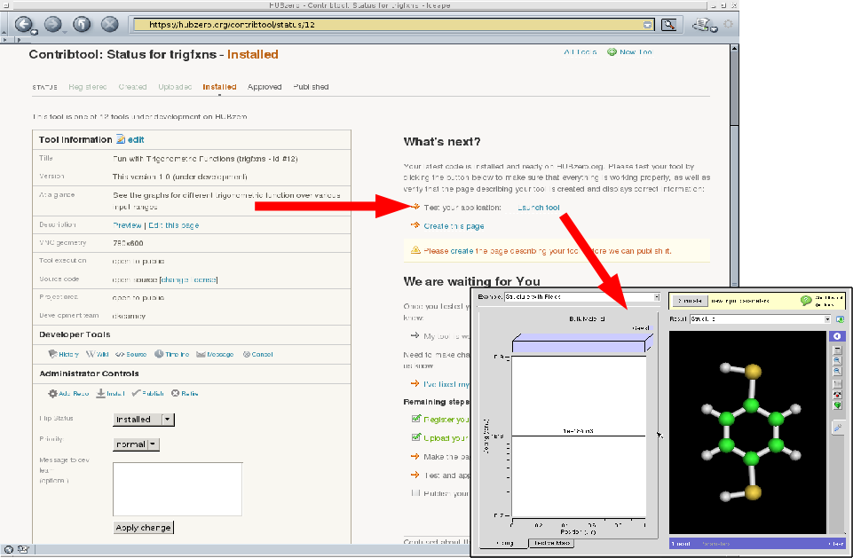

## Installed to Updated

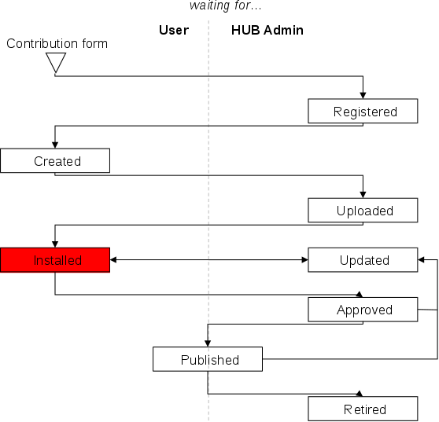

It is the tool developer's responsibility to test the operation of the tool and validate that it generates acceptable results. The tool developer may find an error or otherwise needs to update the code in the source code repository and have the tool reinstalled. Updating the tool is a user task. Any new changes to the tool should be committed to the source code repository. Next, the tool's status in the tool pipeline should be changed to the Updated state. Changing the status will notify the administrator that the tool is ready to be installed again.

## Installed to Approved


When the tool developer feels the tool is working properly, the approval process can be started. Tool approval is a user task. To approve a tool, the tool information page must be created. The tool information page is the web page listing the authors of the tool, credits, publications, and screen shots. To create the tool information page. Click the "Create this page" link in the "What's next?" section on the tool status page in the tool pipeline.

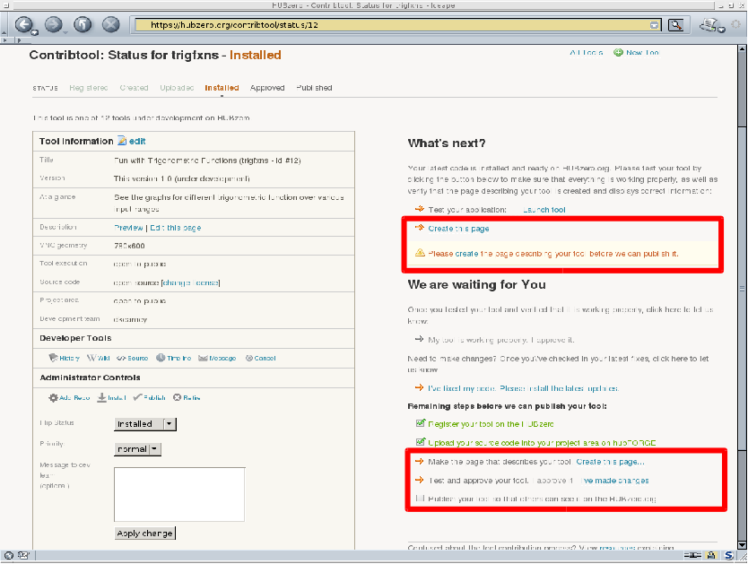

During the process of creating the tool information page, the necessary information will be collected and formatted. At the end of the process a preview page will be provided. The tool developer will need to confirm the layout and information on the preview tool page.

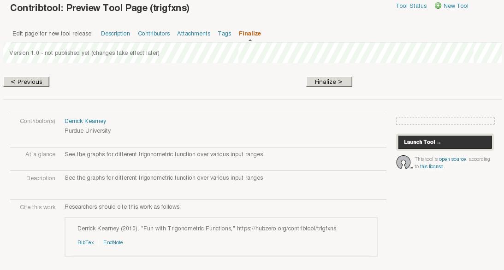

The tool developer will also need to choose a license under which the project will be published. Be sure to replace the template text in the license with the appropriate information.

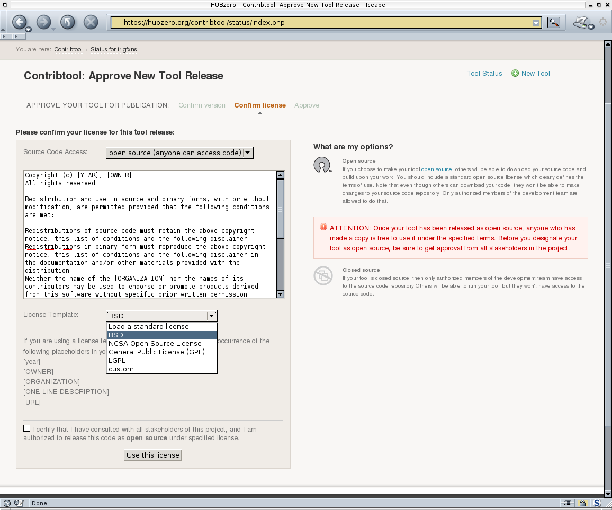

Finally, approve the tool by pushing the button labeled "Approve this tool". The status on the tool's status page in the tool pipeline will automatically be updated.

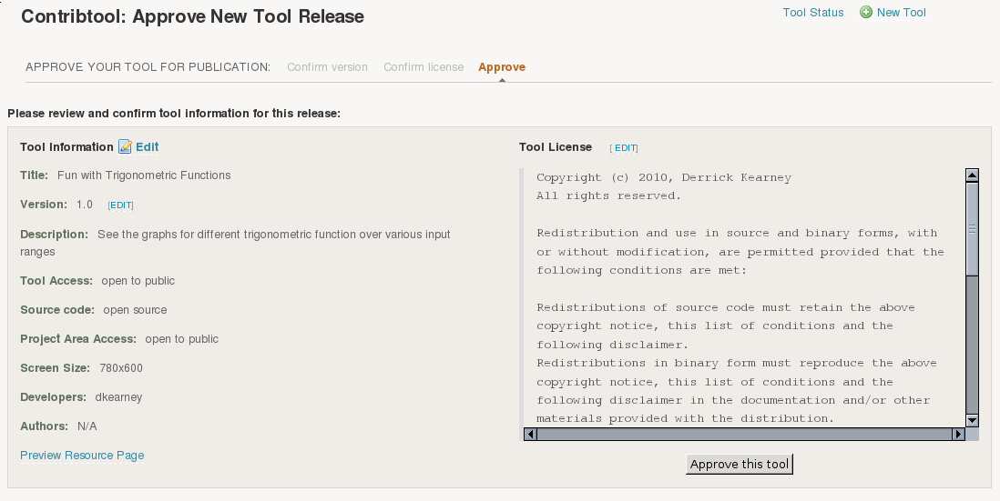

## Approved to Published

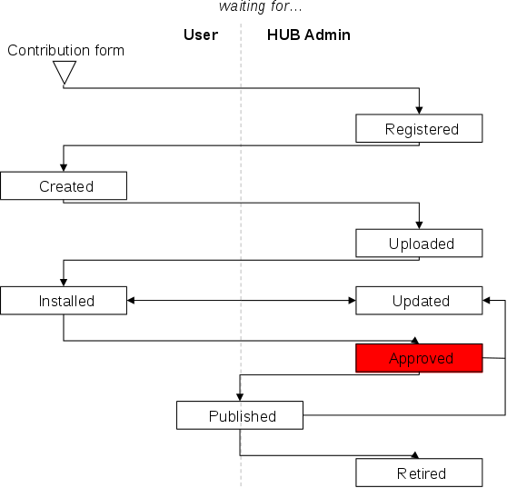

To publish a tool in the Approved state, the administrator must click the Publish link in the Administrator Controls on the tool's status page in the tool pipeline. This is an admin task. Clicking the Publish link updates the database, exposing the tool information page on the HUB. From the tool information page, the tool can be launched using the Launch tool link. The Publish link will run the publishing process and return the results to the administrator. Similar to the Installed state, successful completion will result in a green box with results. Failure will result in a red box with errors. After the results have been presented, flip the status from Approved to Published. and press the Apply change button.

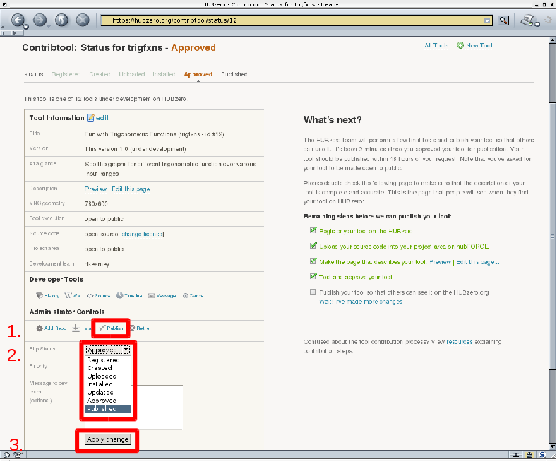

## Published to Updated

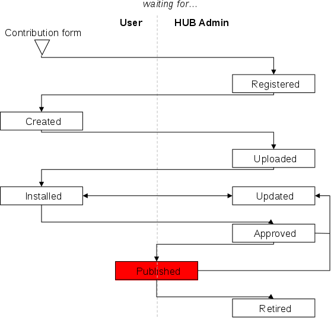

When the tool developer is ready to start testing a new release of the tool, they will commit all changes to the source code repository, and change the status on the tool's status page in the tool pipeline, from Published to Updated. Changing the status from Published to Updated does not unpublish of otherwise change the state of the already published tool. Changing the status will notify the administrator that the tool needs to be reinstalled. From here, the Install-Approve-Publish cycle continues.

## Published to Retire


The tool developer has the option of retiring a tool. Generally, published tools are not retired, and live in perpetuity. Changing the status from Published to Retired places the tool in a state where nobody can run it from the tool information page. The tool information page will still exist, as a placeholder for the previously published resource.
