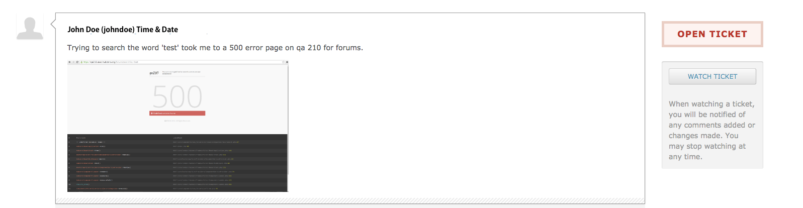

<!--
status: rewritten
reviewed-against: 2.4-main @ 35f103b1b3
reviewed: 2026-09-10
screenshots: stale
source: https://help.hubzero.org/documentation/240/managers/maintenance/tickets
source-id: 3342
imported: 2026-09-09
-->
# Support Tickets

Users open a ticket when something on the hub goes wrong and neither
[Questions and Answers](../09-components/02-answers.md) nor the
[Knowledge Base](../09-components/19-kb.md) answers it. Administrators work
those tickets in the **Support** component. This page is about handling the
queue day to day; for setting the component up — categories, canned messages,
statuses, and who may see what — read
[Support](../09-components/34-support.md).

Every hub that has users has a support queue, whether or not anybody watches
it. The queue is where a hub finds out what is broken, and a manager who reads
it once a week knows more about their hub than one who reads the logs. Half
the tickets on a busy hub are the same three problems, which is what the
knowledge base and the canned **Messages** are for.

The one rule worth stating first: reply before you diagnose. An
acknowledgement costs a minute and stops the user opening a second ticket, or
mailing you directly, or deciding the hub is unmaintained.

> **Note:** Tickets are not the abuse queue. A ticket is a person asking for
> help. An abuse report is a person flagging content, and it lands on a
> different screen with different buttons — see [Abuse
> reports](#abuse-reports) below. Both live in the same component, which is
> why they get confused.

## The screens

**Components → Support** opens the ticket list. The submenu carries the rest:

| Entry | What it is |
|---|---|
| **Tickets** | The queue |
| **Categories** | Ticket categories |
| **Queries** | Saved, sortable ticket searches built with the query builder |
| **Messages** | Canned replies |
| **Statuses** | The status vocabulary this hub uses |
| **Abuse** | Reports of abusive content from around the site |
| **Stats** | Ticket volume and resolution reporting |
| **ACL** | Per-role access to the component |

## What a ticket carries

A ticket is not typed as an issue, a request, or a question — the component
has no such field. What it does have:

| Field | Values |
|---|---|
| **Severity** | `critical`, `major`, `normal`, `minor` |
| **Status** | Whatever the **Statuses** screen defines, plus the built-in open and closed |
| **Owner** | The administrator the ticket is assigned to |
| **Category** | From the **Categories** screen |
| **Target date** | Optional due date |
| **Tags** | Free tagging |

Status is configurable rather than fixed. Each entry on the **Statuses**
screen has a title, an alias, and a flag saying whether it counts as open or
closed, so a hub can run `new → in progress → waiting on user → resolved`
while the component still knows which of those mean the ticket is live.

The list's own filters accept `status:open`, `status:closed`, `status:new`,
`status:waiting`, and `status:all`, alongside `owner:`, `reportedby:`,
`severity:`, and a bare search term. `owner:me` and `owner:none` resolve to
the current administrator and to unassigned.

## Working a ticket

Reply first, then diagnose. A short acknowledgement tells the user the ticket
landed somewhere, and it costs nothing.

Three questions decide whether a ticket is workable. If the user did not
answer them, ask; if you can infer the answers, write them into a comment so
the next person does not have to:

1. What was the user trying to do?
2. What did they expect to happen?
3. What actually happened?

For the ticket above: the user searched the forum for "test"; expected a
results page; got a 500 error, with a screenshot attached.

Each comment you add carries its own controls — the status, severity, and
target date to set alongside it, whether to change the owner, and who gets
emailed (submitter, owner, and any CC addresses). Tick **Private** to keep a
comment internal. Attachments go on the comment, not the ticket. The ticket
itself has a **Group** field that restricts the whole ticket to one group.

Assign the ticket once you understand it. An unassigned ticket is nobody's
work.

## Abuse reports

Carry on the scenario from [Approving Content](01-approvingcontent.md): the
hub has been named in a paper, traffic is up, and along with the genuine
submissions come the first spam posts. Members flag them, and the flags land
here.

The **Abuse** screen collects reports raised from around the site — forum and
blog comments, knowledge base articles, questions, wiki comments. The reporter
supplies a reason; the report lands with a status of **New**.

Open a report to see the reported item in place, then take one action:

| Action | Effect |
|---|---|
| **Release item** | The report is dismissed and the content stays |
| **Remove as Spam** | The content is deleted and fed to the antispam plugins as a training sample |
| **Delete item** | The content is deleted |
| **Decide later** | Nothing changes; the report stays outstanding |

> **Warning:** **Remove as Spam** and **Delete item** both destroy the
> reported content. The component fires an event telling the owning component
> to delete the item, and nothing keeps a copy. There is no trash to fish it
> back out of, so read the report and look at the content before you press
> either. **Decide later** costs nothing and leaves the report where you can
> find it again.

Prefer **Remove as Spam** over **Delete item** for actual spam: it does the
same removal and additionally hands the text to the antispam plugins as a
training sample, so the next post like it is more likely to be caught before a
member has to report it. Use **Delete item** for content that is simply
unacceptable rather than spam — training the filter on it would teach it the
wrong thing.

The list filters by **Outstanding**, **Released**, and **Deleted**. The
**Spam Check** screen under the same controller lets you paste sample content
and see what the enabled antispam plugins make of it — useful when a member
complains that a legitimate post was blocked, since it shows you which
detector objected. [Spam](../11-spam.md) covers the plugins themselves.
