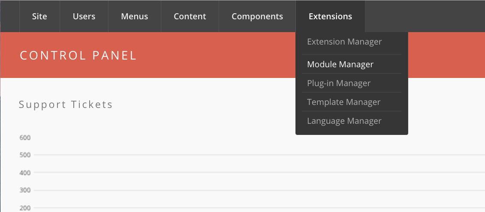
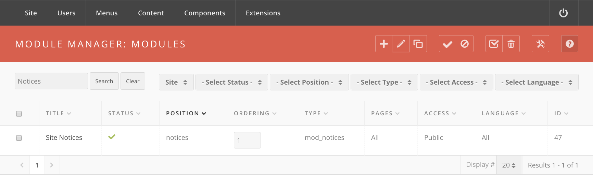

<!--
status: imported
source: https://help.hubzero.org/documentation/240/managers/maintenance/notices
source-id: 3343
imported: 2026-09-09
-->
# Site Notices

## Overview

1. Login to the Hub's **/administrator**.
2. Hover over **Extensions** and then click **Module Manager** from the drop-down.

3. You should now be presented with a list of all the modules installed on your site. There are a variety of methods to find the specific module you wish to edit: you can filter by selecting position, type, or even state (enabled, disabled). The site notice module would be in position **notices** and of type **mod_notices**. You may also search for **notices** in the filter search box or scroll to the bottom of the page and navigate your way through the entire list. Once found, click the module name to edit it.
   
4. Once in edit mode you will be presented with some options such as the title, position, etc. Typically, you will not need to edit anything found in the **Details** section. The items that will most often be changed are under **Parameters**. Here you can set the following:
   - **Start Publishing**  
     This determines when you wish the site notice to *start’ showing on the site.*
   - **Finish Publishing**  
     This determines when you wish the site notice to *stop* showing on the site.
   - **Alert Level**  
     3 levels available: low, medium, and high. This determines the appearance of the site notice (such as eye-catching red for “high”).
   - **Module ID**  
     A CSS ID to be applied to the module. Typically, you will not need to change this.
   - **Message**  
     The notice you wish to display.
   > **Note:** The “Position” must be set to **Notices**, otherwise the banner will not show up, or it will not show up where you intended it to.
5. Once your parameters are set, move down to the **Menu Assignment** portion. This section determines what pages of your site you wish the notice to appear on. This will typically be set to **All**.
   > **Note:** If the menu assignment is set to **none**, your notice will NOT appear on any page of the site, even if it is published and the timeframe is within the publishing window set in the **Parameters** section.
6. Return to the top of the page and click **Save** in the upper right portion of the page.
