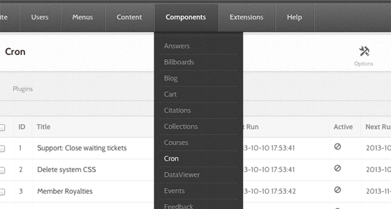
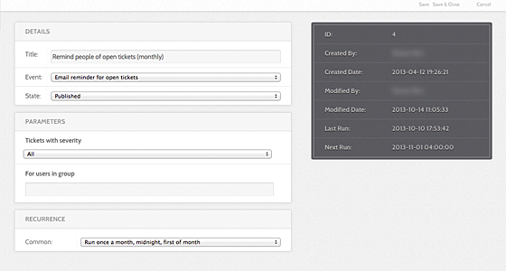
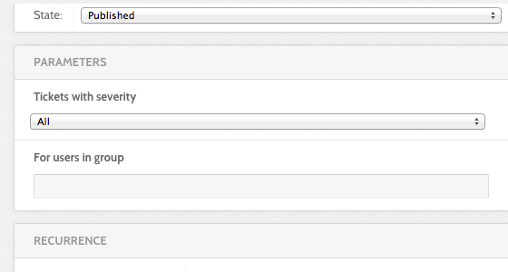
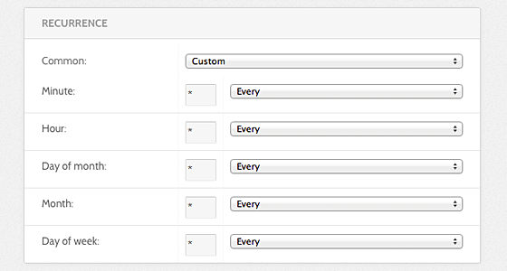

<!--
status: rewritten
reviewed-against: 2.4-main @ 35f103b1b3
reviewed: 2026-09-10
screenshots: stale
source: https://help.hubzero.org/documentation/240/managers/maintenance/cron
source-id: 3344
modified: 2013-11-01
imported: 2026-09-09
-->
# Scheduled Tasks

The **Cron** component manages the hub's scheduled jobs — digest emails, cache
cleanup, search indexing, DOI registration, and the rest. Go to
**Components → Cron**.



## Nothing here runs until you set it up

This is the section of the book where a feature can be switched on, tested,
documented and still do nothing, because the work it depends on happens on a
schedule and no schedule exists. Two things have to be true before anything
happens at all:

1. Something has to tick the hub every minute. That is a Unix cron entry on
   the server, described under [How it works](#how-it-works). Without it, no
   job ever runs, however the administrator interface looks.
2. A **job** has to exist for the thing you want done, and it has to be
   published. Jobs are rows you create on this screen. Enabling a plugin does
   not create one.

A new hub has three jobs, and only one of them is published. Everything else
in the table below is a feature that will sit there doing nothing until
somebody comes to this screen and adds a job for it.

| Waiting for a job | What does not happen without it | Event |
|---|---|---|
| Newsletter mailings | Queued newsletters are never sent | `processMailings` |
| Search index, on a hub using Solr | New and changed content never reaches the index, so search does not find it | `processQueue`, `runFullIndex` |
| Group announcements | Announcements posted in groups are never mailed | `sendGroupAnnouncements` |
| Group membership dates | Memberships with an end date never expire, and nobody is warned they are about to | `expireGroupMemberships`, `notifyExpiringMemberships` |
| Support ticket housekeeping | Pending tickets never close themselves, and no reminders or ticket lists go out | `onClosePending`, `sendTicketsReminder`, `sendTicketList` |
| Activity digests | Members never get their digest email | `emailMemberDigest` |
| Cache expiry | Expired cache data and old generated CSS are never cleared | `trashExpiredData`, `cleanSystemCss` |
| Publication and resource DOIs | Master DOIs are never issued | `issueMasterDoi`, `issueResourceMasterDoi` |

Search is the row to read carefully. A stock hub has **Engine**, on the Search
component's **Options**, set to **Basic (default)**, which queries the
database directly and needs no job at all. Only a hub switched to **Apache
Solr** depends on these two events, and on such a hub search quietly stops
reflecting reality without them.

None of that is a defect. It is a design decision — the hub does not assume
what your site wants on a schedule — but it catches every manager once,
because there is nothing on the newsletter screen or the search screen to
tell you a job is missing.

> **Important:** If a feature on this hub "does not work" and it involves
> sending mail, expiring something, or indexing something, check this screen
> before anything else. Compare each job's **Last Run** against its
> recurrence. A job whose last run was three weeks ago on a five-minute
> schedule means the tick is not arriving at all, and every scheduled feature
> on the hub is dead, not just the one you noticed.

### What ships with a new hub

The install seeds no jobs of its own; three come from migrations that run
during installation.

| Job | Event | Recurrence | State as shipped |
|---|---|---|---|
| **Group Announcements** | `sendGroupAnnouncements` | every 5 minutes | Published |
| **Process Newsletter Mailings** | `processMailings` | every 5 minutes | **Unpublished** |
| **Process Newsletter Opens & Click IP Addresses** | `processIps` | every 5 minutes | **Unpublished** |

So on a new hub exactly one scheduled job runs. The two newsletter jobs are
created for you and left switched off, which is why a manager's first
newsletter is composed, sent, and never arrives.

### Worked example: the first newsletter goes nowhere

Say the hub has just published its first newsletter issue and no one received
it, including you.

1. Go to **Components → Cron**.
2. Find **Process Newsletter Mailings** in the list. Its **State** is
   **Unpublished**, and **Last Run** is empty.
3. Tick it and select **Publish**. The job is now due — its stored next run
   is the zero date, which is in the past — so it goes at the next tick.
4. Wait five minutes and reload. **Last Run** should now carry a timestamp.
   If it does not, the tick is not reaching the hub — go to
   [How it works](#how-it-works) and check the cron entry on the server.
5. Do the same for **Process Newsletter Opens & Click IP Addresses** if you
   want open and click tracking. It is not needed to send mail.

Publishing a job is safe and reversible: unpublish it again and it stops. The
button to be careful with on this screen is **Run**, which runs the selected
jobs immediately — on a mailing job that means the queue goes out now, to
real addresses, whatever you were expecting.

> **Note:** A job is not the same as a plugin. The plugin supplies the event;
> the job says when to fire it. Both have to be in place. Most cron plugins
> ship enabled, but **Cron - Forum** ships disabled, so `emailGroupForumDigest`
> is not on the **Event** menu until you enable it at **Extensions → Plugin
> Manager**.

## How it works

Unix cron does not run each hub job. It ticks the CMS, once a minute, and the
CMS runs whichever jobs are due. Everything about a job — what it does, how
often, and whether it runs at all — is configured in the administrator
interface.

There are two ways to deliver the tick.

**Over HTTP.** A request to `index.php?option=com_cron&task=tick&no_html=1`
runs the pending jobs. The request must come from an allowed address: the
caller either has `core.manage` on `com_cron`, or its IP is in the
component's **whitelist** option (default `127.0.0.1`), or it resolves to the
server's own hostname or to `localhost`. Anything else gets a 404.

**From the command line.** `muse cron:jobs tick` makes that HTTP request for
you, taking the URL from the CMS `live_site` setting and holding a lock so
ticks cannot pile up:

```
* * * * * apache /var/www/yourhub/core/bin/muse cron:jobs tick >> /var/log/hub-cron.log
```

The `cron:jobs` command has four other tasks:

| Task | What it does |
|---|---|
| `run` | Run pending jobs in this process. `--job=5` runs only that job |
| `list` | List jobs that are due. `-a` lists every published job |
| `deactivate` | Mark a job inactive |
| `unpublish` | Unpublish a job |

`cron:jobs` is a component command, so it does not appear in `muse help` or in
the [generated muse reference](../../reference/muse.md), which covers
only the commands under `core/libraries/Hubzero/Console/Command/`. Run
`muse cron:jobs help` for its own documentation.

Jobs claim themselves before running, so a manual run from the administrator
interface and a scheduled tick cannot execute the same job at once, and a job
whose process died is reclaimed.

## The job list

The columns are **ID**, **Title**, **State**, **Starts**, **Ends**,
**Active**, **Last Run** and **Next Run**. The recurrence is not among them;
to see how often a job runs, open it. The toolbar carries **Run** (run the
selected jobs now), **Publish**, **Unpublish**, **Deactivate**, **New**,
**Delete**, and **Options**.

**Last Run** and **Next Run** are the two that tell you whether the hub is
healthy. Read them together: a **Next Run** in the past on a published job
means the tick has stopped.

> **Warning:** **Delete** here removes the job row for good. It asks for
> confirmation and then destroys the record; it is not the reversible trash
> you get on the Article Manager — see [States, deleting and
> check-out](../08-content/states.md). If you only want a job to stop, use
> **Unpublish**, which keeps the row and its history.

**Options** holds one setting, the IP whitelist, which defaults to
`127.0.0.1` — see the
[generated parameter list](../../reference/configuration/components/cron.md).
Leave it at the default unless the tick comes from another machine. Widening
it lets anything at that address run every due job on the hub without logging
in.

## Creating and editing a job

A job has four fieldsets: **Details**, the event's own **Parameters**,
**Recurrence**, and **Publishing**, plus an **Execution** option.

### <a id="editfields-details"></a>Details



- **Title** (required)
  What the job is called in the list.
- **Event** (required)
  The plugin event this job triggers, chosen from a drop-down grouped by
  plugin. This is the job — everything else is scheduling. The event cannot be
  changed to something no installed cron plugin offers.

The events on offer come from the enabled plugins in `core/plugins/cron/`:

| Plugin | Events |
|---|---|
| `activity` | `emailMemberDigest` |
| `cache` | `cleanSystemCss`, `trashExpiredData` |
| `courses` | `syncPassportBadgeStatus`, `emailInstructorDigest` |
| `forum` | `emailGroupForumDigest` |
| `groups` | `cleanGroupFolders`, `sendGroupAnnouncements`, `expireGroupMemberships`, `notifyExpiringMemberships` |
| `members` | `onPointRoyalties` |
| `newsletter` | `processMailings`, `processIps` |
| `projects` | `computeStats`, `googleSync`, `gitGc` |
| `publications` | `sendAuthorStats`, `rollUserStats`, `runMkAip`, `issueMasterDoi`, `updateFtpLinks`, `buildPublicationBundles` |
| `resources` | `issueResourceMasterDoi`, `auditResourceData`, `emailMemberResources`, `updateResourceRanking` |
| `search` | `processQueue`, `runFullIndex` |
| `storefront` | `emailPublishDownNotifications` |
| `support` | `onClosePending`, `sendTicketsReminder`, `sendTicketList`, `cleanTempUploads` |
| `users` | `cleanAuthTempAccounts` |

The [cron events reference](../../reference/events/cron.md) lists each event
with its listeners.

### <a id="editfields-parameters"></a>Parameters



Every event brings its own parameters, and the form swaps them in when you
pick the event. An event with none shows "No parameters found".

### <a id="editfields-recurrence"></a>Recurrence



**Frequency** offers the common schedules:

| Option | Cron expression |
|---|---|
| Run once a year, midnight, Jan. 1st | `0 0 1 1 *` |
| Run once a month, midnight, first of month | `0 0 1 * *` |
| Run once a week, midnight on Sunday | `0 0 * * 0` |
| Run once a day, midnight | `0 0 * * *` |
| Run once an hour, beginning of hour | `0 * * * *` |
| **[ Custom ]** | Set the five fields below by hand |

Choosing **[ Custom ]** opens **Minute**, **Hour**, **Day of month**,
**Month**, and **Day of week**. Each has a drop-down of common values —
`Every`, `Every 5`, `Every 10`, weekday and month names — and a text box for
anything else.

### Publishing

- **State** — Published, Unpublished, or Trashed. Only published jobs run.
- **Start running** / **Stop running** — an optional window. A job outside its
  window is skipped even while published.

The list also shows an **Active** flag. That is not a setting: it means the
job is running right now, or was claimed by a process that has not released
it. **Deactivate** clears a stuck claim.

### Execution

- **Run in a detached process** — run the job in its own background process
  instead of inside the web tick, so a long batch job does not tie up a web
  worker. A detached job runs without a web request, so it cannot build
  correct absolute URLs unless `live_site` is set. The form warns when it is
  empty. Never enable it for a job that emails links.

  > **Caution:** Detached execution is marked a prototype in the code. Use it
  > for archival and bundle-building jobs, not for anything that sends mail.
