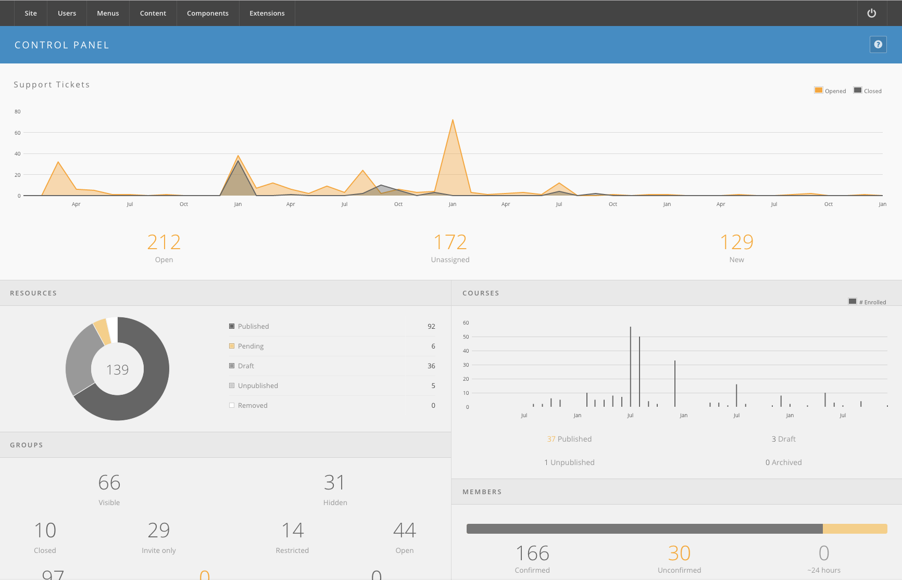

<!--
status: imported
source: https://help.hubzero.org/documentation/240/managers/maintenance
source-id: 3339
imported: 2026-09-09
-->
# Daily Maintenance

## The Dashboard

Every HUB comes with an administrative dashboard that gives you a quick overview of some activity or items on the site that need attention.

1. Login to the **/administrator** interface.
2. Once logged in, you should be presented with a dashboard of categories and the activity within them, such as “Abuse Reports”, “Support Tickets”, etc.
   
