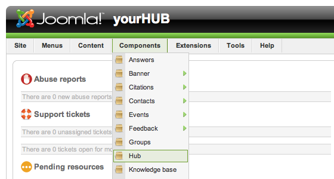
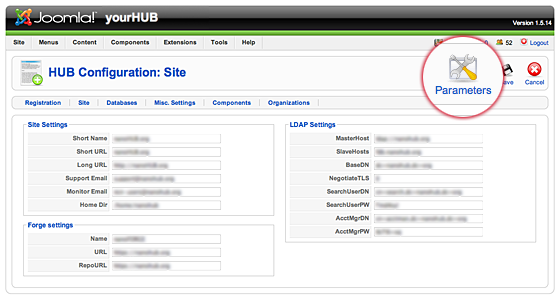
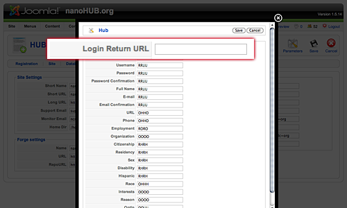
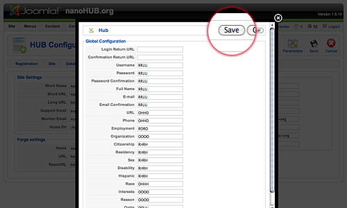

<!--
status: imported
source: https://help.hubzero.org/documentation/240/managers/configuring/hub
source-id: 3347
imported: 2026-09-09
source-state: unpublished
-->
# HUB Settings

## Overview

> **Note:** Most, if not all, of these settings can be set once and then left alone. Most HUBzero installs will have these configurations set for optimal performance. It is not advisable to make changes to any settings not in the "Registration" area.

### Toolbar

At the top right you will see the toolbar. The functions are:

- **Save**  
  Save the modifications you made to the Global Configuration. You will be redirected to the Control Panel
- **Close**  
  Return to the previous screen without saving your work. If you press Close while adding a new item, this new item will not be created. If you were modifying an existing item, the modifications will not be saved.

## Site Settings Group

### Site Settings

- **Short Name**  
  **Deprecated** A short name for the site to be used in various component texts.
- **Short URL**  
  **Deprecated** The URL of the site minus the "http://".
- **Long URL**  
  **Deprecated** The full URL of the site.
- **Support Email**  
  Primary email address for administrative data to be sent to.
- **Monitor Email**  
  Email address for account registration data to be sent to.
- **Home Dir**  
  The home directory for user accounts.

### Forge Settings

- **Name**  
  The name for the Tool Forge area of the site.
- **URL**  
  The URL for the Tool Forge.
- **RepoURL**  
  The URL for the Tool Forge used by Repo.

### LDAP Settings

- **MasterHost**  
  .
- **SlaveHosts**  
  .
- **BaseDN**  
  .
- **NegotiateTLS**  
  .
- **SearchUserDN**  
  .
- **SearchUserPW**  
  .
- **AcctMgrDN**  
  .
- **AcctMgrPW**  
  .

## Registration Setting Groups

> **Tip:** See [Configuring Registration](02-registration.md) for more details.

## Login Return URL

By default, members who have just logged in will be directed to the "/myhub" page. It is possible, in HUBzero, to change the redirection URL to something else.

1. First login to the administrative back-end.
2. Once logged in, find “Components” in the main menu bar located toward the top of the page. You should be presented with a drop-down menu containing a list of your installed components.
3. Choose “Hub” from the available options.
   
4. You should now be presented with a control panel for various settings and configurations of your site.
   > **Note:** This is a different set of configurations than what is found under “Site” > “Global Configuration” and control HUB specific items.
   Once the page has loaded, select the “Parameters” button in the toolbar, found in the upper right-hand portion of the screen. Click it.
   
5. You should now be presented with a pop-up panel for various settings and configurations of your site.
   Look for the option titled "Login Return URL". This will most likely be the first item in the list.
   
6. Enter in the textbox the URL you wish members to be redirected to and then click "Save".
   
