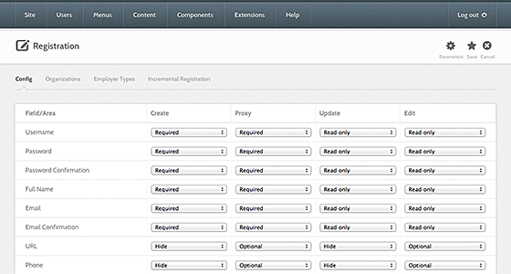
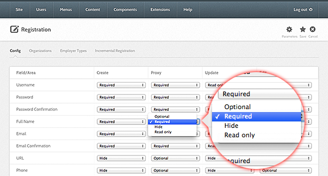
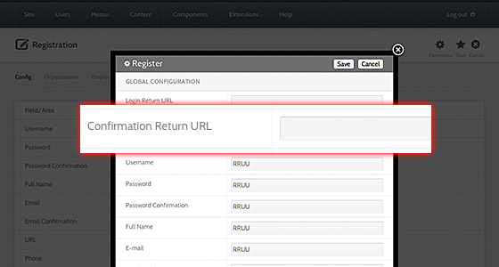

<!--
status: rewritten
reviewed-against: 2.4-main @ 123ea53b14
reviewed: 2026-09-09
screenshots: stale
source: https://help.hubzero.org/documentation/240/managers/configuring/registration
-->
# Registration

A hub decides for itself what a new member has to supply. One hub asks for
an organisation and a phone number; another asks only for a username, a
password, and an email address. The **Registration** screen in the Members
component sets that, field by field, and separately for each of the four
moments a member's details are collected.

## Reaching the screen

1. Sign in to the administrator interface.
2. Choose **Users > Members** from the menu.
3. Select **Registration** in the sub-navigation under the toolbar.

The Registration screen has its own tabs: **Config** (this screen),
**Incremental Registration**, and **PREMIS Data Import**.

## The field table

The table has one row per field and four columns, one per action.

| Column | What it controls |
|---|---|
| **Create Account** | What a visitor sees on the registration form. |
| **Proxy Create Account** | What an administrator sees when creating an account on someone else's behalf. |
| **Update on Next Login** | What an existing member is asked for the next time they sign in. Use it when a field that used to be optional becomes required: set it to **Required** here and members are asked for it once. |
| **Edit Profile** | What a member sees and can change on their own profile. |

Each cell is a drop-down with four choices:

| Choice | Meaning |
|---|---|
| **Required** | The field is shown and must be filled in. |
| **Optional** | The field is shown and may be left blank. |
| **Hide** | The field is not shown. |
| **Read only** | The field is shown but cannot be changed. |

A cell that reads **n/a** means the field does not apply to that action; the
setting is fixed and there is no drop-down.

The rows are the nine fields the Members component declares:

| Row | Default |
|---|---|
| **Username** | Required, Required, Read only, Read only |
| **Password** | Required, Required, Read only, Read only |
| **Password Confirmation** | Required, Required, Read only, Read only |
| **Full Name** | Required, Required, Read only, Read only |
| **Email** | Required, Required, Read only, Read only |
| **Email Confirmation** | Required, Required, Read only, Read only |
| **OptIn** | Hide, Hide, Hide, Optional |
| **CAPTCHA** | Required, Hide, Hide, Hide |
| **TOU** | Required, Hide, Required, Hide |

The four letters are stored as one string per field, in the column order
above: `R` required, `O` optional, `H` hidden, `U` read only. The stored
values are listed in the
[Members component reference](../../reference/configuration/components/members.md#registration).

<!--include: core/components/com_members/config/config.xml:329-340-->

## Saving

The toolbar has **Options**, **Save & Close**, and **Cancel**. **Save &
Close** writes the settings and returns you to the members list; there is no
apply-and-stay button on this screen. Changes take effect immediately, and
the site cache is cleared as part of the save.

## Turning registration off

Registration as a whole is switched on the Members component's options, not
on this screen. Select **Options** in the toolbar and set **Allow User
Registration** to **No**. The same screen carries **New User Registration
Group**, **New User Account Activation**, **Send Password**, and **Simple
Registration**, which lets accounts created through an external
authentication provider skip the username and account-linking steps.

> **Note:** The tabs in the Options pop-up are labelled from language
> strings that the Members component does not define, so three of them
> render as raw keys such as `COM_CONFIG_REGISTRATION_FIELDSET_LABEL`
> instead of a name. The fields inside them are correct.

## Confirmation return URL

By default a member who confirms their email address lands on a thank-you
page. To send them somewhere else, select **Options** on any Members screen
and set **Confirmation Return URL**. It sits in the same group as the
registration fields.

> **Note:** This is only the page shown after email confirmation. Where a
> member lands after signing in is set on the login menu item; see
> [Global configuration](01-hub.md#where-members-land-after-signing-in).

## Customising the registration emails

The mails the hub sends during registration are ordinary view layouts, so a
template can override them without anyone editing core files. They live in
`core/components/com_members/site/views/emails/tmpl/`:

| Layout | Sent when |
|---|---|
| `create.php`, `create_html.php` | An account is created. This is the confirmation mail, sent as a plain-text and an HTML part. |
| `confirm.php`, `confirm_html.php` | A member asks for the confirmation mail again. |
| `update.php`, `updateproxy.php` | A member changes their email address. |
| `adminupdate.php`, `adminupdateproxy.php` | Administrators are told about a profile change. |
| `approved_html.php`, `approved_plain.php` | An account is approved. |
| `remind_html.php`, `remind_plain.php` | A member asks for a username reminder. |
| `reset_html.php`, `reset_plain.php` | A member asks for a password reset. |

To override one, copy it to the site's home template under
`html/com_members/emails/` and edit the copy:

```
app/templates/{YourTemplate}/html/com_members/emails/create.php
app/templates/{YourTemplate}/html/com_members/emails/create_html.php
```

Create the directories if they do not exist. An override in one template is
not visible from another. Mail overrides are resolved from the site's home
template rather than the active one, so they also apply to mail sent from
cron.

> **Tip:** See [Output overrides](../../developers/11-templates/09-overrides.md)
> for the general rules on overriding layouts and CSS.

## Older screenshots

> **Note:** The screenshots below came from the imported version of this
> page. The field table and the Save button are still where they show them,
> but the administrator template has been restyled since. The last four
> images show the retired **Register** component and its parameters pop-up,
> which no longer exist; the settings they show are now on the Members
> component's **Options** screen.









