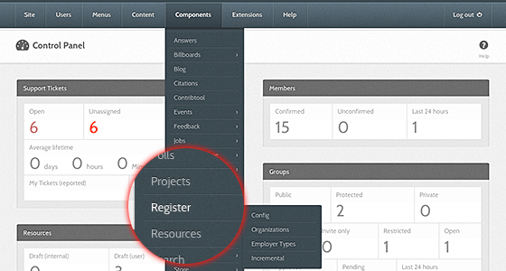
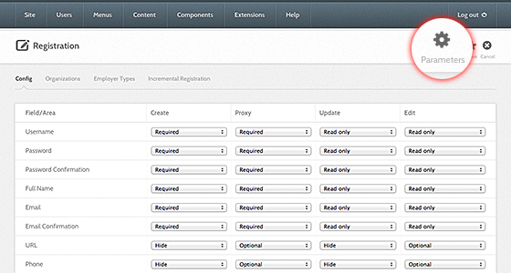
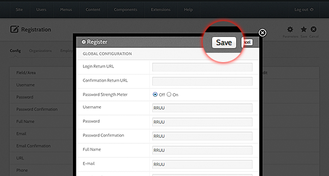

<!--
status: rewritten
reviewed-against: 2.4-main @ 123ea53b14
reviewed: 2026-09-09
screenshots: stale
source: https://help.hubzero.org/documentation/240/managers/configuring/components
-->
# Components

Most components carry a set of options. They decide what the component
offers a visitor, what its defaults are, and — for components that talk to
something outside the hub — the connection details it needs. Options belong
to one component and affect nothing else.

## Opening a component's options

1. Sign in to the administrator interface.
2. Choose the component from the **Components** menu. Members, Groups, and
   System are not listed there; they have their own places in the menu.
3. Select **Options** in the toolbar, at the top right of the screen.
4. A pop-up opens with one tab per group of settings.
5. Change what you need and select **Save & Close**. **Save** keeps the
   pop-up open. **Cancel** discards the changes.

Changes take effect immediately.

> **Note:** Not every component has options. If the manifest declares none,
> the pop-up says "No options found."

The **Options** button appears wherever the component's toolbar calls for
it, which for most components is the main list screen. It always opens the
same pop-up, built from the component's `config.xml`.

## Permissions

Components that declare an `access.xml` get a **Permissions** tab in the
same pop-up. It sets, per user group, who may administer the component,
access its administrator screens, and create, edit, or delete its content.
These rules inherit from the site-wide grid on the **Permissions** tab of
[Global configuration](01-hub.md#permissions-and-text-filters), and
override it for this component only.

## What the options are

Every parameter of every component is listed, with its type and default, in
the generated
[configuration reference](../../reference/configuration/README.md#components).
That list is produced from the same `config.xml` files the pop-up reads, so
it always matches the screen.

> **Important:** Some components do nothing useful until their options are
> filled in. Tools will not run until the middleware settings in the Tools
> component are set; the geolocation and LDAP screens in the System
> component need their connection details before either screen works.

## Known problem: unnamed tabs

The pop-up names each tab from a language string built out of the fieldset
name, `COM_CONFIG_<NAME>_FIELDSET_LABEL`. Only `basic` and `component` are
defined, so a component whose `config.xml` uses any other unlabelled
fieldset name shows the raw key as the tab title. The Members component,
for instance, shows `COM_CONFIG_LOGIN_FIELDSET_LABEL`,
`COM_CONFIG_PASSWORD_FIELDSET_LABEL`, and
`COM_CONFIG_REGISTRATION_FIELDSET_LABEL` where names should be. The fields
under those tabs work normally.

## Older screenshots

> **Note:** The screenshots below came from the imported version of this
> page. They show the retired **Hub** component and call the toolbar button
> **Parameters**; the button is now called **Options**, and there is no Hub
> component. The pop-up they show is otherwise the same screen.

