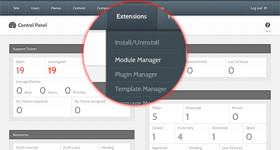
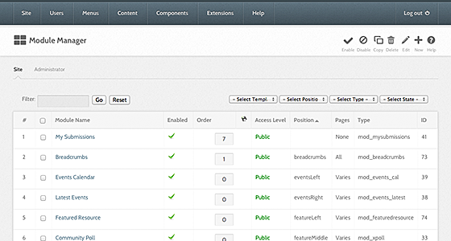
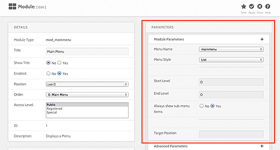
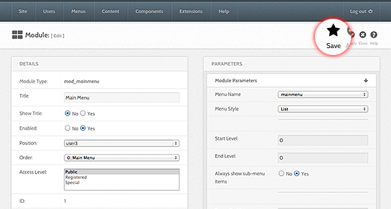

<!--
status: imported
source: https://help.hubzero.org/documentation/240/managers/configuring/modules
source-id: 3350
imported: 2026-09-09
-->
# Modules

## Overview

Most modules will have a set of parameters that can be configured. These parameters can determine what functionality is presented to the user, be a default set of user options, or settings needed for the module to function properly (setting the URL to a feed for a feed reader module, for instance). Accessing and adjusting these parameters is quick and easy.

> **Note:** Not all modules will have configurable parameters. For those that do, the configurations apply **only** to that module instance. You may have multiple instances of a module with different parameter configurations.

1. First login to the administrative back-end.
2. Once logged in, go to the "Module Manager." The Module Manager can be found by selecting "Extensions" > "Module Manager" from the drop-down menu on the back-end of your HUB installation.
   
3. Choose the module you wish to configure from the available list.
   
4. Once the page has loaded, find the “Parameters” grouping, found on the right-hand portion of the screen.
   
5. Adjust the available parameters as needed and then click "Save" (the icon that looks like a star) in the upper right portion of the page. Changes take affect immediately.
   
