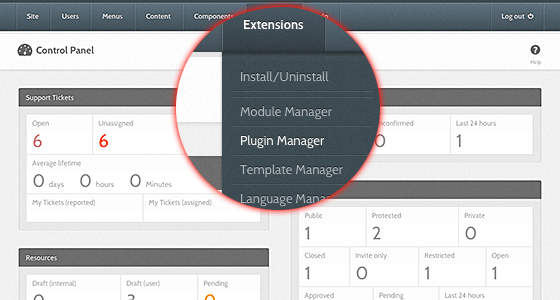
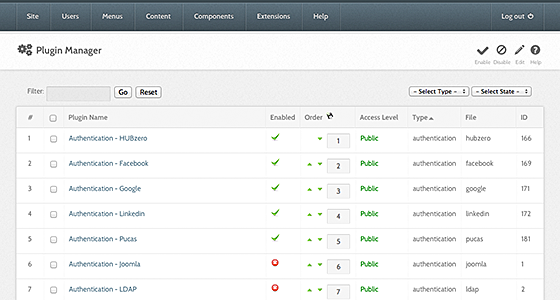
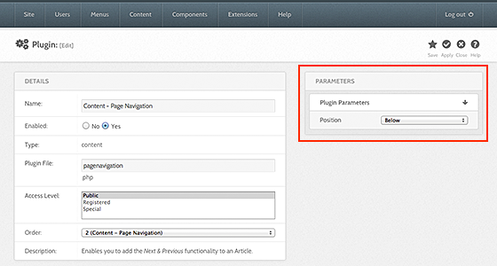
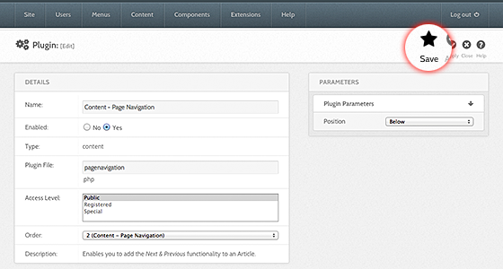

<!--
status: rewritten
reviewed-against: 2.4-main @ 123ea53b14
reviewed: 2026-09-09
screenshots: stale
source: https://help.hubzero.org/documentation/240/managers/configuring/plugins
-->
# Plugins

Some plugins carry parameters: an API key, a display name, a limit, a
switch. Parameters belong to that one plugin and affect nothing else.

## Opening a plugin's parameters

1. Sign in to the administrator interface.
2. Choose **Extensions > Plug-in Manager**.
3. Narrow the list with the **- Select Type -** drop-down, which filters by
   plugin group, and the search box, which matches the plugin's title.
4. Select the plugin's name.
5. Find the collapsible panels on the right of the edit screen: **Basic
   Options**, and **Advanced Options** if the plugin declares any.
6. Change what you need and select **Save** or **Save & Close**. Changes
   take effect immediately.

> **Note:** Not every plugin has parameters. When one has none, the right
> column says "No options found."

## The list screen

Filters: a search box, **- Select Status -**, **- Select Type -**, and
**- Select Access -**. Columns: **Plug-in Name**, **Status**, **Ordering**,
**Type**, **Element**, **Access**, and **ID**. A plugin whose files are
missing is flagged under its name with "Plugin file(s) not found!".

The toolbar offers **Edit**, **Enable**, **Disable**, **Check In**,
**Options**, and **Help**, each subject to your permissions. There is no
**New** and no **Delete**: plugins arrive and leave through the
[Extension Manager](../10-extensions/04-extension-manager.md), and the Plug-in Manager
only turns them on and off and configures them.

## The edit screen

**Details** holds the three settings you can change: **Status**,
**Access**, and **Ordering**. Beside it is a read-only table: **Plug-in
Name**, **ID**, **Plug-in Type** — the group the plugin belongs to, such as
`authentication` or `members` — **Plug-in File**, **Description**, and who
last modified it. Those describe where the plugin lives on disk and come
from its manifest.

The toolbar has **Save**, **Save & Close**, **Close**, and **Help**.

Every plugin's parameters are listed by group in the generated
[configuration reference](../../reference/configuration/README.md#plugin-groups).

## Older screenshots

> **Note:** The screenshots below came from the imported version of this
> page. The screens are the same but the administrator template has been
> restyled since.

