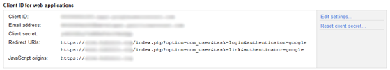
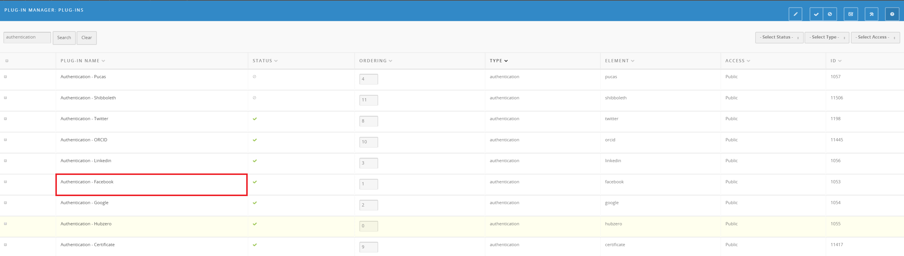
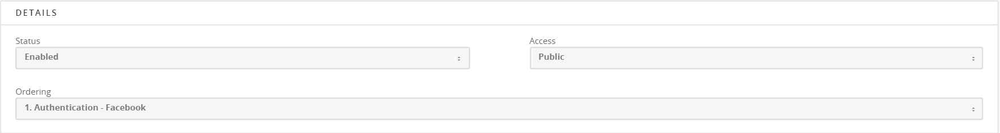
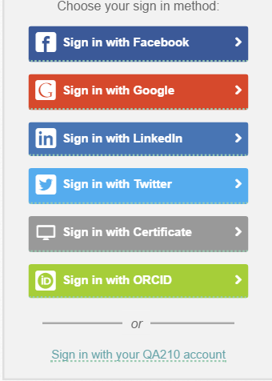

<!--
status: imported
source: https://help.hubzero.org/documentation/240/managers/configuring/authentication
source-id: 3352
modified: 2012-08-29
imported: 2026-09-09
-->
# Authentication

## Why it matters?

By default, your hub comes configured to allow local account creation and authentication. In addition to this default option, HUBzero gives you the ability to extend the authentication process by adding support for third party services, like Facebook, Google, and LinkedIn. Using one or more of these providers, users are given a **single sign-on** experience, while easing the barriers to entry caused by the account creation process. Plus, as more social networking features are developed for the hubs - like posting new resources to your Facebook wall - users will already have that link setup between their hub and Facebook identities.

In brief, that's the principle behind offering multiple authentication options to users. Keep reading to find out how to set it up on your hub!

## Setup

Prior to starting this process, you will have to register an **app** for your hub on a given provider's website. A few examples include:

- <https://developers.facebook.com/apps>
- <https://developer.linkedin.com/> (go to **API Keys**)
- <https://developers.google.com/> (go to the API console)

> **Note:** the information above is accurate as of Aug 2012. It will undoubtedly change. Exact steps and terminology differs between providers.

Whichever provider you're interested in, you'll need to register a new app to obtain an app ID/key and secret (terminology may be slightly different between providers). Once you've completed the registration process and obtained the API key and secret, you can jump over to the hub.

> **Note:** the Oauth protocol requires the specification of a redirect URI. Most of the providers mentioned above require you to specify the redirect domain (usually just your hub URL). The Google API requires you to specifically list any redirect URI's that will be used. These should be as follows:
> (HUBzero 1.1 - see image below)
> https://`yourhub.org`/index.php?option=com_user&task=login&authenticator=google
> https://`yourhub.org`/index.php?option=com_user&task=link&authenticator=google
> (HUBzero 1.2)
> https://`yourhub.org`/index.php?option=com_users&task=user.login&authenticator=google
> https://`yourhub.org`/index.php?option=com_users&task=user.link&authenticator=google

Setup begins in the administrative interface for your hub.

\1. First, navigate to **Extensions -> Plugin Manager**, and filter the results to the **authentication** type

\2. Next, select the plugin you desire to enable (we'll use Facebook in this example)

- In the plugin edit screen, fill in the appropriate values for App ID and Consumer Secret as obtained above. Also be sure to enable the plugin.

That's about it! Now, when you go to your hub's login page, you'll see a new option for Facebook login.

## More details

### What happens if someone already has a local hub account, but wants to start using a new third party provider?

Users that already have hub accounts can go to the accounts tab of their members page. From there, they can link their existing account with external providers. Additionally, if a user tries to log in with an external account that doesn't match one used on the hub before, we check to see if we can match them with an already existing hub account prior to talking them through the new account creation process.

### Purdue Hubs

In addition to the authentication options mentioned above, HUBzero has also developed an authentication plugin for the Purdue Central Authentication Service (CAS). If you're interested in taking advantage of this service, follow the instruction here: <https://www.purdue.edu/apps/account/docs/CAS/CAS_information.jsp> to register your hub with the Identity and Access Management Office at Purdue. Once this is done, simply turn the plugin on and you'll be all set.

> **Note:** Other institutions or universities may find the Purdue CAS plugin a good template for developing their own CAS authentication plugin. If you're developing a plugin that uses Oauth, consider using the Facebook plugin as a starting point.
