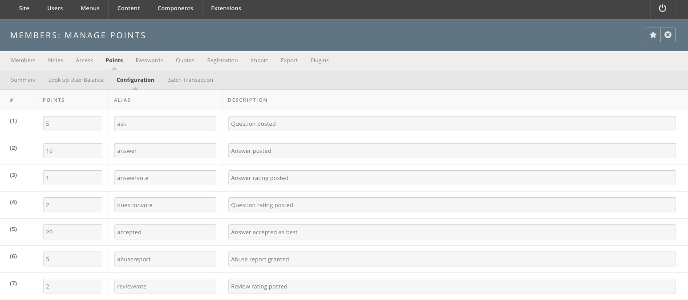

<!--
status: rewritten
reviewed-against: 2.4-main @ 35f103b1b3
reviewed: 2026-09-10
screenshots: stale
source: https://help.hubzero.org/documentation/240/managers/users/members
source-id: 3355
modified: 2014-11-06
-->
# Members

The Members manager is where every account on the hub is created, edited,
confirmed, approved, blocked, exported and deleted. Open it under **Users >
Members**. It is `com_members`, and it owns most of what sits on the **Users**
menu.

> **Note:** There is no separate User Manager to keep in step with. `com_users`
> in this release has no administrator screens at all; the Members manager is
> the only place accounts are edited.

## Which button to reach for

Almost everything a manager does here is one of four operations on somebody
else's live account, and they differ enormously in how much they cost.

| Operation | Reversible? | What the account holder sees |
|---|---|---|
| **Block** / **Unblock** | Yes, completely. | Cannot log in while blocked. Nothing is lost. |
| **Confirm** / **Unconfirm**, **Approve** / **Unapprove** | Yes. | Held on a holding page, or released from one. |
| **De-identify** | **No.** | The account still exists but is blocked and anonymous. |
| **Delete** | **No.** | The account and everything hung off it are gone. |

The two reversible rows cover nearly every real situation. A spam wave after a
paper is published wants **Block**, not **Delete**: blocking a hundred signups
takes them out of service in one press and can be undone if you catch a real
person among them, and it leaves you the evidence to look at later. Somebody
who has left the institution and asks to be removed wants **De-identify** or
**Delete**, and you need to know which they mean before you press either.

Nothing on this screen sends the account holder a message except **Approve**
(and only when **Email On Account Activation** is on) and **Resend
confirmation**. Blocking somebody is silent; they find out when they try to log
in.

## The sub-menu

A row of links sits above every Members screen. Which links appear depends on
your permissions and on one configuration setting; the menu is built in
[`core/components/com_members/admin/helpers/members.php`](../../../core/components/com_members/admin/helpers/members.php).

| Link | Opens | Shown when |
|---|---|---|
| **Members** | The account list. | Always. |
| **Notes** | Administrator notes about accounts, and their categories. | Always. |
| **Access** | Access groups and viewing levels. | Always. |
| **Points** | The points system. | Only when **Bank Accounts** is on in **Options**. |
| **Passwords** | Password rules and the password blacklist. | Only for a Super User (`core.admin`). |
| **Quotas** | Disk quotas, quota classes and quota import. | Always. |
| **Registration** | Which fields registration asks for. | Always. |
| **Import** | Bulk member import and import hooks. | Only for a Super User (`core.admin`). |
| **Plugins** | The hub's `members` plugins. | Always. |

There is **no Export link**. Export is a toolbar button on the account list;
see [Exporting accounts](#exporting-accounts).

## The account list

The list opens on every account on the hub, newest registration first.

### Filters

| Filter | Notes |
|---|---|
| Search | A number matches the account id exactly; anything else matches anywhere inside the name, username or email. **Go** submits, and **Reset** clears the filter bar. |
| **- Email confirmed -** | **Confirmed** or **Unconfirmed**. |
| **Access** | An access level. |
| **- State -** | **Enabled** or **Disabled**, that is, not blocked or blocked. |
| **- Approved -** | **Unapproved**, **Manually approved** or **Automatically approved**. |
| **- Group -** | An access group. |
| **- Registration Date -** | Today, the past week, month, three months, six months or year, or older than a year. |

### Columns

| Column | Notes |
|---|---|
| ID | The account's numeric id. Sortable. |
| Name | Shown as *surname, given name middle name*, rebuilt from the full name when the parts are empty. Click it to edit the account. Sortable. |
| Username | Sortable. |
| E-Mail | Sortable. |
| Access Groups | Every access group the account belongs to. |
| Status | The account's state, with a drop-down of the actions available from it. See [Account states](#account-states). |
| Registered | Sortable. |
| Last Visit | *Never* if the account has never logged in. Sortable. |

### Toolbar

| Button | What it does |
|---|---|
| **Options** | The component's configuration. See the generated [Members configuration reference](../../reference/configuration/components/members.md). Super User only. |
| **Profile** | Opens the profile builder. See [Building the profile form](#building-the-profile-form). Super User only. |
| **Export** | Downloads the accounts matching the current filters as CSV. Super User only. |
| **Reset terms of use agreements for all users** | See [Resetting the terms of use](#resetting-the-terms-of-use). |
| **Confirm** / **Unconfirm** | Marks the checked accounts' email addresses confirmed or unconfirmed. |
| **Block** / **Unblock** | See [Blocking an account](#blocking-an-account). |
| **New**, **Edit**, **Delete** | Create, edit or delete accounts. Delete asks for confirmation first. |
| **De-identify Members** | See [De-identifying members](#de-identifying-members). Needs the **Deidentify** permission. |
| **Help** | The built-in help screen. |

**Confirm**, **Unconfirm**, **Block**, **Unblock**, **Reset terms of use
agreements** and the status drop-downs all require `core.edit.state`.

## Account states

An account carries three separate flags, and the **Status** column shows the
first one that applies.

| Status | Meaning | Actions offered |
|---|---|---|
| **Blocked** | `block` is set. The account cannot log in. | **Unblock** |
| **Incomplete (*authenticator*)** | The account was started through a third-party authenticator and never finished. Its email address ends in `@invalid`. | None |
| **Unconfirmed** | The email address has not been confirmed. | **Confirm email**, **Resend confirmation**, **Block** |
| **Not Approved** | Email confirmed, but the account still needs an administrator's approval. | **Approve**, **Block** |
| **Approved** | Email confirmed and account approved. This is a working account. | **Unapprove**, **Block** |

Confirmation and approval are two different gates. Which of them a new
registration has to pass is set by **New User Account Activation** on the
**Options** screen: **None** confirms the account outright, **Self** emails the
user a confirmation link, and **Admin** emails the link *and* leaves the
account unapproved until someone approves it. The **System - Unconfirmed** and
**System - Unapproved** plugins are what hold such a user on a holding page
until the gate is passed.

> **Note:** There is no administrator dashboard module listing accounts awaiting
> approval. Filter the account list by **- Approved -** → **Unapproved**
> instead.

### Confirming an account by hand

1. Open **Users > Members**.
2. Find the account.
3. Either open its **Status** drop-down and choose **Confirm email**, or check
   the box beside it and press **Confirm** in the toolbar.

**Resend confirmation** on the same drop-down issues a fresh confirmation code
and emails it again.

### Approving an account

Open the account's **Status** drop-down and choose **Approve**. If **Email On
Account Activation** is on in **Options**, approving also emails the user to
say the account is ready.

### Blocking an account

Blocking is the way to take an account out of service without deleting it —
for a spam signup, or for someone who no longer wants an account. A blocked
account can be unblocked later with nothing lost.

1. Open **Users > Members**.
2. Find the account.
3. Either open its **Status** drop-down and choose **Block**, or check the box
   beside it and press **Block** in the toolbar.

You cannot block your own account.

## Editing an account

Click a name in the list, or check it and press **Edit**. The record opens on
six tabs; the last three appear only once the account exists, and plugins may
add more.

| Tab | Contents |
|---|---|
| **Account** | Name, username, email, access groups, and the account's state flags. |
| **Profile** | The profile fields defined in the profile builder. |
| **Password** | The current password hash, a **New Password** field, the password rules, and the shadow values: **Last changed on**, **Valid for (days)**, **Warning at (days)** and **Expires on**. Shown only with `core.admin` or `core.edit`. |
| **Groups** | The hub groups the account belongs to, as member or manager. |
| **Hosts** | The hosts the account may reach. |
| **Messaging** | The account's message delivery settings. |

Save with **Save** or **Save & Close**; **Save & New** saves and opens a blank
record.

Everything on the **Account** tab takes effect at once. Changing the ticked
[access groups](06-accessgroups.md) changes what that person may do on their
next page load; they are not logged out and not told.

> **Note:** An account you create here is created with a private profile. The
> **Default Privacy** option applies only to people who register themselves —
> see [Default Privacy](02-registration.md#default-privacy) — and neither this
> form nor the [importer](03-memberimport.md) runs that code. If a hub-created
> account should appear in the member directory, its owner sets that from their
> own profile page.

> **Warning:** If your browser fills in passwords automatically, check the
> **Password** tab before saving. An autofilled **New Password** field silently
> replaces the user's password with one of your own saved passwords.

## Resetting the terms of use

When the hub's terms of use change, every existing acceptance can be cleared so
that users have to accept the new text.

1. Open **Users > Members**.
2. Press **Reset terms of use agreements for all users** in the toolbar.
3. Log in to the site to confirm the acceptance prompt appears.

The button does two things: it clears the recorded agreement on every account,
and it sets the **TOU** row's **Update on Next Login** column on the
[Registration](02-registration.md) screen to **Required**, which is what
actually puts the prompt in front of the user.

## De-identifying members

De-identification is for the case where somebody has to disappear from the hub
but the hub's statistics and history must stay intact — a data-protection
request, or a person who has withdrawn consent. It is the middle option between
blocking, which keeps everything, and deleting, which removes the account row
and the record that anyone was ever there. Reach for it when the requirement is
"remove their personal information", not "remove their account".

Available from release 2.2.26. De-identification strips personally
identifiable information from the database. Some rows are deleted outright;
elsewhere fields are emptied or replaced with generated values (`anonUsername_`
plus the account id) that cannot be mapped back. The account row itself
survives, blocked and anonymous, so that statistics stay intact.

1. Open **Users > Members** and press **Options**. On the **Permissions** tab,
   set **Deidentify** to *Allowed* for the group that should hold it. Save and
   close.
2. Check the accounts to de-identify in the list.
3. Press **De-identify Members** in the toolbar — the eye icon next to the
   delete button.
4. The list redraws with the anonymised values, and a success message names the
   accounts that were processed.

The work is done by the `user.onUserDeidentify` event. Three plugins listen for
it. **User - HUBzero** does most of it, clearing or deleting rows in the user
profile, support ticket, session and session geo, profile completion award,
newsletter mailing, message, media tracking, jobs, feedback, event
registration, blog entry and comment, cart, authentication link, group
membership, extended profile, wishlist and wiki attachment, quota log,
authentication log, password and password history, and points subscription
tables. **User - Middleware** anonymises the tool session, job, file
permission, view permission and view log tables in the middleware database.
**User - Ldap** re-syncs the directory entry.

> **Warning:** De-identification cannot be undone, and no record of the original
> values is kept.

> **Note:** De-identification does not delete the account's home directory. It
> clears `homeDirectory` on the account row and sets it to `/home/anonymous` on
> the extended profile; removing the directory itself is a job for whatever
> manages home directories on the hub.

## What deleting a member removes

Read this before you use **Delete**, because the button gives no indication of
its reach and there is no undo. Deleting is rarely the right answer on a live
hub: it takes an account's work with it, it leaves other people's pages
referring to somebody who no longer exists, and it cannot be distinguished
afterwards from data that was never there. Use it for accounts that never
should have existed. For everything else, block or de-identify.

Deleting an account with the toolbar's **Delete** button is not the same as
de-identifying it. Delete removes the account row and cascades through
everything hung off it. This section replaces the older
[Members removal tech notes](#members-removal-tech-notes) page.

Deleting needs `core.delete` on `com_members`, and refuses to remove a Super
User unless you are one yourself. For each checked account it calls `destroy()`
on the member model:

<!--include: core/components/com_members/models/member.php:474-522-->

So the account's own profile field values, notes, hosts and tags go with it,
and the `user.onUserAfterDelete` event carries the deletion outward. Seven
plugins listen for it.

| Plugin | What it removes |
|---|---|
| **User - Xusers** | Hub group memberships, the extended profile, every authentication link, and the account's disk quota. Then fires `members.onMemberAfterDelete` for anything listening further out. |
| **User - HUBzero** | The account's sessions. |
| **User - Middleware** | Rows in `#__users_quotas` and `#__users_tool_preferences`. |
| **User - Ldap** | Re-syncs the directory, which removes the entry. |
| **User - Geo** | Removes the account from the hub group named in the plugin's **group** parameter, if one is set. |
| **User - US** | Removes the account from the `location_us` hub group. |
| **User - D1** | Removes the account from the `d1_nation` hub group. |

> **Note:** `user.onUserAfterDelete` is fired twice — once by `destroy()` and
> again by the controller immediately afterwards — so every one of those
> plugins runs twice per deleted account. The work is idempotent, so the
> outcome is correct, but a deletion does roughly twice the work it needs to.

## Building the profile form

The profile builder is where a hub decides what it wants to know about its
members. Most hubs edit it once, early — adding an institution, a department, a
funding source — and then leave it alone. It is worth knowing that it is a live
schema: adding a required field changes what the registration form asks for
next time somebody signs up, and a field you delete takes its stored answers
with it. Add fields freely; remove them only when you are sure nobody's answers
matter.

**Profile** in the account list toolbar opens the profile builder, which
defines the fields that make up a member profile — the same fields the
registration form and the account's **Profile** tab draw on. The form itself
fills the page; a panel beside it carries two tabs, **Add new field** and
**Edit field**.

**Add new field** lists the field types you can drag or click onto the form.

| Type | Renders as |
|---|---|
| **Text** | A single-line text box. |
| **Paragraph** | A multi-line text box. |
| **Checkboxes** | A list of options, any number selectable. |
| **Multiple Choice** | A list of options, one selectable. |
| **Dropdown** | A select box, one selectable. |
| **Country** | A select box of countries, filled in automatically. |
| **Date** / **Time** / **Date/Time** | A date, a time, or a full timestamp. |
| **Number** / **Price** / **Range** | Numeric inputs. |
| **Email** / **Website** | Text boxes for an address or a URL. |
| **ORCID** | A text box for an ORCID identifier. |
| **Address** | Street, city, region, postal code and country. |
| **Tags** | Keywords separated by commas or semicolons. |
| **Hidden** | A hidden input. |
| **Section Break** | A heading with no input, for grouping the form. |

**Edit field** configures the selected field: its **Label**, a longer
description, its **Viewing level**, and the **Required**, **Read only** and
**Disabled** checkboxes. Fields with options — Checkboxes, Multiple Choice,
Dropdown — get a row per option with a label, an optional separate value, and a
**Dependent fields** box naming the fields that should appear when that option
is chosen.

Working in the builder:

- **Add a field.** Click or drag its type from **Add new field**, then fill in
  the label and options on **Edit field**.
- **Duplicate a field.** Hover the field and press the **Duplicate Field**
  icon.
- **Remove a field.** Hover the field and press the **Remove Field** icon.
- **Reorder fields.** Drag a field up or down.

The builder's toolbar has **Save**, **Save & Close** and **Cancel** only —
there is no **Save & New**. Nothing is written until you save.

## Notes

**Notes** manages the notes administrators keep *about* accounts — they are not
something users write. A note has a subject, a body, a category, a review date
and a state, and it hangs off one account.

Two links sit under the tab: **User Notes**, the list itself, and **Note
Categories**, which opens `com_categories` scoped to `com_members`.

> **Warning:** Most of the User Notes toolbar does nothing in this release, and
> the column sort links fail outright. [User notes](user-notes.md) sets out
> what works and what does not; read it before you rely on this screen.

## Access

**Access** covers the two halves of the permission system.

**Access Groups** are the buckets permissions are granted to: Public, Manager,
Administrator, Registered, Author, Editor, Publisher and Super Users by
default, arranged as a tree. The **Users in group** column counts the accounts
in each. To add one, press **New**, give it a **Group Title**, pick a **Group
Parent**, and **Save & Close**.

**Viewing Levels** are the named levels content is tagged with. To add one,
open the **Viewing Levels** link, press **New**, give it a **Level Title**,
check the groups under **Access Groups Having Viewing Access**, and **Save &
Close**.

See [Access Groups](06-accessgroups.md) and
[Access Levels](07-accesslevels.md).

## Points

Points are the hub's internal currency, awarded for taking part. The **Points**
link appears only when **Bank Accounts** is on in the component's **Options**.
Turn that option on only if your hub is actually going to use points for
something — leaving it off keeps four screens and a column of numbers out of
the way of everyone who is not.

Four sub-links:

- **Summary** — the top earners and how points were earned.
- **Look up User Balance** — a single account's balance.
- **Configuration** — the award table.
- **Batch Transaction** — deposit to or withdraw from many accounts at once.

The configuration screen is a table of fifty numbered rows, each with
**Points**, **Alias** and **Description**. The alias is the key a component
passes when it awards points, so the rows you fill in are the ones your hub's
components actually use. A hub running the Answers component typically fills in
these seven:

| Alias | Awarded for |
|---|---|
| `ask` | Posting a question. |
| `answer` | Posting an answer. |
| `questionvote` | Rating a question. |
| `answervote` | Rating an answer. |
| `accepted` | Having your answer accepted as the best one. |
| `abusereport` | An abuse report that an administrator upholds. |
| `reviewvote` | Rating a review. |

Fill in **Points**, **Alias** and **Description** on a row and press **Save
Configuration**.

> **Note:** That screenshot is from an older release. Its sub-menu shows an
> **Export** tab, which no longer exists — export is a toolbar button on the
> account list.

## Passwords

Two sub-links.

**Password Rules** lists the rules a password must satisfy, with columns
**Id**, **Rule**, **Description**, **Ordering** and **Enabled**. Opening a rule
adds its **Value**, **Failure message**, **Class** and **Group**. The shipped
set matches current security guidance and is meant to stay enabled.

**Password Blacklist** is a list of words that may not be used as passwords —
somewhere to put obvious choices and words specific to your hub. To add one:

1. Open **Users > Members > Passwords**, then **Password Blacklist**.
2. Press **New**.
3. Type the word in the **Word** box.
4. **Save & Close**.

## Quotas

Disk quotas exist for hubs whose members get real storage — home directories,
tool sessions, uploads. If your hub does not hand out storage, leave **Manage
Quotas** off and ignore these screens entirely. Where quotas do apply, the usual
job is the one-off: a group has filled its allocation and needs more, which
means changing that account's quota class or its individual limits.

Three sub-links, and they only matter when **Manage Quotas** is on in
**Options**.

**Member disk quotas** lists accounts and their quotas. To change one, find the
account, open it, change its quota class or its individual limits, and **Save &
Close**.

**Quota classes** are reusable sets of limits. Press **New** and fill in:

| Field | Notes |
|---|---|
| **Alias** | The class's short name. |
| **Soft blocks limit** | Soft limit on disk blocks. |
| **Hard blocks limit** | Hard limit on disk blocks. |
| **Soft files limit** | Soft limit on file count. |
| **Hard files limit** | Hard limit on file count. |
| **User Access Groups** | Access groups whose members get this class automatically. |

**Import quotas** seeds the tables from the filesystem. Paste the contents of a
`quota.conf` file into the **Conf file** box, tick **Overwrite matching
existing entries?** if you want existing rows replaced, and press **Import**.
Accounts named in the file that have no quota row yet are listed underneath so
you can import them in a second pass.

## Registration

**Registration** controls which fields the hub asks for, and when. It has three
sub-links: **Config**, **Incremental Registration** and **PREMIS Data Import**.
See [Registration](02-registration.md).

## Import

**Import** bulk-creates and bulk-updates accounts from a data file, and manages
the hooks that can transform records on the way in. Super User only. See
[Member import](03-memberimport.md).

## Exporting accounts

**Export** in the account list toolbar downloads a CSV of accounts. Two things
about it are worth knowing:

- It exports **the accounts matching the filters currently applied to the
  list**, not always every account. Clear the filters first if you want the
  whole hub.
- The columns are generated from the accounts table plus every field in the
  profile builder, so the file's shape follows your hub's profile schema.
  Passwords are never included.

The download is served as `members.csv`.

## Plugins

**Plugins** lists the hub's `members` plugins. It is a screen of its own, not
the Plugin Manager, though it works the same way. These plugins are what put
the tabs on a member's public profile and the panels on the member dashboard,
so publishing and unpublishing them is how you decide what the member area
contains.

To publish or unpublish: check the plugin, press **Publish** or **Unpublish**,
and the **Status** column changes. Reordering needs `core.edit.state` on
`com_plugins`.

The **Members - Dashboard** plugin has a **Manage** link in its own column,
which opens the default dashboard layout:

1. Drag modules to move them; drag the lower-right corner to resize.
2. **Add Modules** adds one to the layout.
3. **Push Module to Users** puts one module onto existing members'
   dashboards. Fill in the module, column, position, width and height, then
   press **Push Module**.

Changes are saved as they are made and apply to members who have not yet
rearranged their own dashboard.

> **Warning:** Pushing a module writes to every member's dashboard. The screen
> says so itself: it is resource-intensive and should not be done often.

## Members removal tech notes

This page used to hold pasted excerpts of the code that runs when a member is
deleted. That material now lives in the Members manager chapter, checked
against the current source and with the plugin cascade written out:

- [What deleting a member removes](#what-deleting-a-member-removes)

Two neighbouring sections cover the operations people usually mean when they
ask about removing a member:

- [Blocking an account](#blocking-an-account) — take an account out
  of service without losing anything.
- [De-identifying members](#de-identifying-members) — strip personally
  identifiable information but keep the account row.
