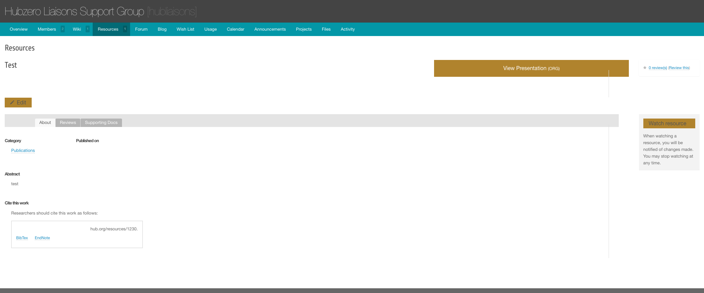

<!--
status: rewritten
reviewed-against: 2.4-main @ 123ea53b14
reviewed: 2026-09-09
screenshots: ok
source: https://help.hubzero.org/documentation/240/managers/users/supergroups
source-id: 3365
modified: 2016-07-12
-->
# Super Groups

A super group is a hub group with a web space of its own. It keeps
everything an ordinary group has — members, forum, wiki, blog, files — and
adds a directory on the server holding its own template, its own pages, its
own modules, optionally its own components, and its own database. Content in
a super group may contain PHP and JavaScript, which is stripped out of an
ordinary group's pages.

Super groups are for the hub's own project teams and partners, not for
anything a visitor can create. Only an administrator can make one, and the
code inside one runs with the hub's full privileges.

Writing the template itself is a developer task. See
[Super Groups](../../developers/13-supergroups/README.md) in the developer
book for the templating system, page templates, macros, PHP pages, databases,
migrations and components, and
[Super Groups with GitLab](../../developers/14-supergroups-gitlab/README.md)
for the repository workflow.

## Creating a super group

A group's type can only be set from the administrator interface. Groups
created by users on the site are always ordinary hub groups.

1. Go to **Users** → **Groups**.
2. Select **New**.
3. Set **Type** to **Super**.
4. Fill in the **Alias** and **Title**, and a **Group Logo** if you have one.
   The alias becomes both the group's URL segment and the name of its
   directory and database, and cannot be changed later.
5. Under **Membership**, choose a **Join Policy**, and give the
   **Credentials** text if the policy is Restricted. Clear **Membership
   Control** if this group's membership is managed elsewhere.
6. Under **Access**, choose a **Discoverability**: **Visible** lists the
   group in searches, **Hidden** keeps it out of them.
7. Set **Approve** to **Approved** and **Published** to **Published**. Groups
   created here are not approved automatically.
8. Select **Save & Close**.

On save the hub does the rest, in
[`_handleSuperGroup()`](../../../core/components/com_groups/admin/controllers/manage.php):

- Creates the group's directory under the **Upload** path from the component
  options, `/site/groups` by default, named after the group's numeric ID.
- Copies the active site template's `super/` directory into the group's
  `template/` directory, if that template ships one.
- Copies the default skeleton from
  `core/components/com_groups/super/default` over the top, without
  overwriting anything already there. That gives the group its `template/`,
  `components/`, `config/`, `macros/`, `migrations/`, `uploads/` and
  `language/` directories, and a base template with its own error and login
  pages.
- Sets the directory to mode 2770 and changes its group ownership to the
  **Super Group Group Owner** option, `access-content` by default.
- Creates a database named `sg_<alias>`, if the hub's database account holds
  a grant on `sg\_%`. If it does not, the screen warns *Hub is missing super
  group database creation permission* and carries on without one.
- Writes the group's `config/db.php` from `/etc/supergroup.conf`. If that
  file is missing you get *Unable to load super group config* and the group
  has no working database connection.
- Connects the group's repository, if **Repo Management** is on. That step
  only runs when `application_env` is a production environment.

> **Warning:** Deleting the group from the administrator interface removes
> the group and its content but leaves its directory and its `sg_` database
> on the server. Clean those up by hand.

## What a super group can do that an ordinary group cannot

| Capability | Where it lives |
|---|---|
| PHP and `<script>` in group pages and modules | The page or module content itself |
| Standalone PHP pages | `pages/<name>.php` in the group directory, served at `/groups/<alias>/<name>` |
| Its own components | `components/com_<name>/<name>.php`, with an optional `router.php`. Requires the **Super Group Components** option |
| Its own template | `template/` in the group directory |
| Its own database | `sg_<alias>`, configured by `config/db.php` |
| Its own language strings | The group directory is searched first when a group plugin loads its language file, so a super group can rename or reword anything a group plugin says |
| Modules on group pages | The **Manage Modules** tab, which ordinary groups only get if the **Pages** option **Modules** is on |
| Resources shown in the group's own template | Automatic; see below |

An ordinary group has PHP and `<script>` removed from its page content
before rendering. The one exception is the per-group **Trusted content**
page setting on the group's admin form, which suppresses the stripping for
that group without making it a super group.

## Approval of pages and modules

Because a super group's content executes, it is not published on the author's
say-so.

When a page version or a module is saved and its content contains `<?`,
`<?php` or `<script`, the hub marks it unapproved and emails everyone listed
in the **Page Approvers** option of the `com_groups` configuration. Until it
is approved, visitors get the "not approved" placeholder instead of the page,
and the module shows as **Pending approval** in the module list.

To approve one:

1. Go to **Users** → **Groups**.
2. Select the group's page count. The **Pages Needing Approval** table sits
   at the top of the screen; the **Modules** entry in the sub-navigation
   carries the same table for modules.
3. Read the submission. **View Raw** shows the source as written, **Edit**
   opens it, and **Render Preview** shows it as a visitor would see it.
4. Run the two checks: **Check for Errors** and **Scan Content**.
5. Select **Approve**.

**Render Preview** and **Approve** stay closed until both checks have been
run — the screen says *You must check for errors and scan before you can
approve*. Approving sends a second notification, this time to the group's
managers.

> **Note:** **Page Approvers** is a comma-separated list of *usernames*, not
> email addresses. Only a listed user can approve; anyone else is turned away
> with *Pages can only be approved by authorized approvers*. With the option
> empty nobody can approve anything, and content containing code stays
> invisible.

## Managing modules from the site

Modules are managed by the group's own managers, on the site.

1. Open the super group's home page.
2. In the group toolbar, open **More options** and select **Manage Group
   Pages**.
3. Select the **Manage Modules** tab.

The tab is present for every super group. For an ordinary group it appears
only when the **Pages** option **Modules** is on.

Filter the list by module position with the menu in the toolbar, or type in
the search box beside it.

### Adding a module

1. Open **Manage Modules** and select **New Module**.
2. Give the module a **Title** and its **Content**. Both are required. In a
   super group the editor accepts PHP and script tags, and opens in source
   mode when the content already contains either.
3. Under **Menu Assignment**, choose **On all pages** or pick the pages the
   module belongs on.
4. Under **Publishing**, set the **Status**.
5. Under **Module Settings**, set the **Position** and the **Ordering**
   within that position.
6. Select **Save Module**.

### Publishing, unpublishing and deleting

In the module list, select the unpublished icon to publish a module, or the
published icon to unpublish it. **Manage Module** opens the module for
editing, and its drop-down also offers **Publish**, **Unpublish** and
**Delete**.

### Reordering

Ordering is a property of the module, not a drag on the list.

1. Open **Manage Modules** and select **Manage Module** on the module you
   want to move.
2. Change **Ordering** under **Module Settings**.
3. Select **Save Module**.

## Resources shown in the super group's template

When a resource is opened through a super group's **Resources** tab, the
group plugin runs the `com_resources` controller itself and renders its view
inside the group's page, so the resource keeps the super group's navigation
and styling instead of switching to the site template. The behaviour is
tested on the group's type and applies to super groups only.

## Known gaps

- The super group's `error.php` template is copied into the group directory
  and the hub still checks for it, but the code that installs the custom
  error handler is commented out. A super group therefore gets the site's
  error pages, not its own.
