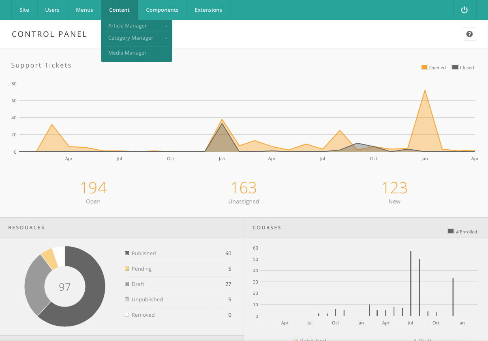

<!--
status: rewritten
reviewed-against: 2.4-main @ f22290e4e4
reviewed: 2026-09-09
screenshots: ok
source: https://help.hubzero.org/documentation/240/managers/content
source-id: 3367
modified: 2014-10-10
imported: 2026-09-09
-->
# Content

An **article** is a page of written content that the hub stores and serves
itself: the About page, the terms of use, a policy statement, a short
explanation of how the community works. Articles are the hub's own pages, as
opposed to the resources, wiki pages, group pages, and publications that
members create.

Articles live in the **Content** menu of the administrator interface, which
holds three screens:

| Menu entry | Screen | Chapter |
|---|---|---|
| **Article Manager** | The list of articles and the article editor. | [Article Manager](articlemanager.md) |
| **Category Manager** | The categories articles are filed under. | [Categories](categories.md) |
| **Media Manager** | The shared image and file library the editor's image button browses. | — |

**Add New Article** and **Add New Category** appear under their managers when
you may create one.

## Content is not layout

What you type into an article is content, not presentation. The template
supplies the typography, the colours, and the page furniture; the article
supplies the words. Styling individual articles by hand fights the template
and breaks the next time the template changes. If a page needs a look the
template does not give it, change the template — see
[Templates](../10-extensions/02-templates.md).

## Where articles appear

An article has no URL of its own until something points at it. The two ways
to reach one are:

- **A menu item.** A menu item of type **Articles → Single Article** carries
  its own alias, and that alias — plus the aliases of its parents — is the
  URL. This is how the pages shipped with a hub work: the sample **Terms of
  Use** article is reached at `/about/terms` because a menu item with that
  path points at it.
- **The article's own category path.** With no menu item, the hub matches a
  URL against category path plus article alias.

Both are explained in [URLs](urls.md), along with redirects.

## In this section

- [Article Manager](articlemanager.md) — the article list, the editor,
  categories, and the publishing workflow.
- [Categories](categories.md) — the shared category manager, which serves
  articles, user notes, the knowledge base, and events.
- [URLs](urls.md) — how an article's address is built, and how to redirect
  one address to another.
- [States, deleting and check-out](states.md) — what published, unpublished,
  archived and trashed store, which delete buttons are permanent, and why a
  record gets stuck checked out.

Every option on the Article Manager's **Options** screen is listed in the
[Content configuration reference](../../reference/configuration/components/content.md).
