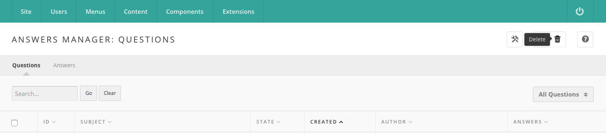

<!--
status: rewritten
reviewed-against: 2.4-main @ ddeb90135f
reviewed: 2026-09-09
source: https://help.hubzero.org/documentation/240/managers/components/answers
-->
# Answers

Answers is the hub's question-and-answer forum. Members post a question,
other members answer it, everyone votes answers up or down, and the person
who asked picks the answer that helped. On the site it appears as
**Questions and Answers** at `/answers`. This chapter covers the
administrator's side; the [Hub users](../../users/questions.md) book covers
asking and answering.

Open it in the administrator interface under **Components > Answers**. Two
sub-menu links sit at the top left: **Questions**, the default list, and
**Answers**, the responses posted to those questions.

## Questions

The Questions screen lists every question with its **ID**, **Subject**,
**State**, **Created** date, **Author**, and **Answers** count. Click a
column heading to sort by it; click again to reverse the order. The author
column links to that member's record in the Members component and notes
below the name when the question was posted anonymously. The answers count
links to the Answers list filtered to that question.

Above the list, type a term in the search box and press **Go** to match it
against question subjects and bodies, or use **Filter by:** to show **Open
Questions**, **Closed Questions**, or **All Questions**. **Clear** resets
the search.

The toolbar offers:

- **Options** — the component's configuration; see [Options](#options)
  below. Shown only to administrators.
- **New** — open a blank question form.
- **Delete** — permanently remove the checked questions after a
  confirmation, along with their answers, comments, tags, and votes. There
  is no trash to recover from.
- **Help** — the built-in help screen.

Click the state icon in a row to toggle a question between open and closed.
Closing a question is the same act the asker performs on the site by
accepting an answer, except that no answer is marked as chosen and, when
banking is on, no points are distributed.

> **Note:** A question a member deleted on the site is not removed from the
> database; it is set to a trashed state. Such rows still appear in this
> list, as do questions reported as abusive, because the **All Questions**
> filter has no separate entry for them.

## Creating or editing a question

Click a subject, or **New**, to open the question form.

**Details**

| Field | Notes |
|---|---|
| Anonymous | Hides the author's name from other members on the site. Managers still see it here. |
| Notify of responses | Whether the asker is messaged when an answer or comment is posted. Questions asked on the site always have this set. |
| Subject | Required. The one-line question. Maximum 250 characters. |
| Question | Optional. The longer version, with details, written in the editor. |
| Tags | Required. A comma-separated list. Saving without at least one tag fails with an error and returns you to the form. |

**Parameters**

| Field | Notes |
|---|---|
| Creator | The numeric user ID of the member credited with the question. Defaults to your own ID on a new question. |
| Created | The timestamp, `YYYY-MM-DD hh:mm:ss`, picked from the calendar control. |
| State | **Open** or **Closed**. Trashed and reported questions cannot be set from this list. |

The panel beside the form shows the question's ID and, for a saved
question, its creation date and the creator's name.

Press **Save** to save and stay, **Save & Close** to return to the list, or
**Cancel** to discard changes.

> **Note:** Tags entered here are attached in your name, not the author's,
> and the tag field is required even on questions that were imported or
> created before tagging was enforced.

## Answers

The **Answers** sub-menu link lists the responses members have posted. With
no question chosen it shows **Responses to all questions**; reached from a
question's answer count it is filtered to that question, whose ID and
subject head the table and link back to the question.

Columns are **ID**, **Answer** (the first 75 characters, stripped of
markup), **Accepted**, **Created**, **Author**, and **Helpful**, which
shows the up and down vote totals. **Filter by:** offers **All Responses**,
**Accepted Response**, and **Unaccepted Responses**.

The toolbar offers **New** (only when the list is filtered to one
question), **Edit**, **Delete**, and **Help**. Click the accepted icon in a
row to accept or reject that answer. Accepting marks the answer as chosen,
clears the mark from any other answer to the same question, and closes the
question; a question can have only one accepted answer, so checking more
than one row and accepting is refused.

## Creating or editing an answer

**Details**

| Field | Notes |
|---|---|
| Anonymous | Hides the responder's name from other members on the site. |
| Question | The subject of the question being answered. Read-only. |
| Answer | Required. The response text, written in the editor. |

**Publishing**

| Field | Notes |
|---|---|
| Accept | Marks this response as the chosen answer. |
| Creator | The numeric user ID of the member credited with the answer. |
| Created | The timestamp, picked from the calendar control. |

The panel beside the form shows the answer's ID, its creation date and
creator, and its **Helpful** totals. When either total is above zero, a
**Reset Helpful** button appears; it zeroes both counts and deletes the
vote log for that answer, so members may vote on it again.

> **Note:** Accepting an answer from this screen sets the state directly.
> Unlike accepting on the site, it does not run the points distribution,
> so no bank transactions are created.

## Comments

Members can reply to an answer, and reply to those replies, up to three
levels deep. These comments live in the hub's shared item-comment table and
have no administrator screen of their own. A comment reported as abusive
becomes a support ticket and is hidden behind a notice on the site until
the ticket is resolved; the same is true of a reported question or answer.
See [Support](support.md).

## Options

The **Options** button opens four settings, listed with their values in the
[configuration reference](../../reference/configuration/components/answers.md):

| Option | Effect |
|---|---|
| About points | The address of the page explaining the point system. Every "What are points?" and "Learn more" link on the site points here. Defaults to `/kb/points`. |
| Users notified on every activity | A comma-separated list of usernames messaged whenever a question or answer is posted. |
| Restrict accounts to create new posts | Disabled, or Enabled to block new accounts. |
| Minimum number of days to post | With the restriction enabled, how old an account must be before it may post. |

> **Note:** The account-age restriction is checked when a member opens the
> new-question form and when they submit an answer, and again in the
> resources plugin, but not when a question is finally saved.

The **Permissions** tab sets, per access group, who may administer the
component, manage it (which gates the administrator screens entirely),
create, delete, edit, edit their own, and change the state of questions and
answers. On the site these same actions decide who sees the **New
Question** button, who may save a question, and who may delete one:
a member can delete their own question with `core.delete`, and anyone with
`core.manage` can delete any of them.

## Points and rewards

Everything about rewards only appears when banking is switched on in the
Members component (**Bank accounts**). With it off, no reward field, point
breakdown, or "Rewards" sort is rendered anywhere.

With banking on, each question carries a market value calculated from its
answers, votes, and recommendations, and the asker may put a bonus reward
on top from their own balance. The reward is held, not spent, until the
question closes. When the asker accepts an answer, the accumulated value is
split three ways: a third to the asker, a third to the writer of the
accepted answer, and a third shared among other answers that drew at least
three votes with a majority positive — or added to the accepted answer when
no other answer qualifies. Deleting a question releases the hold and
adjusts the asker's credit back.

## Modules and plugins

Five site modules draw on this component: **mod_answers**,
**mod_recentquestions**, **mod_popularquestions**, **mod_myquestions**, and
**mod_featuredquestion**. Two answers plugins add the site's extra filters:
`answers-tools` supplies "Questions related to my contributions" and
notifies tool authors of questions tagged with their tools, and
`answers-members` supplies "Questions tagged with my interests". Without
them, those filters return nothing. The `resources-questions` and
`publications-questions` plugins put a Questions tab on resource and
publication pages, `tags-answers` includes questions in tag results,
`search-questions` includes them in site search, and `support-answers`
handles abuse reports.

## API

The component exposes `/api/answers/questions` for listing, reading,
creating, updating, and deleting questions; see the
[API reference](../../reference/api/answers.md). The site also publishes an
RSS feed of the newest questions at `/answers/latest.rss`.
