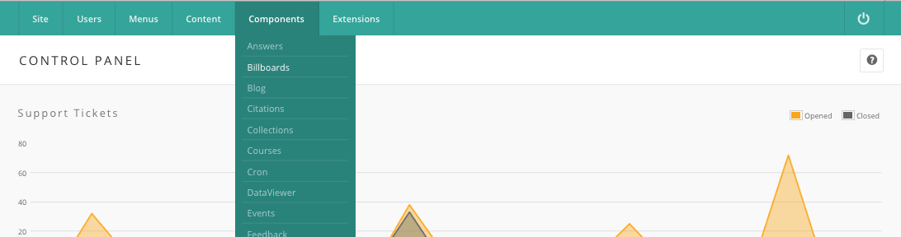
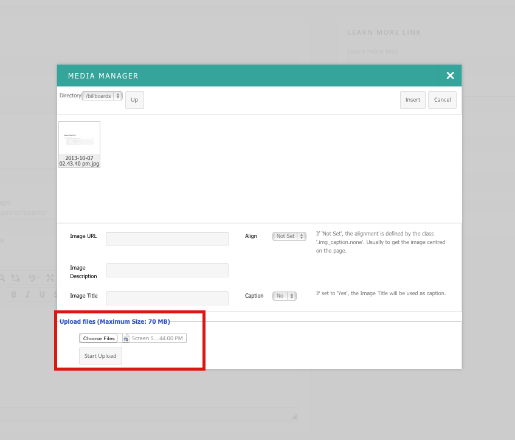
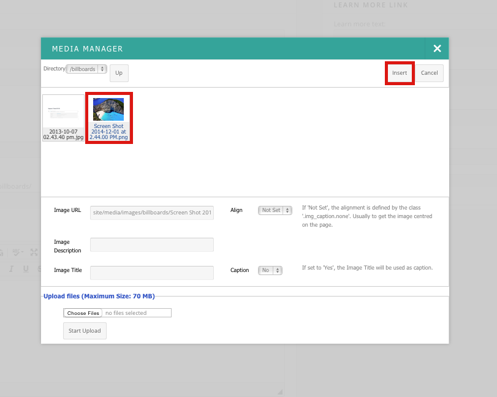

<!--
status: rewritten
reviewed-against: 2.4-main @ 009ec973b7
reviewed: 2026-09-10
screenshots: stale
source: https://help.hubzero.org/documentation/240/managers/components/billboards
source-id: 3372
modified: 2016-07-12
imported: 2026-09-09
-->
# Billboards

Billboards are the rotating slides a hub shows on its front page. Each slide
carries a background image, a heading, a block of text, and an optional
"learn more" link. Slides belong to a collection, and the `mod_billboards`
module displays one collection as a carousel. Go to **Components →
Billboards**.

## Whether your hub needs it

A billboard is the hub's shop window: the thing you want a visitor who has
never been here to see in the first three seconds. Most hubs run three or
four slides and change one of them a few times a year — a new tool, a paper,
a workshop with places left.

The typical case: your annual user meeting opens for registration and you
want it on the front page for six weeks. That is one billboard, published
now and unpublished when registration closes.

This is a small component and there is not much to it. What makes it awkward
is that it does nothing on its own: a published billboard appears nowhere
until somebody places the `mod_billboards` module on a template position. If
you have made a slide and cannot find it on the site, go straight to
[Displaying a carousel](#displaying-a-carousel).

**What it is not:** it is not the front page. The hub's front page is a menu
item and its layout comes from the template; billboards fill one band of it.
And it is not the media manager — the image lives on the billboard, not in a
library, and is deleted when you replace it.

The component has two screens, reached from the submenu:

- **Billboards** — the slides.
- **Collections** — the named groups a module points at.

## Collections

A collection is a name and nothing else. It exists so that a hub can run more
than one carousel — a front-page set and a landing-page set, say — and point
each module instance at a different one.

Press **New** on the **Collections** screen, fill in **Collection Name**, and
**Save & Close**. The list shows each collection's ID and name, and the
toolbar carries **New**, **Edit**, and **Delete**.

Every billboard needs a collection. If you save a billboard without picking
one, the component creates a collection called *Default Collection* and puts
the slide in it.

> **Note:** Deleting a collection does not delete the billboards in it. They
> stay in the database, out of every carousel, until you edit each one and
> give it a collection that exists.

## Creating a billboard

1. Go to **Components → Billboards** and press **New**.
2. Fill in the fields below.
3. Press **Save & Close**.

The edit form has three fieldsets.

### Content

| Field | Notes |
|---|---|
| **Name** | Required. What the slide is called in the list |
| **Collection** | The collection this slide belongs to |
| **Ordering** | Position within the collection. On a new billboard this reads *New Items Last*; it becomes a drop-down once the slide is saved |
| **Header** | The heading drawn over the image |
| **Background image** | A file picker. See below |
| **Text** | The body text, edited in the rich-text editor |

### Learn More Link

| Field | Notes |
|---|---|
| **Learn more text** | The link's label. Leave empty for no link |
| **Learn more target** | Where the link goes |
| **Learn more class** | An extra CSS class for the link |
| **Learn more location** | **Top left**, **Top right**, **Bottom left**, **Bottom right**, or **Relative** |

### Styling

| Field | Notes |
|---|---|
| **Alias** | The slide's HTML `id`. The module writes the slide's CSS against it, so give each billboard a distinct alias |
| **Text padding** | A CSS `padding` value applied to the slide's text |
| **CSS** | Free-form CSS added to the page for this slide |

## Adding a background image

The **Background image** field is an ordinary file input on the edit form.
There is no media browser and no separate upload step.

1. Open the billboard you want to edit.
2. Press the button beside **Background image** and choose a file from your
   computer.
3. Press **Save** or **Save & Close**.

The file is scanned for viruses and moved into the directory named by the
component's **Image Location** option, which defaults to
`/site/media/images/billboards/`. See the
[generated parameter list](../../reference/configuration/components/billboards.md).
Uploading a new image deletes the one it replaces.

Once a billboard has an image, the edit form shows it under **Current Image**,
scaled to 500 pixels wide.

> **Note:** The screenshots on this page show an older interface in which the
> image was chosen through a **Media Manager** pop-up with **Browse** and
> **Start Upload** buttons, and the filename was then pasted into a text
> field. That flow no longer exists. Ignore the pop-up in the second and third
> images.

## The billboard list

The list shows each slide's ID, name, collection, ordering, and published
state. Click a name to edit it. Click the icon in the **Published** column to
toggle the slide on or off. Reorder slides by typing new numbers in the
**Ordering** column and pressing the column's sort arrows.

The toolbar carries **Publish**, **Unpublish**, **New**, **Edit**,
**Delete**, and — for users with `core.admin` — **Options**.

Only published billboards appear in a carousel.

Unpublishing is how you retire the user-meeting slide when registration
closes: the slide drops out of the carousel at once and everything about it
survives, so next year you edit the dates and publish it again. **Delete**
takes the record and its uploaded image with it. Given that a billboard is a
few sentences and a picture, there is rarely a reason to delete rather than
unpublish.

A new billboard is created unpublished — the edit form has no published
field at all, so the only way to put a slide on the front page is the
**Published** toggle in the list. That is the right way round: write and
save the slide, come back to the list, and toggle it on when you are
satisfied. There is no preview, so the front page itself is the first place
you see the slide rendered.

> **Warning:** Once a slide is published, every subsequent save shows on the
> front page immediately. Editing a live slide means editing in public.
> Toggle it off, make the change, and toggle it back on.

## Displaying a carousel

Slides are not shown by the component. They are shown by the
`mod_billboards` module, which you publish to a template position from
**Extensions → Module Manager**. Its options are:

| Option | Default | Notes |
|---|---|---|
| **Billboard Collection** | collection `1` | Which collection to display |
| **Slide Transition Style** | Scroll Horizontal | Scroll Horizontal, Scroll Vertical, Fade, Shuffle, Zoom, or Turn left |
| **Random** | No | Show the slides in random order |
| **Slide Time** | 5 | Seconds each slide stays on screen |
| **Transition Speed** | 1 | Seconds a transition takes |
| **Display Pager** | Yes | Show the dots that let a visitor jump between slides |

Several instances of the module can run at once, each on its own collection
and its own timing.

Note the **Billboard Collection** default: collection `1`. On a hub that has
never created a collection by hand, the first slide you save creates
*Default Collection*, which is usually ID 1, and the module finds it. On a
hub where somebody has since deleted or renumbered collections, a freshly
placed module points at a collection that may not exist and shows nothing.
If the carousel is empty, check the module's collection against the
**Collections** screen before you look anywhere else.

**Slide Time** defaults to 5 seconds, which is too fast for a slide carrying
a paragraph of text — a reader who has to finish a sentence will not. If your
slides have more than a headline on them, 8 to 10 is kinder. This is a module
setting and changing it affects only that module instance, so it is safe to
try on a live hub and change back.
