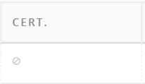

<!--
status: imported
source: https://help.hubzero.org/documentation/240/managers/components/courses
source-id: 3377
modified: 2016-07-12
imported: 2026-09-09
-->
# Courses

## Creating a Course

1. On the **/administrator** interface, navigate to **Courses** under the Components tab
2. At the top of the Courses panel, click the **+** sign to add a new course
3. Fill in the details of the course. (See below for field/option descriptions.)

4. Click on the drop-down section under **Publishing**, and determine if you want your course to be a **Draft** or **Published**
5. Click on **Save** to save the work that you have completed. You can only further edit your course, such as add an image or managers, after you have saved the initial details
6. Under the Managers area, add course administrators (Instructors, Managers, etc.)
7. Under the Image area, add a course image by dragging an image file into the upload box
8. Click **Save & Close** to save all the details of the course and to go back to the Courses main page, where your course will now be listed

**Field/Option Descriptions**

- **Course Alias:** Your course alias. This will be part of the URL.
- **Course Title:** The official name of your course. This name will be what users see when browsing the hub.
- **Interests (tags):** Helps categorize your course in search results. These tags can help your course be discovered more effectually.
- **Blurb:** A short description of the course.
- **Description:** A longer description of the course. Here you can personalize what the goal or concept is in further detail to your students.
- **Unpublished:** The course is taken off the front end of the hub.
- **Published:** The course can be found in the front end. Anyone can find the course through searches.
- **Draft:** The course is being drafted. The course is accessible only to course administrators. This allows instructors and managers to build a course before it is available to students.
- **Deleted:** The course is deleted permanently. Once a course is deleted nothing can be retrieved from the course after this action.

## Creating Course Overview Pages (tabs)

1. In the backend, navigate to **Courses** under the Components tab
2. Find your course in the list. Under the **Pages** column, click on the **+** sign to add a new page
   > **Note:** If there are already existing pages, you will see a number in place of the **+** sign.
3. Enter the title, URL, and content into the page details. In the published parameters choose **Yes** to make the page active on the **Course Overview**
   > **Note:** Note: A new page must be saved before files can be uploaded.
4. Click **Save & Close** and your new page will appear in the course pages list in the backend. On the frontend, your new page will show as another tab in the Course Overview

## Opening up Enrollment into a Course

1. In the backend, navigate to **Courses** under the Components tab
2. Locate the course and click the number of offerings for that course in the **Offerings** column
3. Locate the offering and click the number of sections for that offering in the **Sections** column
4. Click the section’s title
5. Under the **Details** tab, locate **Enrollment** and select a response from the drop-down
   1. **Open (anyone can join)**: Any user on the Hub can join this section of the course.
   2. **Restricted (coupon code is required)**: Only users with a coupon code can gain access to this section of the course.
   3. **Closed (no new enrollment)**: This section of the course is closed and cannot be accessed by new students.

## Editing Parameters in an Offering

1. In the backend, navigate to **Courses** under the Components tab
2. Locate the course and click the number of offerings for that course in the **Offerings** column
3. Locate the offering and click the title
4. Locate the **Parameters** section and select the parameters for **Progress Calculation**
   - **Inherit from course defaults-** means that all of the parameters preset on the hub will be the same for this offering.
5. Click **Save & Close** to save the parameters for that offering

## Editing Parameters in a Section

1. In the backend, navigate to **Courses** under the Components tab
2. Locate the course and click the number of offerings for that course in the **Offerings** column
3. Locate the offering and click the number pf sections for that offering in the **Sections** column
4. Click the section's title
5. Under the **Details** tab, locate the **Parameters** section and select the parameters for **Progress Calculation**
   - **Inherit from course defaults**- means that all of the parameters preset on the hub will be the same for this section.
6. Click **Save & Close** to save the parameters for that section

## Editing Discussion Parameters

1. In the backend, navigate to **Courses** under the Components tab
2. Find the course and the click the number in the **Offerings** column
3. Locate the offering and click the number of sections for that offering in the **Sections** column
4. Click the title of the section that you would like to change the discussions settings in
5. Under the **Details** tab, locate the **Discussions Parameters** area. In the drop-down, choose **All sections** to show discussion threads across all sections in this offering, or choose **This section only** to show discussion threads only by this specific section
6. Click **Save & Close** to save the changes to the parameters

## Deleting Assets

> **Note:** You must be logged into your hub in order to complete the following tasks.

1. Click the **Components** tab and then select the **Courses** button located in the drop-down
2. On the Courses page, locate the course
3. After locating the course, under the **Offerings** column, select the number of offerings
4. On the Courses: Offerings page, locate the offering
5. Locate the **Units** column and select the number of units
6. Locate the Unit, then under the **Asset Groups** column select the number of under the column
7. Inside **Asset Groups**, check the box of the offering
8. Click the **Delete** button to permanently remove the content and asset from the course
9. A pop-up will appear asking **Are you sure you want to remove these items?**
10. Proceed to click **OK**, and the items will be removed from the course

## Creating Certificates

> **Note:** You must be logged into your hub in order to complete the following tasks.

1. Click the **Components** tab and then select the **Courses** button located in the drop-down
2. On the Courses page, locate the course
3. After locating the course, under the **Cert.** or certificate column click on the **No Certificate Set** button
4. On the **Courses: Certificate: Create page**, upload a PDF certificate file by choosing the file from your files and then clicking **Upload**
5. Once the file is uploaded, a preview will appear
   1. The preview is where you can place, drag, and resize various placeholders for elements such as the user’s name, course name, etc. to be dynamically filled in when a certificate is claimed.
6. Click the **Save & Close** button in order to navigate back to the Courses page

## Deleting Certificates

> **Note:** You must be logged into your hub in order to complete the following tasks

1. Click the **Components** tab and then select the **Courses** button located in the drop-down
2. On the Courses page, locate the course
3. After locating the course, under the **Cert**. or certificate column click on the **Certificate Set** button (checkmark icon **✔**)
4. On the **Courses: Certificate: Create** page, click the **Delete** button

5. Click the **Save & Close** button in order to navigate back to the **Courses** page
6. A pop-up will appear stating **Entry successfully removed** and you will be navigated back to the Courses page

## Changing Deployment Time

> **Note:** You must be logged into your hub in order to complete the following tasks.

1. Click the **Components** tab and then select the **Courses** button located in the drop-down
2. On the **Courses** page, locate the course
3. After locating the course, under the **Offerings** column, select the number of offerings
4. On the **Courses: Offerings** page, locate the offering
5. Locate the **Sections** column and select the number under the column
6. Check the box of the section, and then click the **Edit** button
7. In the **Courses: Sections: Edit** page, select the **Dates/Times** tab
8. Locate the course asset and set a date and time for the content of the asset, which is usually in the third tier inside the asset group
   1. Example: Exam> Exam 1> Exam1
9. Set the date and time by clicking the **From** and **To** boxes to access the time pop-up
10. Save the changes by clicking **Save & Close** and a pop-up will appear saying **Entry successfully saved**

## Display Number of Users Enrolled in a Course

> **Note:** You must be logged into your hub in order to complete the following tasks.

1. Click the **Components** tab and then select the **Courses** button located in the drop-down
2. On the **Courses** page, select the **Options** button in the top-right corner of the page
3. Under the **Defaults** tab, locate the **Show Enrollment Numbers** option at the bottom of the pop-up
4. Select between **Yes** to show enrollment numbers or **No** to not show enrollment numbers from the drop-down
5. Click the **Save & Close** button to save the new setting and exit out of the pop-up

## Course Presentations: HUB Presenter

Hub Presenter is a presentation formatting section available to upload large video files inside of Courses. An administrator with privileges to workspace is the only one who can upload these presentation files.

1. Navigate to the HUB and go to **hubname.org/resources**
2. Create a new Resources and make the category **Online Presentations**
3. Fill out the information needed for the Resource and then navigate to the backend of the HUB to make sure that the Resource is **Published**
4. Then, navigate to the HUB **Workspace** and **ssh** into your HUB account
5. Upload the videos & slides of the presentation
   1. Note: Slides must be uploaded in order by appearance as individual images (.jpg) in a zipped folder called Slides, the video must be uploaded as a .webm, .mp4, and a .ogv
      1. Example: media.webm/media.mp4/media.ogv
6. Create a folder called **/slides** and then navigate to /hubname/app/site/resources/XX-XX-XXXX/slides and upload all image slides as a .zip file
   1. Note: "XX-XX-XXXX" is the date of when the resource was created
7. Listed below is an example of the presentation layout:

{
"presentation": {
"title": "Career Development",
"type": "Video",
"media": [
{
"source": "media.mp4",
"type": "mp4"
},
{
"source": "media.webm",
"type": "webm"
},
{
"source": "media.ogv",
"type": "ogv"
}
],
"slides": [
{
"title": "Career Development",
"type": "Image",
"media": "slides/001.01.jpg",
"time": "0",
"slide": "1"
},
{
"title": "Career Development",
"type": "Image",
"media": "slides/001.01.jpg",
"thumb": "slides/001.01.jpg",
"time": "8.5752419085752418",
"slide": "1"
},
{
"title": "Your Career Choices after Graduate School and The Most-Neglected Item in your Career Development",
"type": "Image",
"media": "slides/002.01.jpg",
"thumb": "slides/002.02.jpg",
"time": "50.417083750417085",
"slide": "2"
},
{
"title": "Your Career Choices after Graduate School and The Most-Neglected Item in your Career Development",
"type": "Image",
"media": "slides/002.02.jpg",
"time": "64.7313980647314",
"slide": "2"
},
{
"title": "Questions? I Might have replies….",
"type": "Image",
"media": "slides/046.01.jpg",
"thumb": "slides/046.01.jpg",
"time": "4506.6733400066732",
"slide": "46"
}
]
}
}

​

## Setting a Course in Preview Mode

You can set a course offering to give users a preview from the administrator interface.

1. Navigate to /administrator for your hub and login
2. Click on "Courses" under "Components"
3. Locate the course where you want to enable preview mode, and click on the number of offerings
4. Then click on "Sections" for that offering
5. Click on the title of the offering
6. Under "Parameters" change "Preview mode" to "Yes, offer a full preview" or "Yes, offer a preview of the first unit."
7. Click "Save & Close"
