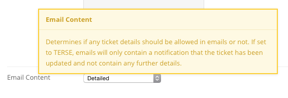

<!--
status: rewritten
reviewed-against: 2.4-main @ d48e29db14
reviewed: 2026-09-09
source: https://help.hubzero.org/documentation/240/managers/components/support
-->
# Support

Support is the hub's ticket tracking system. Members report a problem at
`/support`, the ticket lands in a queue, and support staff answer it,
reassign it, tag it, and close it — with every change recorded in the
ticket's log. The component also collects the abuse reports that members
file against comments and other content elsewhere on the hub. This chapter
covers the administrator's side; the [Hub users](../../users/support.md)
book covers submitting and tracking a ticket.

Open it under **Components > Support**. Eight sub-menu links run across
the top: **Tickets**, **Categories**, **Queries**, **Messages**,
**Statuses**, **Abuse**, **Stats**, and **ACL**.

## Tickets

The Tickets screen is split into three panes. The left pane is your list
of saved queries; the middle pane holds the tickets the selected query
returns; the right pane shows a ticket you pick from the list.

Above the queries sits **Watch list**, with **Open tickets** and
**Closed tickets** counts for every ticket you are watching. Below that
are your query folders. Each folder and each query carries **Edit** and
**Delete** links, and the two controls at the bottom, **Add custom query**
and **Add folder**, create new ones. Folders and queries can be dragged
into a new order, which is saved as you drop them.

The ticket list has a **Sort results** bar — **Age**, **Status**,
**Severity**, **Summary**, **Group**, **Assignee** — and a **Find** box
that searches within the current query. Each row shows the ticket number,
its status (coloured with the status's own colour), the time of the last
comment, any target date, the submitter, the summary, tags, group,
assignee, and severity.

The toolbar offers **Options**, **New**, **Delete**, and **Help**.
Deleting removes the ticket and everything attached to it; there is no
trash to recover from.

## Reading and answering a ticket

Clicking a ticket's summary opens it. The top of the screen shows the
original report — which cannot be edited — with the submitter's name,
**Submitter e-mail**, **User type**, **OS / Browser**, **IP and Hostname**,
**Referrer URL**, **Instances**, the user agent string, and any files the
submitter attached. Beside it are the ticket's status, **Severity**,
**Owner**, **Last Activity**, and a **Watch ticket** / **Stop watching**
button.

Below the existing comments is the response form.

| Field | Notes |
|---|---|
| (message template) | Pick a saved response from the list to fill the comment box; **[custom]** leaves it empty. See [Messages](#messages). |
| Comments | The reply. Leave it blank to record only a change of status, owner, or tags. |
| Private | Marks the comment visible to staff only. It overrides every e-mail setting — a private comment is never sent to the submitter. |
| Attachments | Drag files in or click to browse. Size and type come from the component's Options, or the Media Manager's if those are blank. |
| Send message to | Usernames, user IDs, or e-mail addresses to copy, comma-separated. The value is remembered and pre-filled on the next comment. |
| Ticket submitter / Ticket owner | Checked by default; clear either to leave that person out of the notification. |
| Tags | Tags for the ticket, comma-separated. |
| Group | A group the ticket belongs to. With no owner set, the group's managers are notified instead. |
| Assigned to | The person who owns the ticket now. The list is drawn from the users and groups in the [ACL](#acl), or from the group named in the **Group** option. |
| Category | One of the [categories](#categories) you have defined. |
| Target date for completion | Optional deadline, shown on the ticket in the list. |
| Severity | Critical, High, Normal, or Low. |
| Status | Grouped under **Open** and **Closed**. The open group lists your open statuses; the closed group starts with plain **Closed** and then your closed statuses. |

Press **Save** or **Save & Close**. Everything that changed is written to
the ticket's log, along with who was notified.

> **Note:** Posting a comment reopens a closed ticket. This is deliberate,
> so that a reply is never lost on a ticket nobody is watching.

> **Note:** If someone else commented while you had the form open, the save
> is refused and your text is handed back so you can review it first.

**New** on the Tickets toolbar opens a shorter form for entering a ticket
on someone's behalf: **Login**, **Name**, **Email**, **Description**,
tags, group, assignee, severity, status, category, and CC.

## Queries

The Queries screen manages the default queries every user starts with.
Each has a **Type**:

- **Common (in ACL)** — a common query such as *Open tickets* or
  *New tickets*, given to users who hold support permissions.
- **Common (not in ACL)** — the same idea, but filtered so that a user only
  sees tickets they submitted, own, or that belong to one of their groups.
- **Mine** — queries about the logged-in user: *Reported by me*,
  *Assigned to me*, *Assigned to me (closed)*.
- **Custom** — a query a user built for themselves.

Editing one opens the **Query builder**: a title, a set of rules matching
**any** or **all** of the conditions, optional nested groups of rules, a
sort field, and a direction. Conditions can test the owner, group,
submitter, ticket ID, report text, open/closed state, status, created and
closed dates, tag, type, severity, and category.

The toolbar adds **Reset to defaults**, which deletes every query and
folder on the hub and rebuilds the stock set.

> **Note:** Changes here only reach *new* users, the first time they open
> the support component. Existing users keep the copies they already have.

## Categories

Categories organise tickets. The list shows **ID**, **Title**, and
**Alias**; an entry has only those fields, with the alias generated from
the title when you leave it blank.

## Statuses

Statuses are the labels a ticket can carry. Filter the list by
**Status for** — *all statuses*, *open*, or *closed*.

| Field | Notes |
|---|---|
| Title | Required. What the status is called on the ticket. |
| Alias | Generated from the title if blank. |
| For | **Open tickets** or **Closed tickets**. Setting a ticket to a closed status closes it and records the closing time. |
| Color | A colour swatch, picked from the colour widget, used to stripe the ticket in the list. |

> **Note:** A new hub starts with no statuses at all. Until you add some,
> the only choices on a ticket are the built-in **New** and **Closed**.

## Messages

Messages are canned responses that appear in the drop-down above the
comment box. Each has a **Summary** — the name shown in that list — and
the **Message** text. Four placeholders are substituted when the message
is chosen: `{ticket#}` and `#XXX` become the ticket number, `{sitename}`
the site name, and `{siteemail}` the site's from address.

## Abuse

Abuse reports are filed by members against comments and other content
across the hub. The list shows **ID**, **Status**, **Reported Item**,
**Reason**, **By**, and **Date**, filtered by **Show**: *Outstanding*,
*Released*, or *Deleted*. Opening a report shows the reported content and
who reported it, with four choices:

- **Release item** — return the content to its normal state.
- **Remove as Spam** — take the content down and train the enabled
  antispam plugins on it.
- **Delete item** — take the content down, with an optional note.
- **Decide later** — leave the report alone.

Releasing or removing marks the report reviewed. Removal e-mails the
content's author, and — where banking is enabled — credits points to the
member who filed the report.

The **Spam Check** link beside the list runs a block of sample text past
every enabled antispam plugin and reports what each one made of it.

## Stats

Stats charts tickets opened against tickets closed by month, then breaks
the totals down: opened and closed all time, average ticket lifetime,
unassigned tickets, tickets by severity, and tickets by resolution. Below
that is a card for each person tickets are assigned to, ranked by how many
they have closed, with their own chart and average lifetime. **Show for
group** narrows everything to one group's tickets.

## ACL

The ACL grants support permissions to individual users and to groups.
Each row is a user or group with **Read**, **Update**, and **Delete** on
tickets, **Create** and **Read** on comments, and **Create** and **Read**
on private comments; click a cell to toggle it. To add a row, type a
username, user ID, or group name into **Alias or ID** at the foot of the
table, choose *user* or *group*, tick the permissions, and press **Add**.

Group permissions are inherited by every member, and where a user belongs
to several groups the highest permission wins. A permission set on the
user directly overrides everything the groups give them. Super
administrators pass every check.

> **Note:** Whatever the ACL says, a member always has read access to a
> ticket they submitted, own, or were copied on in the most recent comment.

## Options

**Options** on the Tickets toolbar opens the component-wide settings:
the group to draw assignees from, whether replies can arrive by e-mail,
the addresses notified of a new ticket, whether e-mails carry ticket
details or only a bare notification, abuse-report notifications, the
attachment upload path, size limit and allowed extensions, and the IP
blacklist and bad-word list used to screen submissions. Every option is
listed with its values in the
[configuration reference](../../reference/configuration/components/support.md).

Setting **Email Content** to *Terse* strips ticket detail out of every
notification, which is what a hub bound by FISMA or HIPAA rules wants.
When it is on, the **Terse** checkbox on the comment form is pre-checked;
staff can clear it for a single comment.

The **Permissions** tab carries the actions from `access.xml`: the
component-wide *Configure*, *Access Administration Interface*, *Create*,
*Delete*, *Edit*, *Edit State*, and *Edit Own*, plus a per-object set for
tickets (view, create, delete, edit, edit state, edit own) and for ticket
comments and private ticket comments (view and create). These are the
Joomla-style rules; the day-to-day permissions that decide who answers
tickets live in the [ACL](#acl) screen instead.

## API

Support exposes a full REST API — tickets, comments, categories,
statuses, messages, stats, and a report of tickets that breach a
service-level criterion. See the
[API reference](../../reference/api/support.md).
