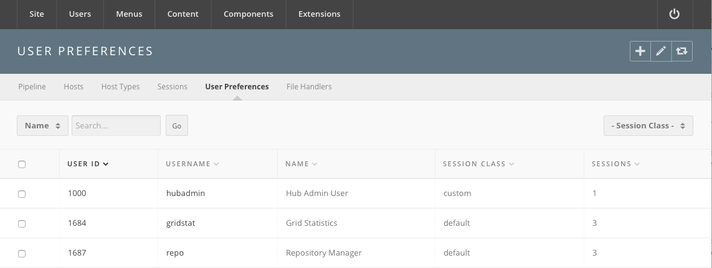

<!--
status: rewritten
reviewed-against: 2.4-main @ f22290e4e4
reviewed: 2026-09-09
screenshots: stale
source: https://help.hubzero.org/documentation/240/managers/components/tools
source-id: 3404
modified: 2016-08-26
imported: 2026-09-09
-->
# Tools

The Tools component has two halves. The half a tool contributor sees lives on
the site, at `/tools/pipeline`, and is where a tool moves from registration to
publication. The half described here lives in the administrator interface and
manages the machinery around it: execution hosts, session zones, running
sessions, per-user session limits, and file handlers.

For the pipeline itself — the nine tool states, the administrator controls,
the install and publish steps, and the group membership those controls
require — see [Tools](../03-maintenance/02-tools.md) in the maintenance
section. That chapter is the one to read before touching a tool
contribution.

Go to **Components → Tools**. The submenu holds:

| Screen | Shown |
|---|---|
| **Pipeline** | always |
| **Hosts** | always |
| **Host Types** | always |
| **Zones** | only when the **Zones** option is on |
| **Sessions** | always |
| **User Preferences** | always |
| **File Handlers** | always |
| **Windows** | only when the **Access Key ID** option is set |

Every screen needs `core.manage` on `com_tools`. That is separate from the
pipeline's own controls, which are granted by membership of the group named
in the **Admin Group** option.

## Pipeline

A list of every tool contribution: **ID**, **Name**, **Title**, **State**,
**Registered**, **Changed**, and **Versions**. Above it are a **Search** box
and a **State** drop-down. The toolbar carries only **Options** and **Help** —
tools are not created or deleted here.

Clicking a tool's name or title opens a small edit form carrying only **Title**,
**Ticket ID**, and **State**. **State** offers all ten values — Unpublished,
Registered, Created, Uploaded, Installed, Updated, Approved, Published,
Retired, Abandoned. Setting it here writes the state
directly and skips everything the pipeline would otherwise do, so use the
site-side **Flip Status** control instead unless you are repairing a stuck
contribution.

**Options** in the toolbar opens the component's configuration; the full
parameter list is in the
[generated reference](../../reference/configuration/components/tools.md).

### Versions

The number in the **Versions** column links to the tool's version list —
**ID**, **Name**, **Version**, **Revision**, **State**, and, when DOI
registration is configured, **DOI**.

A version's edit form has a **Details** tab with **Command**, **Timeout**,
**Required Host**, **Middleware** and **Parameters**, a DOI panel, and a
**Zones** tab listing the zones the version may run in.

The **DOI** column appears only when the **Enable DOI service?** option is on.

> **Note:** The component has a `batchdoi` task that registers DOIs for tool
> versions that lack one, but no screen links to it. Reach it by hand at
> `index.php?option=com_tools&controller=pipeline&task=batchdoi&limit=25`.
> It processes `limit` records — two by default — and prints its results as
> plain text.

## Hosts

The execution hosts that run tool sessions. Columns: **Name**, **Service
Host**, **Provisions**, **Status**, **Uses**, **Zone**, and **Broken
Containers**.

A host's edit form asks for **Name** (a valid hostname), **Service Host**,
the **Types** it provides, and its **Zone**. The right-hand side shows the
host's live status, its **Tool Sessions**, and its **Container Statuses**.

The **Provisions** cell lists every host type; the ones the host provides are
bold. Each is a link that flips that capability bit on the host, so you can
take one capability away without touching the rest. The **Status** cell links
to a live status page for the host.

> **Note:** Hosts, provisions, status and container information live in the
> middleware database, not the CMS database. When the middleware is
> unreachable these screens are empty or error.

> **Warning:** The provisions toggle is a plain GET link with no CSRF token
> and no permission check beyond `core.manage`. Treat a link to it in an
> email the way you would treat any other unguarded admin action.

## Host Types

The capability bits a host advertises and a tool requires. Columns:
**Name**, **Bit#**, **Description**, and **References** — the number of hosts
using the type.

An entry is a **Name**, a **Value** (the bit number), and a **Description**.
A tool's **Required Host** field is matched against these.

## Zones

Zones group hosts into pools — a local cluster, a remote site — so a tool
version can be pinned to one. The screen appears only when the **Zones**
option is turned on.

Columns: **Zone**, **Type**, **State**, **Default**, **Master**, **SSH Key
Path**, and **Locations**. Type is **Local** or **Remote**; state is **up**
or **down**; one zone is the **Default** and the toolbar's **Make default**
sets it.

A zone's edit form has a **Details** tab and a **Locations** tab. Details
takes the **Zone** name (letters, numbers, dashes and underscores), a
**Title**, a **Description**, a **Master**, a **Type**, and a **State**, plus
an **Image** panel and a **Parameters** fieldset holding the VNC and
websocket proxy settings:

- **Websocket VNC Proxy Server Enabled**, **Websocket VNC Proxy Server**,
  **Secure Websocket VNC Proxy Server**
- **VNC Proxy Server Configuration Enabled**, **VNC Proxy Server**,
  **Secure VNC Proxy Server**

**Locations** are IP ranges — **IP from**, **IP to**, **Continent**,
**Country**, **Region**, **City** — used to send a visitor to the nearest
zone. A zone must be saved before locations or an image can be added.

> **Note:** **SSH Key Path** is a column on the list but has no field on the
> form. Set it in the database, or through whatever provisions the zone.

## Sessions

Two screens, reached from the sub-navigation: **Active** and **Session
classes**.

### Active

Every tool session currently running. Columns: **Session**, **Owner**,
**Viewer**, **Started**, **Last accessed**, **Tool**, **Exec host**, and
**Stop**. Drop-downs filter by **Tool**, **Execution Host**, and **Viewer**.

The **Stop** cell terminates one session. Ticking rows and pressing
**Delete** terminates several. Terminating is immediate and the user is not
warned.

### Session classes

A session class is a named session allowance. Columns: **ID**, **Alias**, and
**Jobs Allowed**.

The install creates one class, `default`, allowing **3** concurrent sessions.
That is the number every user gets unless something overrides it.

A class's edit form has:

- **Alias** — must be unique, and cannot be `custom`, which is reserved.
- **Jobs Allowed** — the number of concurrent sessions.
- **User Access Groups** — the access groups this class applies to. A user
  added to one of these groups is given this class automatically.

Deleting a class moves everyone in it back to the `default` class. The
`default` class itself cannot be deleted.

## User Preferences

The per-user override of the session allowance. This is the screen the old
version of this page described.

The list shows **User ID**, **Username**, **Name**, **Session class**, and
**Sessions**, all sortable. Above it, a **Search by** drop-down (**Username**
or **Name**) with a search box and **Go**, and a **- Session Class -** filter.

Only users with an explicit entry appear. Everyone else runs on the class
their access groups give them, or on `default`.

To change a user's limit:

1. Go to **Components → Tools → User Preferences**.
2. If the user is listed, tick the row and press **Edit**. If not, press
   **New** and find them with the **User** field — search by name, or type a
   username or user ID.
3. Set **Session class**. Picking a named class fills **Sessions** from that
   class and makes it read-only. Picking **custom** leaves **Sessions**
   editable, so you can give one person a number no class offers.
4. Fill in **Sessions** if you chose **custom**. It must be numeric.
5. **Preferences** takes free-form extra settings for the session.
6. Press **Save & Close**.

Ticking rows and pressing **Default** in the toolbar puts those users back on
the `default` class.

> **Warning:** The **Default** action fails with *Could not find class with
> name 'default'!* if the `default` session class has been renamed or
> deleted. Do not rename it.

> **Note:** The screenshot above predates two changes: the **Search by** and
> **for** labels beside the filter, which were missing strings, and the
> **Zones** and **Windows** submenu entries, which appear when those options
> are on.

## File Handlers

A file handler tells the hub which tool opens a given file from a user's
storage. Columns: **Tool alias**, **Prompt**, and **Rules**.

A handler is a **Tool alias** chosen from the installed tools, a **Prompt**
shown to the user, and a list of rules. Each rule is an **Extension** and a
**Quantity** — how many files of that extension the tool accepts. **Add
rule** and **Delete rule** build the list.

If the drop-down says *No tools installed*, no tool has reached the
**Installed** state yet.

## Windows

Present only when the component's **Access Key ID** option holds an Amazon
Web Services key. It manages Windows tool instances on AWS: **ID**, **Name**,
**Title**, **UUID**, in-use and available session counts, and **State**, with
per-instance session and usage views and a **Terminate** action.

Leave the option empty on a hub with no Windows tools and the screen never
appears.
