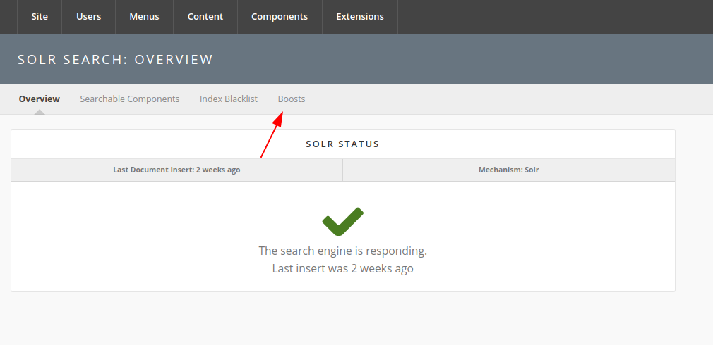
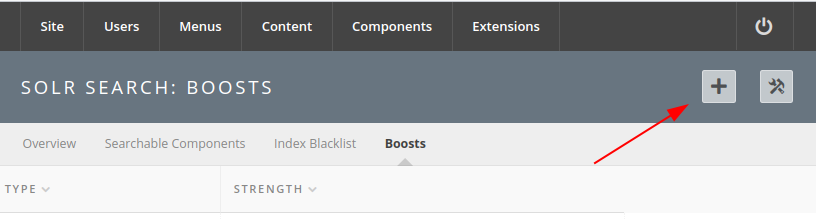
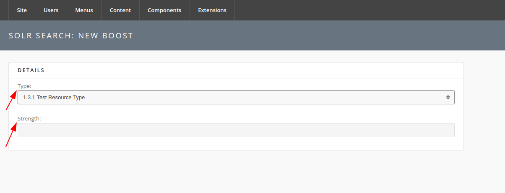
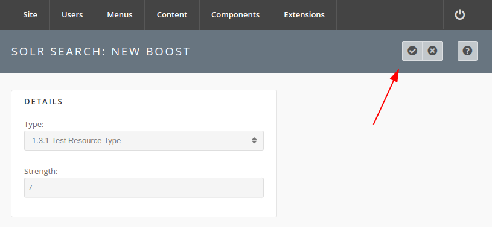

<!--
status: rewritten
reviewed-against: 2.4-main @ 009ec973b7
reviewed: 2026-09-10
screenshots: ok
source: https://help.hubzero.org/documentation/240/managers/components/search/boosting
source-id: 3394
modified: 2019-09-11
-->
# Boosting

A boost moves one kind of matching result up or down the ranking. It does not
change which results are found, only their order.

Most hubs never need one. Reach for a boost when a whole class of content is
consistently in the wrong place: a hub whose members come for the tools, but
where a search for a tool's name returns the dozen presentations that mention
it first. Boosting the tool resource type moves tools up for every query at
once. That is also its limitation — a boost is not per-query and not per-word,
so if the problem is one bad result rather than a whole type, a boost is the
wrong instrument.

Boosts are the safest thing on these screens. Nothing is re-indexed, nothing
is deleted, the change takes effect on the next search, and setting the
strength back to zero or deleting the row undoes it completely.

> **Note:** Boosting is a Solr feature. On a hub running Basic search the
> **Boosts** tab is not reachable and the stored boosts have no effect.

## What can be boosted

The **Type** menu offers one entry for each resource type defined under
**Components > Resources**, plus **Citations**. Those are the only choices;
there is no boost for blog entries, groups, members, or the other indexed
types.

Behind the menu, a resource type becomes the Solr clause
`type:<the type>^<strength>` and **Citations** becomes
`hubtype:citation^<strength>`. Every boost is added to the query as a Solr
boost query, so the effect is cumulative with the field weights in
**Query Fields**.

## Creating a boost

1. Go to **Components > Search**.
2. Select the **Boosts** tab.

   

3. Select the **+** button in the toolbar.

   

4. Choose a **Type**.

   

5. Enter a whole number for **Strength**.
   - A positive value moves matching results higher.
   - A negative value moves them lower.
   - Zero has no effect.

   There is no scale printed anywhere and no preview. Start at a small
   number, save, run two or three searches you know the right answer to, and
   raise it only if nothing moved. A large boost pushes that type to the top
   of every result page on the hub, including searches where it is irrelevant.
6. Save the boost with the tick button in the toolbar.

   

The new boost applies to the next search; nothing has to be re-indexed.

## Editing and removing

Selecting a row on the **Boosts** list opens it for editing. **Strength** can
be changed; **Type** is shown as a disabled field, because a boost is
identified by its type. To boost a different type, delete this boost and
create another. The edit screen's trash button deletes the boost outright —
there is no trashed state to recover it from.

Only one boost may exist per type. Saving a second one for a type that
already has a boost fails with *A boost already exists for …*.

## When boosts are ignored

Turning the **Tag Search Box** option on disables boosting altogether: the
query is built without any boost queries, and the **Boosts** screen shows the
notice *Query boosts are currently omitted because tag search is enabled*.
The boosts stay stored and take effect again when the option is turned off.

> **Warning:** Tag search costs more than the boosts. The same block of code
> that adds the boost queries also sets **Query Fields**, **Phrase Fields**
> and **Phrase Slop**, so with tag search on the hub stops weighting titles
> and URLs above body text as well. If you turn on **Tag Search Box** and
> then wonder why result ordering got worse across the whole site, that is
> why. The option is off by default. See
> [Breadth](03-breadth.md#how-wide-a-query-reaches).

This is the first thing to check when a boost appears to do nothing: the
notice at the top of the **Boosts** screen. A boost that is saved, correct,
and simply never applied looks identical to one that is too weak.
