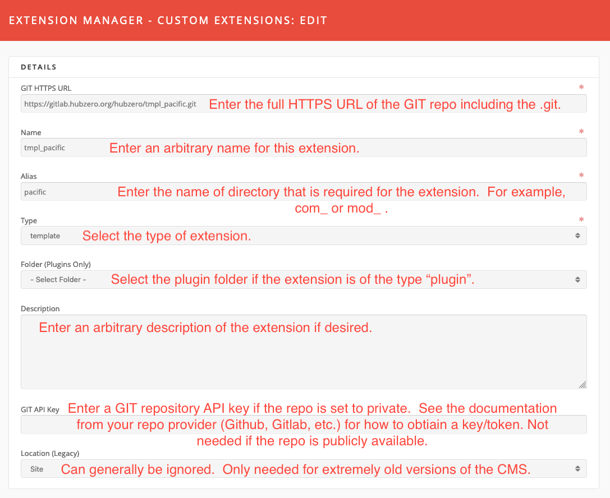
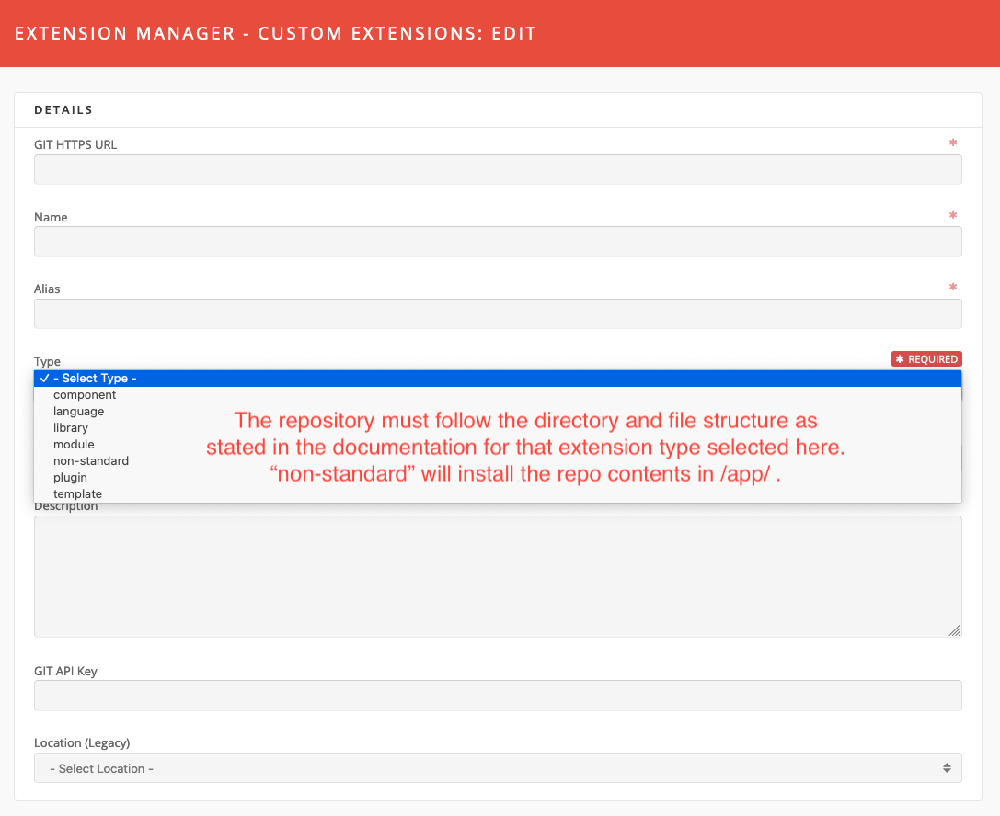
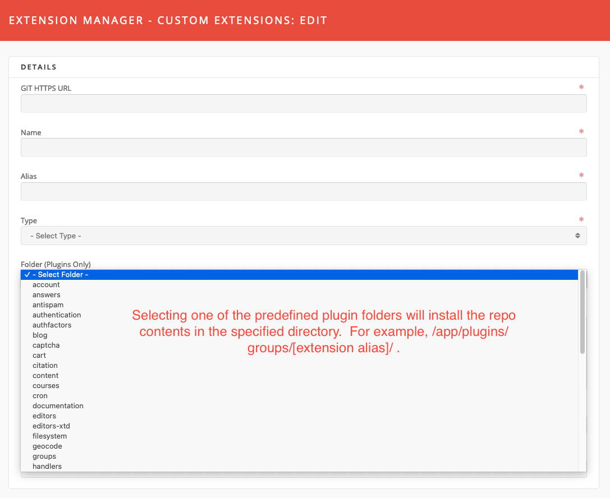
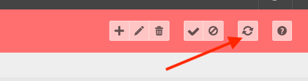
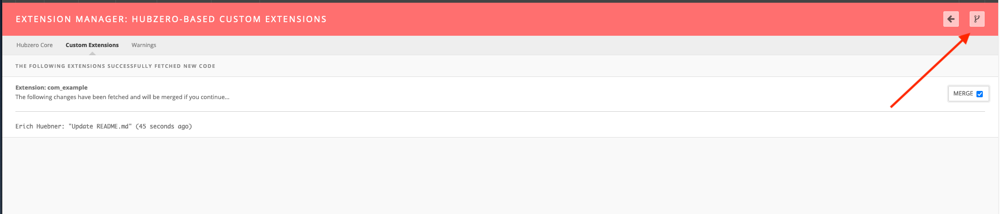
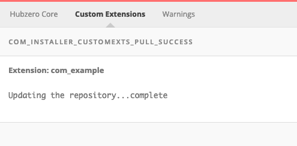

<!--
status: rewritten
reviewed-against: 2.4-main @ 123ea53b14
reviewed: 2026-09-09
screenshots: stale
source: https://help.hubzero.org/documentation/240/managers/extensions/extmanger
source-id: 3409
imported: 2026-09-09
-->
# Extension Manager

The Extension Manager lists every installed extension — components, modules,
plugins, templates, languages and libraries — and enables or disables them. It
also installs a hub's own extensions from a git repository, and reports
problems with the server's PHP configuration.

Select **Extensions** → **Extension Manager**, or go to
`/administrator/index.php?option=com_installer`.

The screen has three tabs:

| Tab | Controller | What it holds |
|---|---|---|
| **Hubzero Core** | `manage` | Every extension shipped with the platform |
| **Custom Extensions** | `customexts` | Extensions this hub installed from git |
| **Warnings** | `warnings` | Checks on the server's PHP settings |

> **Note:** Hubzero's Extension Manager is not the Joomla one it descends
> from. There are no **Install**, **Update**, **Discover** or **Database**
> screens: those controllers were removed, and only some orphaned language
> strings remain. Core extensions come with the code; a hub's own come from
> git through **Custom Extensions**.

## Hubzero Core

This tab lists the platform's own extensions. They can be disabled and
re-enabled, but never installed or removed from here — they come and go with
the codebase. A core extension can be overridden by putting a replacement of
the same name under `app/`.

Columns: **Name**, **Location** (Site or Administrator), **Status**, **Type**,
**Version**, **Date**, **Author**, **Folder** (plugins only) and **ID**. The
Name, Location, Status, Type, Folder and ID columns sort.

Filters: a search box and drop-downs for location, status
(Enabled / Disabled / Protected), type and folder.

> **Note:** The search matches the stored extension name, which for most core
> extensions is an untranslated language key such as `COM_MODULES` or
> `PLG_CONTENT_LOADMODULE`, not the label shown in the list. Search for a word
> from the key, or use `id:` followed by an extension id. Filtering by
> **Type** is usually quicker.

### Toolbar

| Button | Effect |
|---|---|
| **Enable** / **Disable** | Changes the state of the selected extensions. |
| **Refresh Cache** | Re-reads the selected extensions' XML manifests. Useful after editing one. |
| **Options** | Component settings and permissions. |
| **Help** | Opens the built-in help screen. |

There is no **Uninstall** button; it is commented out in the view. Names in
this list are not links — there is nothing to edit. Extensions marked
protected are highlighted but can still be disabled; the only thing the
component refuses to disable is the default template.

To enable or disable a core extension:

1. Go to **Extensions** → **Extension Manager**.
2. Stay on **Hubzero Core**, and find the extension with the search box or the
   **Type** filter.
3. Tick it and select **Enable** or **Disable**.

> **Note:** Disabling a component here removes it everywhere, including from
> the administrator menu. Disabling a module type stops every instance of it
> from rendering, whatever the [Module Manager](01-modules.md) says.

### Core Migrations

A second navigation strip inside this tab leads to **Core Migrations**, which
lists the platform's database migration files and their status. Its toolbar
offers **Run pending migrations**, and, per selected file, **Force run UP on
selected migrations** and **Force run DOWN on selected migrations**.

> **Warning:** Forcing a migration up or down runs schema changes against the
> live database. Take a backup first.

## Custom Extensions

A custom extension is code this hub adds to `app/`, installed and updated by
cloning a git repository. The repository must lay its files out the way the
platform expects for the chosen extension type; the `non-standard` type drops
the repository's contents into `app/` as they are.

Columns: **Name**, **Status**, **Location**, **Type**, **Folder**,
**Modified on**, **Modified by** and **ID**.

### Toolbar

| Button | Effect |
|---|---|
| **New** | Opens an empty extension record. |
| **Edit** | Opens the selected record. |
| **Delete** | Removes the record, after a confirmation. |
| **Enable** / **Disable** | Changes the state of the selected extensions. |
| **Update Selected Custom Extensions** | Fetches from git and offers to merge. |
| **Help** | Opens the built-in help screen. |

### The form

| Field | Notes |
|---|---|
| **GIT HTTPS URL** | Required. The full HTTPS clone URL, ending in `.git`. |
| **Name** | Required. A title for the extension. |
| **Alias** | Required. The directory name to create, including any `com_` or `mod_` prefix. |
| **Type** | Required. One of `component`, `language`, `library`, `module`, `plugin`, `template`, `non-standard`. |
| **Folder (Plugins Only)** | The plugin group to install into, for `plugin` extensions. |
| **Description** | Free text. |
| **GIT Personal Access Token** | Needed only for a private repository. |
| **GIT Branch** | The branch to install, in the form `origin/main`. Blank uses the repository's default branch. |
| **Location (Legacy)** | Site or Administrator. Only relevant to very old extensions. |

To add one:

1. Go to **Extensions** → **Extension Manager** → **Custom Extensions**.
2. Select **New**.
3. Fill in the form.
4. Select **Save & Close**.

Editing works the same way: tick the row, select **Edit**, change the form,
**Save & Close**. Enabling and disabling work as they do on the Hubzero Core
tab.

> **Note:** These three images are out of date. The form now also has a
> **GIT Branch** field, and what they label *GIT API Key* is now
> **GIT Personal Access Token**.

### Installing and updating the code

Saving a record does not fetch anything. The code is pulled by the update
button.

1. Tick the extension on the **Custom Extensions** tab.
2. Select **Update Selected Custom Extensions**.

   

3. Hubzero clones the repository if it has not been cloned, or fetches it if
   it has, and lists the incoming commits. Select **Merge Code** to apply
   them.

   

4. A confirmation screen reports what was merged.

   

## Warnings

This tab runs a set of checks against the PHP configuration and lists
anything it does not like, each as an expandable panel. It checks that:

- file uploads are enabled;
- `upload_tmp_dir` is set and writable;
- the hub's temporary path is set and writable;
- `memory_limit` is at least 16 MB;
- `post_max_size` is not smaller than `upload_max_filesize`;
- `post_max_size` and `upload_max_filesize` are each at least 4 MB;
- the Imagick extension is loaded;
- `/usr/bin/unzip` exists.

If nothing is wrong the tab says so.

## Options

**Options** holds a cache timeout for the extension list and the name of the
system user that runs git operations, plus a permissions tab. See
[the generated reference](../../reference/configuration/components/installer.md).

## Composer packages

The component also carries two screens for installing PHP packages with
Composer — a package list and a repository list. Neither is linked from the
Extension Manager's navigation, and both need an `app/composer.json` before
they will do anything. They are also incomplete: their language strings are
missing, so they render raw keys such as `COM_INSTALLER_TITLE_PACKAGES`
instead of labels. Treat them as unfinished.
