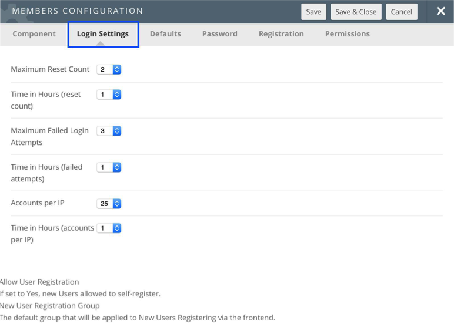
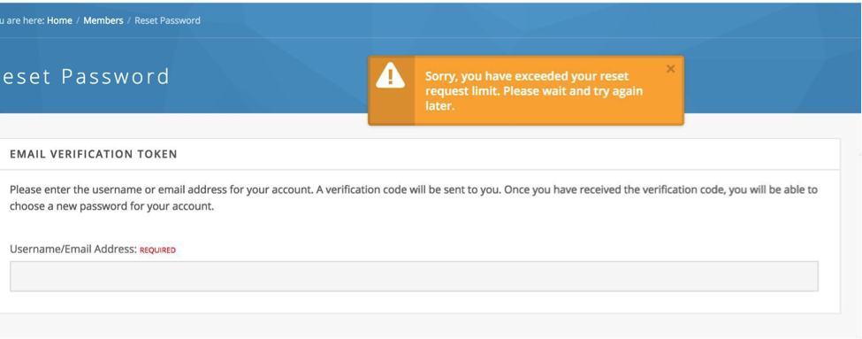
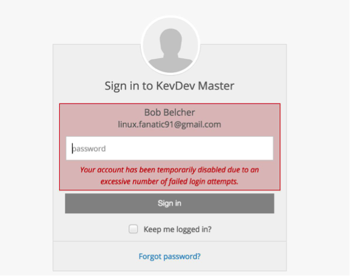

<!--
status: rewritten
reviewed-against: 2.4-main @ f22290e4e4
reviewed: 2026-09-09
screenshots: none
source: https://help.hubzero.org/documentation/22/security_considerations
source-id: 2825
modified: 2025-01-31
imported: 2026-09-09
merged-from: 2.2
source-state: unpublished
-->
# Security considerations

A hub is a public web application on a public server, so its security has
two halves. The operating system, the web server, and the services around
them are hardened by the system administrator with tools that are not part
of this repository. The CMS has its own settings that decide how sessions
and cookies behave, what HTML members may submit, how quickly a brute-force
attempt is throttled, and how spam is caught. This section covers both, and
says plainly which is which.

## In this section

- [Operating system hardening](#operating-system-hardening) — what the people who run
  the Purdue hubs do to the host underneath a hub. All of it is external to
  the CMS.
- [Hardening the CMS](#hardening-the-cms) — the settings and extensions in
  the administrator interface that affect the hub's own security posture.
- [CMS-controlled Fail2Ban jail](#cms-controlled-fail2ban-jail) —
  how the login thresholds under **Users** > **Members** > **Options** work,
  and how the CMS hands an address to Fail2Ban.

Spam has its own chapter: [Spam](11-spam.md).

## What the CMS gives you

| Area | Where |
|---|---|
| Force HTTPS | **Site** > **Global Configuration** > **Server** > **Force SSL** |
| Session lifetime and handler | **Site** > **Global Configuration** > **System** > **Session Settings** |
| Cookie domain and path | **Site** > **Global Configuration** > **Site** > **Cookie Settings** |
| What HTML each access group may submit | **Site** > **Global Configuration** > **Text Filters** |
| Failed login and password-reset thresholds | **Users** > **Members** > **Options** > **Login Settings** |
| Password rules and password blacklist | **Users** > **Members** > **Passwords** |
| Second authentication factors | **Extensions** > **Plug-in Manager**, the `authfactors` group |
| Content-Security-Policy header | **Extensions** > **Plug-in Manager** > **System - Content Security Policy** |
| Spam detection | **Extensions** > **Plug-in Manager**, the `antispam` group |
| Upload virus scanning | The `virus_scanner` key in `configuration.php` |

Every parameter behind these screens is listed in the generated
[configuration reference](../reference/configuration/README.md).

## Reporting a vulnerability

If you find a vulnerability in the Hubzero release itself, report it to the
project rather than filing it in a public tracker.
## Security questions

Answers to the questions hub managers ask most often about the CMS side of
security. Questions about the host underneath the hub belong in
[Operating system hardening](#operating-system-hardening).

### Does an advisory for another content management system apply here?

Usually not, but check each one rather than assuming.

Some naming in this tree is shared with other PHP content management
systems: language keys beginning `J`, the `#__` table-prefix placeholder,
and `com_` component directories. The running code is Hubzero's own. The
application object, the request and response objects, the session handler,
the user object, the registration flow, the router, the database layer, and
the plugin and module systems are all in
[`core/libraries/Hubzero`](../../core/libraries/Hubzero), and the
components under [`core/components`](../../core/components) are written
against them.

So an advisory for another project rarely names code a hub actually runs.
It also means you cannot dismiss one on the strength of a version number:
read what the advisory describes and look for the same pattern here.
Hubzero tracks no other project's releases and receives no other project's
security patches, so nothing arrives automatically.

### Where does the CMS record failed logins?

Two places, and they hold different things.

`/var/log/hubzero/cmsauth.log` is a text log. Every line is a timestamp in
`Y-m-d H:i:s` followed by a message, with nothing between them but a space.

**System - HUBzero** writes the line most people mean by "a failed login".
It is the submitted username (stripped to `A-Z 0-9 _ . -`, or `[unknown]`),
the remote address, and the word `invalid`:

```
2026-09-09 14:22:31 jdoe 203.0.113.7 invalid
```

The same plugin writes `<username> <address> detect` when it recognises its
tracking cookie. **System - Log** writes a second, differently shaped line
for the same failure — the authentication type, the word `FAILURE`, and the
plugin's error message, with the username appended in quotes only when its
**Log user names** parameter is on. It carries no address.

The log directory is `/var/log/hubzero` when that directory exists, and the
`log_path` from **Site** > **Global Configuration** > **System** otherwise.
See
[`LogServiceProvider`](../../core/bootstrap/Site/Providers/LogServiceProvider.php)
for the three loggers the CMS registers: `debug` (`cmsdebug.log`), `auth`
(`cmsauth.log`), and `spam` (`cmsspam.log`). Only the `auth` logger uses the
bare `%datetime% %message%` format; the other two use Monolog's default
line format.

The `#__users_log_auth` database table holds a structured record per attempt, with
`username`, `ip`, `status` and `logged` columns. The CMS reads that table,
not the text log, when it decides whether an account or an address has
crossed a threshold. See
[CMS-controlled Fail2Ban jail](#cms-controlled-fail2ban-jail).

### Does the CMS scan uploads for viruses?

Yes, wherever a component calls `Filesystem::isSafe()` — support ticket
attachments, group and project files, wiki and blog media, storefront
images, and course media among them. The scan shells out to the command in
the `virus_scanner` configuration key, which defaults to:

```
clamscan -i --no-summary --block-encrypted
```

`virus_scanner` has no field in **Global Configuration**; set it in
`configuration.php` if you want a different command, for example `clamdscan`
against a running daemon. A non-zero exit from the scanner rejects the file,
so a scanner that is missing or whose daemon is down fails closed and logs
the reason.

Installing and updating ClamAV itself is the system administrator's job.

### Does the CMS set a Content-Security-Policy header?

Only if you enable **System - Content Security Policy**. It ships disabled.
The plugin can run in report-only mode, enforcing mode, or both at once, and
it sets `base-uri`, `object-src`, `child-src`, `connect-src`, `default-src`,
`font-src`, `form-action`, `frame-src`, `img-src`, `script-src` and
`style-src` from its own parameters. Start in report-only mode; the shipped
`script-src` default already includes `'unsafe-inline'` and `'unsafe-eval'`,
which much of the interface still needs.

The parameters are listed in the
[system plugin reference](../reference/configuration/plugins/system.md).

### A member is stuck on a "spam detected" page. How do I release them?

That is the **System - Spamjail** plugin. Clear the counter from **Users** >
**Members**, open the member, and use **Reset** beside **Lifetime Spam
Incidents**. The full procedure, including the per-session counter that
clears itself, is in [Spam](11-spam.md).

### Can I stop a specific address from reaching the hub?

Not from the CMS. The only address-level action Hubzero takes is handing an
address to a Fail2Ban jail after too many accounts have been blocked from
it, and even that only happens when you turn it on. Blocking, rate limiting
at the network edge, and reputation-based blocklists are all the system
administrator's tools.
## Operating system hardening

Everything on this page is **external to the CMS**. None of it is configured
from the administrator interface, none of it ships in this repository, and
none of it could be verified against the source tree. It is the practice the
team that runs the Purdue hubs follows on the hosts underneath them,
generalised where the original advice named a distribution or a package that
no longer exists.

Treat it as a starting checklist for whoever administers the server, not as
a specification. Package names, repository URLs, and version numbers below
were correct for Debian a decade ago and should be checked against your own
distribution before you type them.

> **Note:** The CMS-side settings — HTTPS enforcement, sessions, cookies,
> text filters, login thresholds, spam — are covered in
> [Hardening the CMS](#hardening-the-cms).

### Keep packages patched

Apply security updates daily, and check that they actually applied. A hub at
Purdue was once compromised through a package update that failed halfway;
the check below would have caught it, and has run every day since.

```bash
apt update && apt upgrade
```

```bash
dpkg --audit
```

```bash
debsums | grep FAILED
```

Run the first two daily and the third at least weekly.

> **Warning:** The original version of this page told administrators to add
> a Hubzero package repository that also carried patches for a third-party
> content management system. That has not been true for many releases.
> Hubzero maintains its own code and carries no other project's patches; see
> [the security questions](#does-an-advisory-for-another-content-management-system-apply-here).

### Web server

- **Put an application firewall in front of PHP.** ModSecurity is the option
  still maintained. It can block attempts against a vulnerability nobody has
  disclosed yet, and its log lines make a good basis for a Fail2Ban jail.

  > **Warning:** Earlier versions of this page recommended Suhosin
  > (`php5-suhosin`). Suhosin targets PHP 5, which Hubzero 2.4 does not run
  > on. Do not install it.

- **Redirect every plain HTTP request to HTTPS** at the web server. This
  stops mixed-content pages and stops a login form ever being served over
  plain HTTP. Do it here as well as in the CMS — the CMS's own **Force SSL**
  setting (**Site** > **Global Configuration** > **Server**) redirects
  within the application, which is later than you want.

- **Consider a DNS blocklist module** such as `mod_spamhaus`
  (`libapache2-mod-spamhaus` on Debian) to stop known spam-sending addresses
  submitting content while still letting them read. Spamhaus requires a paid
  data feed for commercial use. If you deploy one, say why the request was
  refused; the wording Purdue uses is:

  ```
  Access Denied! Your address is blacklisted. It could be because your
  computer is infected and participates in a spam botnet. If you're using a
  shared access point (e.g., wireless), it's possible that the IP address of
  that access point has been banned because someone else's computer is
  infected.
  ```

- **Aim for an A rating** from the Qualys SSL Labs server test at
  <https://www.ssllabs.com/ssltest/>.

### Fail2Ban

Install Fail2Ban and give it jails for SSH, WebDAV, the web server's error
log, your application firewall's log, exim, SpamAssassin, and the hub's own
authentication log at `/var/log/hubzero/cmsauth.log`.

The CMS writes that log itself, so a jail over it is the one item here you
can verify from the source tree. A failed login appears as a timestamp, the
attempted username, the remote address, and the word `invalid`:

```
2026-09-09 14:22:31 jdoe 203.0.113.7 invalid
```

Purdue bans permanently on any attempt to log in as `root` or another key
account. SSH is configured to refuse root password logins anyway; the
attempt is still allowed to happen so the address can be caught.

Hubzero can also hand an address to a Fail2Ban jail directly, without a log
line for Fail2Ban to match. That is a separate mechanism with its own
setup: see
[CMS-controlled Fail2Ban jail](#cms-controlled-fail2ban-jail).

> **Note:** The original page argued for blocking all non-local IPv6 because
> the blocking tools of the day could not scale a ban from one address to a
> network. Fail2Ban has handled IPv6 since 0.10, and modern firewalls block
> prefixes as easily as addresses. Weigh the cost of turning IPv6 off
> against the users you exclude; the old blanket recommendation no longer
> holds.

### Antivirus

Install ClamAV, keep `freshclam` running so definitions stay current, and
scan the whole document root at least weekly.

The CMS calls a scanner on uploaded files by itself. The command it runs
comes from the `virus_scanner` key in `configuration.php` and defaults to
`clamscan -i --no-summary --block-encrypted`. A non-zero exit rejects the
upload, so a broken or unreachable scanner blocks uploads rather than
silently passing them.

Verify the whole path with the EICAR test file from
<https://www.eicar.org/download-anti-malware-testfile/> — try to upload it
to a support ticket or a group, and confirm the CMS refuses it.

### Host monitoring

- **Detect unauthorised configuration changes.** Purdue runs a tool called
  Ogre hourly; its engine is open source but the metadata and templates that
  make it useful are not. Any configuration management system that reports
  drift will do.
- **Run `rkhunter` daily** to catch suspicious changes.
- **Run an auditing tool** such as `lynis` and track the hardening score.
  Purdue targets 72 or better.
- **Install a firewall blocklist.** Purdue feeds DShield's list into
  iptables. It is published at <https://www.dshield.org/block.txt> with a
  detached signature at <https://www.dshield.org/block.txt.asc>; verify the
  signature before you load it.
- **Scan the network periodically.** Note that Debian does not bump version
  numbers in service banners when it backports a security patch, so a
  scanner like Nessus reports a great many false positives on a
  fully-patched host. The scans are still worth running to spot newly open
  ports and configuration mistakes.

### File system permissions

Own the Hubzero code with a user other than the one the web server runs as
(`www-data` on Debian), so a compromise of PHP cannot rewrite the
application. Directories the CMS genuinely writes to — uploads, the log
path, the cache and temporary paths — need to stay writable.

### PHP configuration

Hardening guides for `php.ini` are worth reading, but apply them one setting
at a time. Several of the settings such guides recommend break hub
functionality outright — the CMS shells out to a virus scanner and to
`fail2ban-client`, so disabling `exec()` disables both. Test each change on
a staging hub.

## Hardening the CMS

The settings and extensions inside the administrator interface that decide
how strict the hub is. Everything on this page is part of Hubzero and can be
checked in the source tree. The host underneath is covered separately in
[Operating system hardening](#operating-system-hardening).

### Force HTTPS

**Site** > **Global Configuration** > **Server** > **Force SSL** takes three
values: **None**, **Administrator Only**, and **Entire Site**. Set it to
**Entire Site**.

This is a redirect inside the application, so the request has already
reached PHP by the time it fires. Redirect at the web server as well.

### Sessions and cookies

**Session Settings** are on the **System** tab of **Global Configuration**:

| Field | Default | Notes |
|---|---|---|
| **Session Lifetime** | 15 | Minutes of inactivity before a session expires. Shorter is safer; too short annoys people mid-form. |
| **Session Handler** | `none` | Where sessions are stored. The list offers whatever backends the server supports — `database`, `file`, `memcached`, `redis`, `apc` and so on. `database` is the usual choice. |

**Cookie Settings** are on the **Site** tab, and hold **Cookie Domain** and
**Cookie Path**. Leave both empty unless the hub genuinely shares a session
with a sibling host — widening the cookie domain widens who receives the
session cookie.

### Text filters

**Global Configuration** > **Text Filters** sets, per access group, what
HTML a member may submit through an editor field. Each group gets one of:

| Option | Effect |
|---|---|
| **Default Black List** | Strips the tags and attributes commonly used in attacks. This is the shipped behaviour. |
| **Custom Black List** | Strips the tags and attributes you list, instead of the default set. |
| **White List** | Strips everything except the tags and attributes you list. |
| **No HTML** | Strips all HTML. |
| **No Filtering** | Submits the markup untouched. |

**No Filtering** should be reserved for groups whose members you would trust
with shell access, because it is equivalent. The filter applies to editor
fields; it is not a substitute for a component escaping its own output.

### Login thresholds

**Users** > **Members** > **Options** > **Login Settings** limits how often
one account may fail to log in, how often one account may request a
password reset, and how many accounts may be blocked from one address before
the hub asks Fail2Ban to ban it.

The fields, their defaults, and what the code actually counts are described
in [CMS-controlled Fail2Ban jail](#cms-controlled-fail2ban-jail). The
parameters themselves are listed in the
[Members configuration reference](../reference/configuration/components/members.md#login).

### Password rules

**Users** > **Members** > **Passwords** holds two screens.

**Password Rules** is an ordered list. The list shows **Id**, **Rule**,
**Description**, **Ordering** and **Enabled**; opening a rule adds
**Value**, **Failure message**, **Group** and **Class**. The **Group** field
scopes a rule to one access group, so you can demand more of administrators
than of ordinary members. The toolbar carries **Restore Defaults**, which
replaces the whole list with the shipped set.

**Password Blacklist** is a list of words a password may not contain.

Enable **System - Password** as well. It watches every request from a signed
in member and, if their stored password no longer satisfies the rules or has
expired, diverts them to the change-password screen until they fix it. A
short list of tasks — logging out, submitting a support ticket, saving the
new password — is exempt so the member is not trapped.

The hashing mechanism itself is set under **Options** > **Password** and
defaults to `sha512`.

### Second authentication factors

Two plugins in the `authfactors` group ship with 2.4:

| Plugin | Second factor |
|---|---|
| **Authfactors - Certificate** | A client-side SSL certificate. |
| **Authfactors - Google** | A time-based one-time code from an authenticator app. |

Neither has any parameters of its own. Which interfaces demand a second
factor is set on **System - Authfactors**, whose **Clients** parameter is a
pair of checkboxes for the site and the administrator interface; only the
administrator interface is ticked by default. If **System - Authfactors** is
disabled, no second factor is ever asked for however the `authfactors`
plugins are set.

### Security headers

Two system plugins add response headers. Both ship disabled.

**System - Content Security Policy** sets `Content-Security-Policy`,
`Content-Security-Policy-Report-Only`, or both, depending on its **Mode**
parameter. It writes eleven directives from its own parameters:
`base-uri`, `object-src`, `child-src`, `connect-src`, `default-src`,
`font-src`, `form-action`, `frame-src`, `img-src`, `script-src` and
`style-src`. The token `{host}` in any value is replaced with the request's
host name, and a `report-uri` is appended when one is set. Start in
**Report Only** and read the reports before you enforce: the shipped
`script-src` default still allows `'unsafe-inline'` and `'unsafe-eval'`,
and tightening it will break screens until they are cleaned up.

**System - Referrer Policy** sets `Referrer-Policy`. Its default is
`same-origin`.

Other headers — HSTS, `X-Content-Type-Options`, `X-Frame-Options` — are not
set by the CMS. Add them at the web server.

### Spam

The `antispam` plugin group and the **Content - Antispam** plugin that
drives it have their own chapter: [Spam](11-spam.md).

### Rate limiting

Hubzero rate-limits the **API only**, per application token, over a short
and a long window. The limits live in the application's own
`rate_limit` configuration and have no field in **Global Configuration** —
the manifest declares one, but no screen renders it. Site page requests are
not rate limited by the CMS; do that at the web server.

### Scan what you add

A web application scanner looks for the mistakes PHP applications make:
cross-site scripting, cross-site request forgery, SQL injection, and the
rest. Scan any component you write yourself, any third-party component, and
any component from the Hubzero release that you have modified — a local
change can introduce a hole the release does not have. Free scanners are
adequate for this; Purdue uses AppScan.

If you find a vulnerability in the Hubzero release itself, report it to the
project rather than filing it publicly.
### CMS-controlled Fail2Ban jail

Hubzero throttles brute-force attempts in three stages, all configured on
one screen. The first two stages are entirely inside the CMS. The third
hands the offending address to Fail2Ban, which is server software outside
this repository and has to be set up by the system administrator first.

#### The settings

Go to **Users** > **Members**, then **Options** in the toolbar. The
**Members Configuration** window opens; the fields below are on the **Login
Settings** tab.

| Field | Parameter | Default | What it does |
|---|---|---|---|
| **Maximum Reset Count** | `reset_count` | 10 | Password reset requests allowed per account per window. |
| **Time in Hours** | `reset_time` | 1 | The reset window. |
| **Maximum Failed Login Attempts** | `login_attempts_limit` | 10 | Failed logins allowed per account per window. |
| **Time in Hours** | `login_attempts_timeframe` | 1 | The failed-login window. |
| **Purge Log After** | `login_log_timeframe` | Never | How long attempts stay in the log table. |
| **Fail2Ban** | `fail2ban` | Off | Whether stage three runs at all. |
| **Maximum Number Blocked Accounts** | `blocked_accounts_limit` | 10 | Blocked accounts allowed per address per window. |
| **Time in Hours** | `blocked_accounts_timeframe` | 1 | The blocked-accounts window. |
| **Fail2Ban Jail** | `fail2ban-jail` | `hub-login` | Name of the jail to ban into. |

The same list, generated from the manifest, is in the
[Members configuration reference](../reference/configuration/components/members.md#login).



> **Warning:** This screenshot predates 2.4. It shows six fields with older
> labels and is missing **Purge Log After**, **Fail2Ban**, and **Fail2Ban
> Jail**. Read the table above, not the picture.

> **Warning:** Setting any of the three limits to `0` does **not** mean
> "no limit", whatever the field's help text says — it makes the check fail
> for everyone immediately. Leave them at one or more.

#### Where the counting happens

All three stages read `#__users_log_auth`, the table
[`plg_user_xusers`](../../core/plugins/user/xusers/xusers.php) writes to
after every login attempt. Each row holds a username, the remote address, a
status of `success`, `failure` or `blocked`, and a timestamp.

**Purge Log After** trims that table. It is checked on each authentication
attempt, and rows older than the chosen period are deleted. Leaving it at
**Never** lets the table grow without bound, which eventually slows the
login page down.

#### Stage one: password reset requests

Counted per account by
[`com_members`'s credentials controller](../../core/components/com_members/site/controllers/credentials.php).
It counts the member's outstanding reset tokens created inside
**Time in Hours**, and once that reaches **Maximum Reset Count** it refuses
the request:

> Sorry, you have exceeded your reset request limit. Please wait and try
> again later.



Nothing is blocked and nothing is logged as blocked; the member simply has
to wait for the window to pass.

#### Stage two: failed logins

Counted per account by
[`plg_authentication_hubzero`](../../core/plugins/authentication/hubzero/hubzero.php).
It counts rows for that username with status `failure` inside **Time in
Hours**. Once the table already holds one fewer than **Maximum Failed Login
Attempts**, the plugin writes a `blocked` row for the account and refuses
the login:

> Your account has been temporarily disabled due to an excessive number of
> failed login attempts.



With the default of 10, the tenth attempt inside the hour is the one that is
refused. The account frees itself as the window slides forward; there is no
administrator action to take.

**Authentication - Email Token** applies the same two thresholds to its own
one-time codes, using the same parameters.

#### Stage three: too many blocked accounts from one address

This stage only runs when **Fail2Ban** is **On**. With it **Off**,
**Maximum Number Blocked Accounts** has no effect at all.

When it is on, the plugin counts the *distinct* usernames that have a
`blocked` row from the current address inside **Time in Hours**. Once that
count reaches **Maximum Number Blocked Accounts**, the CMS locates
`fail2ban-client` on `PATH` and runs, as the web server user:

```bash
sudo /usr/bin/fail2ban-client set hub-login banip <address>
```

The jail name is whatever **Fail2Ban Jail** holds. The login is refused with
the same "temporarily disabled" message.

If `fail2ban-client` cannot be found, the CMS logs `fail2ban-client not
found.` and lets the login proceed to the account-level checks.

> **Important:** The CMS bans the address; it never unbans it. How long the
> ban lasts is entirely Fail2Ban's `bantime`. Nothing in the CMS calls
> `unbanip`.

> **Note:** This mechanism does **not** work by writing log lines for
> Fail2Ban to match. The CMS calls `fail2ban-client` directly. The jail
> therefore needs a filter that matches nothing, and exists only as a
> container for addresses the CMS pushes into it. The CMS does also write
> `/var/log/hubzero/cmsauth.log`, and you can point an ordinary
> log-scanning jail at that file, but that is a separate jail from this one.

#### What the system administrator has to set up

Everything from here down is external to Hubzero. It could not be verified
against this repository; the samples are illustrations, not a supported
configuration, and any competent administrator will write better rules.
Fail2Ban's own documentation is the authority.

##### sudo

The web server user needs to run exactly one command as root, with no
password:

```
www-data ALL=(root) NOPASSWD: /usr/bin/fail2ban-client set hub-login banip *
```

Put it in a file under `/etc/sudoers.d/` and check it with `visudo -c`.
Confirm the path with `which fail2ban-client` — the CMS resolves the path
itself, so the sudoers rule has to name the same one. Keep the rule as
narrow as this: it grants root, and a wildcard in the wrong place grants a
great deal more than a ban.

##### The jail

```ini
# /etc/fail2ban/jail.local
[hub-login]
enabled   = true
port      = http,https
filter    = hub-login
logpath   = /var/log/hubzero/cmsauth.log
banaction = hublogin-failure
bantime   = 600
findtime  = 1
maxretry  = 1
```

##### The filter

The filter has to match nothing, because the CMS supplies the addresses:

```ini
# /etc/fail2ban/filter.d/hub-login.conf
[Definition]
# The CMS bans into this jail directly, so this pattern is never meant to fire.
failregex = ^<HOST> this-filter-never-matches
ignoreregex =
```

##### The action

```ini
# /etc/fail2ban/action.d/hublogin-failure.conf
[INCLUDES]
before = iptables-common.conf

[Definition]
actionstart = iptables -N fail2ban-hublogin
              iptables -I INPUT -p tcp -j fail2ban-hublogin

actionstop  = iptables -D INPUT -p tcp -j fail2ban-hublogin
              iptables -F fail2ban-hublogin
              iptables -X fail2ban-hublogin

actioncheck = iptables -n -L fail2ban-hublogin | grep -q fail2ban-hublogin

actionban   = iptables -I fail2ban-hublogin -p tcp --dport 443 -s <ip> -j DROP
              iptables -I fail2ban-hublogin -p tcp --dport 80 -s <ip> -j DROP

actionunban = iptables -D fail2ban-hublogin -p tcp --dport 443 -s <ip> -j DROP
              iptables -D fail2ban-hublogin -p tcp --dport 80 -s <ip> -j DROP

[Init]
name     = DEFAULT
protocol = tcp
chain    = INPUT
```

##### Check it

```bash
fail2ban-client status hub-login
```

The output names the jail's filter, its log file, and the addresses
currently banned. `iptables -L fail2ban-hublogin` shows the rules the action
inserted.

> **Note:** The imported version of this page pinned Fail2Ban to 0.9.5 from
> a NeuroDebian repository for Debian wheezy. That advice is a decade out of
> date; use your distribution's current package.

#### Turning it off for an event

Consider setting **Fail2Ban** to **Off** during a conference, a class, or a
workshop. A room of people typing the same wrong password produces exactly
the pattern stage three is looking for, and one banned address takes out
everyone behind that NAT. Stages one and two stay in effect and act per
account, which is the behaviour you want in a crowd.
