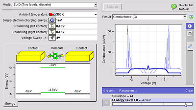

<!--
status: merged
source: https://help.hubzero.org/documentation/platform_2_4/tooldevs/overview
source-id: 3536
modified: 2009-10-13
imported: 2026-09-09
merged-from: 2.2
-->
# Overview

## Tool Development Process

Each hub relies on its user community to upload tools and other resources. Hubs are normally configured to allow any user to upload a tool. The process starts with a particular user filling out a web form to register his intent to submit a tool. This tells the hub manager to create a new project area for the tool. The user then uploads code into a source code repository, and typically develops the code within a workspace or Jupyter Notebook. The user can work alone or with a team of other users. When the tool is ready for testing, the hub manager installs the tool and asks the development team to approve it. Then, the hub manager takes one last look at the tool, and if everything looks good, moves the tool to the "published" state. Of course, a tool can be improved even after it is published, and re-installed, approved, and published over and over again.

The complete process is explained in the [tool maintenance documentation for hub managers](../../managers/03-maintenance/02-tools.md). Additional details about this process can be found in the following seminars:

- [Bootcamp Course for New Developers](https://nanohub.org/resources/14671)
- [Overview of Tool Development Process](https://nanohub.org/resources/14668)
- [Using Workspaces](http://nanohub.org/resources/3081)
- [Using Subversion for Source Code Control](https://nanohub.org/resources/14669)

The tool contribution process currently supports use of [Subversion](https://svnbook.red-bean.com/) and [Git](https://git-scm.com) repositories.

## Creating Graphical User Interfaces

If a tool already has a graphical user interface that runs under Linux/X11, then it can be published as-is, usually in a matter of hours. There are two caveats:

- **If the tool relies heavily on graphics, it may not perform very well within HUBzero execution containers.** Our containers run in cluster nodes without graphics cards, and are therefore configured with MESA for software emulation of OpenGL. This has much poorer performance than ordinary desktop computers with a decent graphics card, so frame rates are much lower. Also, all graphics are transmitted to the user's web browser after rendering, again lowering the frame rate. You can expect to achieve a few frames per second in the hub environment--good enough to view and interact with the data, but far below 100 frames/sec that you would normally see on a desktop computer.
- **Tools running within the hub have access to the hub's local file system--not the user's desktop.** Many tools have a *File* menu with an *Open* option. When a user invokes this option within the hub environment, it will bring up a file dialog showing the hub file system. The user won't see his own local files there unless he uploads them first via sftp, webdav, or the hub's `importfile` command.

The graphical user interface for any tool published in the hub environment can be created using standard toolkits for desktop applications--including Java, Matlab, Python/QT, etc.

If you're looking for an easy way to create a graphical interface for a legacy tool or simple modeling code, check out the [Rappture Toolkit](http://rappture.org) that is included as part of HUBzero. Rappture reads a simple XML-based description of a tool and generates a graphical user interface automatically. It interfaces naturally with many programming languages, including C/C++, Fortran, Matlab, Python, Perl, Tcl/Tk, and Ruby. It creates tools that look something like the following:

Rappture was designed for the hub environment and therefore addresses the caveats listed above. All Rappture-based tools have integrated visualization capabilities that take advantage of hardware-accelerated rendering available on the HUBzero rendering farm. Rappture-based tools also include options to upload/download data from the end user's desktop via the `importfile`/`exportfile` commands available within HUBzero.

For more details about Rappture, see the following links:

- [Rappture Quick Overview](https://nanohub.org/infrastructure/rappture/wiki/whatIsRappture)
- [Developing Scientific Tools for the HUBzero Platform](https://help.hubzero.org/resources/tooldev) (introductory course with 7 lectures)
- [Rappture Reference Manual](https://nanohub.org/infrastructure/rappture/wiki/Documentation)

## Learn more about HUBzero Tools

Discover the power of HUBzero tools and how easy it is to visualize research using the HUBzero platform.

Jupyter Notebooks:

RStudio:

## Material from the 2.2 documentation

> **Note:** The text below comes from the older 2.2 page of the same name, where it differed substantially from the 2.4 page above. Reconcile the two when reviewing.

## Tool Development Process

Each hub relies on its user community to upload tools and other resources. Hubs are normally configured to allow any user to upload a tool. The process starts with a particular user filling out a web form to register his intent to submit a tool. This tells the hub manager to create a new project area for the tool. The user then uploads code into a [Subversion](https://subversion.apache.org) or github source code repository, and develops the code within a workspace or using Jupyter or RStudio. The user can work alone or with a team of other users. When the tool is ready for testing, the hub manager installs the tool and asks the development team to approve it. Then, the hub manager takes one last look at the tool, and if everything looks good, moves the tool to the "published" state. Of course, a tool can be improved even after it is published, and re-installed, approved, and published over and over again.

## What is Publishing?

Publishing a notebook is similar to publishing anything on the hub platform. By publishing your work you will:

- Make your work available to others.
- Allow others to cite your work.

To do this, you will have to go to <https://help.hubzero.org/tools/create> (on other hubs, use the appropriate hubname) and follow the process described there.

## What Kinds of Content Can You Publish?

Previously, HUBzero was limited to publishing Rappture Tools. However, you can now publish many different types of computational content on HUBzero.

## Rappture Tools

If you're looking for an easy way to create a graphical interface for a legacy tool or simple modeling code, check out the [Rappture Toolkit](http://rappture.org) that is included as part of HUBzero. It works well for tools with simple inputs and outputs. You document the inputs and outputs in an XML file and the GUI is generated for you. When you run the tool, you simply set the inputs and click "Simulate".

It works with many programming languages, including C/C++, Fortran, Matlab, Python, Tcl/Tk, and Ruby. It creates tools that look something like the following:

## Traditional Desktop Applications

If you have a traditional desktop application running under Linux/X11, you can publish it and have the X output appear in a VNC window on the users browser. There are two caveats:

- **If the tool relies heavily on graphics, it may not perform very well within HUBzero execution containers.** All graphics are transmitted as images to the user's web browser after rendering, lowering the frame rate. You can expect to achieve a few frames per second in the hub environment--good enough to view and interact with the data, but far below what you would normally see on a desktop computer.
- **Tools running within the hub have access to the hub's local file system--not the user's desktop.** Many tools have a *File* menu with an *Open* option. When a user invokes this option within the hub environment, it will bring up a file dialog showing the hub file system. The user won't see his own local files there unless he uploads them first via sftp, webdav, or the hub's `importfile` command.

## Jupyter Notebooks

Notebooks work best for education, documenting workflows, and highly-interactive or exploratory work. Jupyter notebooks on the hubs can be written in Python, R, and Octave/Matlab. Other languages can be installed if required. And notebooks can run external programs written in any language. So some Python code in a notebook can prepare input, send it to a simulation, and then postprocess the ouputs.

## Jupyter Tools

Jupyter tools are Jupyter notebooks. When published, only the graphical components (UI widgets, visualizations, etc) are displayed. The notebook is automatically run and the IDE is hidden and cannot be accessed. Jupyter tools will be easier to write in Python due to the large collection of available widgets. If necessary, just the GUI can be written in Python.

## R Studio and Shiny

HUBzero also supports R Shiny tools for R developers. https://shiny.rstudio.com/

## Plotly Dash

Dash is a Python framework for building analytical web applications. No JavaScript required. Built on top of Plotly.js, React, and Flask, Dash ties modern UI elements like dropdowns, sliders, and graphs to your analytical Python code.

<https://plot.ly/products/dash/>
<https://plot.ly/dash/gallery>

## Web Applications and Pages (HTML, CSS, and Javascript)

If you have a web application that runs on Linux or just some web pages and javascript, then you can publish them as a tool on HUBzero.

---

Discover different ways the HUBzero team has incorporated new tool creation systems such as Jupyter Notebooks and RStudio.

Jupyter Notebooks:

RStudio:

## HUBzero Development Team: Custom Software & Tool Projects

Check out custom software and tool projects the HUBzero development team has helped design and implement on sites using the HUBzero platform.

REMEDI Central:
