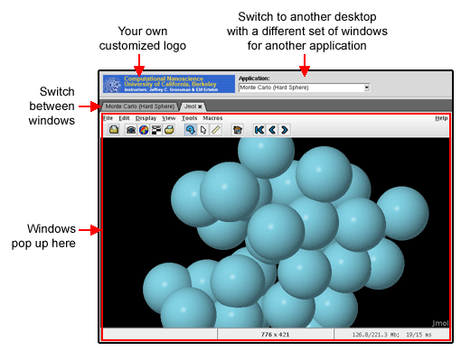
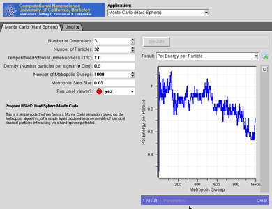
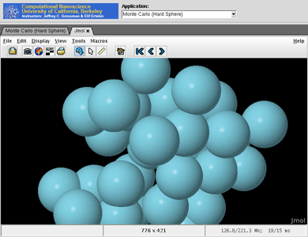
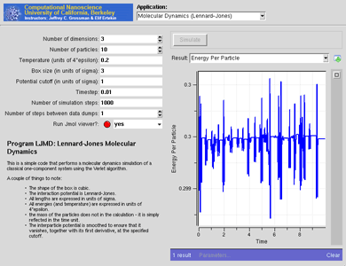

<!--
status: imported
source: https://help.hubzero.org/documentation/platform_2_4/tooldevs/nanowhim
source-id: 3538
modified: 2010-05-13
imported: 2026-09-09
-->
# Combining Tools

## Overview

Some of the tools on any hub are really a collection of 3-5 programs acting like a "workbench" for a particular application. [Berkeley Computational Nanoscience Class Tools](http://www.nanohub.org/tools/ucb_compnano/) is one such example. It is really a collection of several separate [Rappture](http://rappture.org)-based applications, all running on the same desktop, in the same tool session.

We've created a simple window manager called **nanoWhim** that makes it easy to switch back and forth between several applications on a desktop--without all of the fuss and bother associated with a typical window manager. A tool using nanoWhim looks like this:



The combobox at the top lets users switch between applications. Each window that pops up within an application is managed by a set of tabs.

nanoWhim is based on the [Whim](http://whim.linuxsys.net/site/0) window manager written in Tcl/Tk. We needed something like this for nanoHUB to create a very simple tabbed interface, so users could easily switch between a couple of tools within the same tool session. A more comprehensive workflow interface is under development, but this simple solution is sometimes useful.

## Flipping between tools

The following example shows a [Rappture](http://rappture.org)-based application that popped up a separate [Jmol](http://jmol.sourceforge.net/) application for molecular visualization. Jmol pops up in its own tab, and you can easily switch back and forth between the original application and the Jmol popup by clicking on the tabs, as shown below:

 

You can click on the **x** on the Jmol tab to close that application.

You can select another application by using the combobox at the very top of the window. That brings up another [Rappture](http://rappture.org)-based application, with a different set of inputs and outputs.



You can run each program independently, and the outputs stay separate. If you flip back to the previous application, it will be sitting just the way you left it.

## Configuring nanoWhim

To use nanoWhim, you'll need to create two files in the "middleware" directory for your tool: **nanowhimrc** and **invoke**.

### The nanowhimrc File

This file configures the various applications that pop up within the tool session. Here's a very simple example:

```
# set an icon
set.config controls_icon header.gif

# first app is an xterm
start.app "Terminal Window" xterm

# second app is a web browser
start.app "Web Browser" firefox
```

Any line that starts with a pound sign (`#`) is treated as a comment.

The `set.config` command configures various aspects of the window manager. Right now, the only useful option is `controls_icon`, which sets the icon shown in the top-left corner of the window. Note that a relative file name is interpreted with respect to the location of the `nanowhimrc` file itself. In this case, we've assumed that the image `header.gif` is sitting in the same directory as `nanowhimrc`.

The rest of the file contains a series of `start.app` commands for each application that you want to offer. In this case, the first application is called "Terminal Window" and is just an xterm application. The second application is the Firefox web browser, which we label "Web Browser".

Here's a more realistic example:

```
#
# Customize the nanoWhim window manager
#
set.config controls_icon header.gif

start.app "Average" \
  /usr/bin/invoke_app -t ucb_compnano -T $dir/../rappture/avg

start.app "Molecular Dynamics (Lennard-Jones)" \
  /usr/bin/invoke_app -t ucb_compnano -T $dir/../rappture/ljmd

start.app "Molecular Dynamics (LAMMPS)" \
  /usr/bin/invoke_app -t ucb_compnano -T $dir/../rappture/lammps -u lammps-12Feb07

start.app "Monte Carlo (Hard Sphere)" \
  /usr/bin/invoke_app -t ucb_compnano -T $dir/../rappture/hsmc

start.app "Ising Simulations" \
  /usr/bin/invoke_app -t ucb_compnano -C "java -jar $dir/../bin/ising-1.0.jar"
```

Each `start.app` command starts a different Rappture-based application. The first argument in quotes is the title of the application, which is displayed in the combobox at the top of the window. The remaining arguments are treated as the Unix command that is invoked to start the application.

The commands shown here all use the `/usr/bin/invoke_app` script to invoke a Rappture-based application. The `-t` argument for that script indicates the toolname. The `-T` argument indicates which directory contains the Rappture tool.xml file. You can use `$dir` here to locate the directory relative to the `nanowhimrc` file.

### The invoke File

The `nanowhimrc` file configures the window manager, but the `middleware/invoke` script actually invokes it. Every tool on nanoHUB has its own `invoke` script sitting in the middleware directory. Your invoke script should look like this if you want to use nanoWhim:

```
#!/bin/sh

/apps/share/nanowhim/invoke_app "$@" -t ucb_compnano
```

This script invokes the nanoWhim window manager for the tool specified by the `-t` argument. This is the short name that you gave when you registered your tool. This script looks for the `middleware/nanowhimrc` file within your source code, and launches nanoWhim with that configuration.

### Testing Your Tool

Normally, you develop and test tools within a workspace in your hub. If you're using nanoWhim, that's still true for the individual applications. In other words, you can test each application individually within a workspace. But to get the full effect of the nanoWhim manager running all applications at once, you'll have to get your tool to "installed" status, and then launch the application in test mode. For details about doing this, see the [tool maintenance documentation for hub managers](../../managers/03-maintenance/02-tools.md) or the lecture on [Uploading and Publishing New Tools](https://help.hubzero.org/resources/173). Look at the tool status page for your own tool project and find the *Launch Tool* button. This is what you would normally do to test any tool before approving it. Once you're in the "installed" stage and you're able to click *Launch Tool*, the nanoWhim configuration should take effect and you'll be able to test the overall combined tool.
