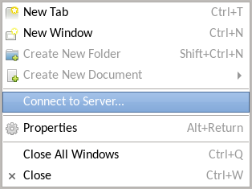
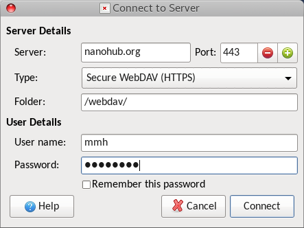

<!--
status: reviewed
reviewed-against: 2.4-main @ e097e0236d
reviewed: 2026-09-10
screenshots: stale
source: https://help.hubzero.org/documentation/platform_2_4/tooldevs/accesshomedir/webdav
source-id: 3546
modified: 2014-02-28
imported: 2026-09-09
merged-from: 2.2
-->
# WebDAV

WebDAV is the Distributed Authoring and Versioning extension to HTTP. It lets a
client browse a remote filesystem, usually in a graphical browser that makes
your hub files look like files on your desktop. Hubs offer WebDAV over HTTPS
only; plain HTTP is not supported.

> **Note:** The WebDAV server is part of the tool platform, which is separate
> software and is not in this repository, so none of the client procedures below
> could be checked. What the CMS knows is only the mount the web server writes
> through, `/webdav/home/<username>`, which is not the address you connect to.

## The address

On a standard installation the endpoint is:

```text
https://yourhub.org/webdav/
```

Some hubs put it on a host of its own, `https://webdav.yourhub.org/`. If neither
works, ask your hub administrator which one it uses. You authenticate with your
hub login and password.

## Linux

Most desktop file managers speak WebDAV. In the location bar of GNOME Files, KDE
Dolphin or Nemo, enter:

```text
davs://username@yourhub.org/webdav
```

Some file managers offer a **Connect to Server** entry instead. Choose **Secure
WebDAV (HTTPS)** and give `/webdav` as the folder.



To mount your hub storage as a filesystem rather than browse it, use
[davfs2](https://savannah.nongnu.org/projects/davfs2). For a text-mode client,
`cadaver` behaves much like FTP; run it against the address above and it prompts
for your login.

## macOS

1. In the Finder, choose **Go → Connect to Server**.
2. Enter the address for your hub and select **Connect**.
3. Enter your hub login and password when prompted.

The hub then appears in the Finder and you can drag files and folders to and
from it.

## Windows

Windows connects through the **WebClient** service, which is not always running.
Turn it on first:

1. Open **Services**.
2. Find **WebClient**, set its startup type to **Automatic**, and select
   **Apply**.
3. If it is not running, select **Start**.

Then map the hub as a network location:

1. Open **File Explorer** and select **This PC**.
2. Select **Map network drive → Connect to a Web site that you can use to store
   your documents and pictures**.
3. Select **Next**, then **Choose another network location**, then **Next**.
4. Enter the address for your hub and select **Next**.
5. Enter your hub credentials.
6. Name the location and finish the wizard.

The new network location appears under **This PC**. Open it and drag files and
folders between it and your computer.

> **Tip:** If dragging does not work, right-click the file or folder and choose
> **Copy**, then right-click the destination and choose **Paste**.
