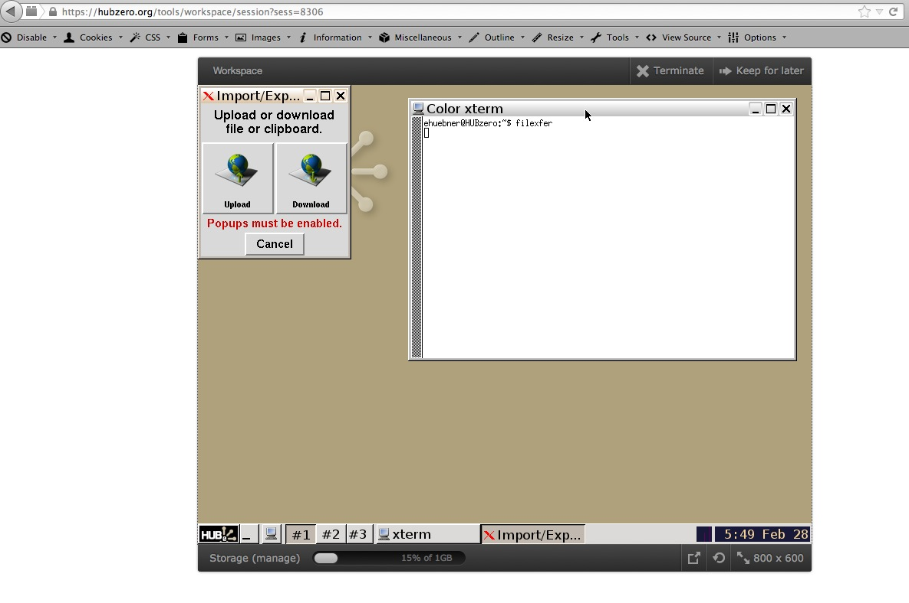

<!--
status: reviewed
reviewed-against: 2.4-main @ e097e0236d
reviewed: 2026-09-10
screenshots: stale
source: https://help.hubzero.org/documentation/platform_2_4/tooldevs/accesshomedir/filexfer
source-id: 3547
modified: 2014-02-28
imported: 2026-09-09
-->
# filexfer

`filexfer` moves a file between your computer and a running tool session,
without going through sFTP or WebDAV first.

> **Note:** `filexfer` belongs to the tool platform, which is separate software
> and is not in this repository. Searching `com_tools` and the rest of the CMS
> finds no trace of it, so the CMS neither provides nor configures it and
> nothing below could be checked here.

## Using it

Start the Workspace tool and type `filexfer` at the terminal prompt. The
interface offers **Upload** and **Download**. Choosing either opens a browser
window for the transfer, so your browser must allow pop-ups from the hub.

Other tools can include `filexfer` as a secondary application, which gives their
users the same way of exchanging files with a session.

## From inside a tool

A tool does not call `filexfer` itself. It calls the two commands that ship with
it, `importfile` and `exportfile`. See
[Importing and exporting user files](../08-fileinout/README.md).
