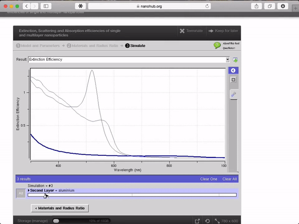

<!--
status: rewritten
reviewed-against: 2.4-main @ e097e0236d
reviewed: 2026-09-10
screenshots: stale
source: https://help.hubzero.org/documentation/platform_2_4/users
source-id: 3751
modified: 2017-02-09
imported: 2026-09-09
-->
# Tool users

Everything a hub member needs in order to run a tool is written up in the
users book, which covers the whole hub rather than the tool platform alone.
This page says which chapter to read for what. The rest of this book is for
the people who build tools and the people who run the hub.

> **Note:** The chapters linked below have been checked against the CMS in
> this repository. What happens once a session starts belongs to the tool
> execution platform, which is separate software and is not in this
> repository; each chapter marks where that line falls.

## Running a tool

[Tools](../../users/22-tools.md) is the chapter to read. It covers:

- [Launching a session](../../users/22-tools.md#running-a-tool) from a tool's
  page, and what the controls across the top of the session page do — keeping
  a session for later, terminating it, renaming it, and choosing a viewer.
- [Your files](../../users/22-tools.md#your-files): a session sees your home
  directory on the hub, not your own computer.
- [Sharing a session](../../users/22-tools.md#sharing-a-session) with other
  members or with a group, read-only or not.

The animation shows a tool session in an older hub interface; the surrounding
page looks different now, but the arrangement — the tool in a frame, its
controls above it, the storage meter below — is the same.

New to the hub altogether? Start with
[Getting started](../../users/30-gettingstarted.md), which walks through
registering and finding your way around, and
[Introduction](../../users/04-introduction.md), which explains how the member
area is laid out.

## Usage figures

- [Usage](../../users/28-usage.md) — the **Usage** tab on your own profile,
  which of its figures are computed live, and which need statistics collection
  the hub has to set up separately.
- [Simulation usage definitions](../../users/25-simusagedefinitions.md) — what
  each figure on the hub-wide usage pages counts.

## Contributing a tool of your own

[Contributing a tool](../../users/22-tools.md#contributing-a-tool) describes
what can be hosted and walks the contribution pipeline from registration to a
published tool page. Note that the Rappture toolkit, long the usual way to put
an interface on a command-line program, is deprecated; a Jupyter notebook is
the current path on most hubs.

Once you have registered a tool, the detail lives elsewhere in this book:

- [Tool developers](../developers/README.md) — repository layout, invoke
  scripts, tool paths and environment variables, moving files in and out of a
  session, the `submit` command for cluster jobs, and
  [Jupyter notebooks as tools](../developers/10-jupyter-notebooks/README.md).
- [Tool administrators](../administrators.md) — what the hub's staff do
  on their side: tool dependencies, the directory parameter whitelist, and the
  Anaconda environments behind Jupyter kernels.

Hub staff running the pipeline should read
[Tools](../../managers/03-maintenance/02-tools.md) in the hub managers book.
