<!--
status: rewritten
reviewed-against: 2.4-main @ 1924c22171
reviewed: 2026-09-09
screenshots: stale
source: https://help.hubzero.org/documentation/240/users/collections
source-id: 3292
modified: 2014-11-20
imported: 2026-09-09
-->
# Collections

Collections are a scrapbook. You make a collection, then pin images, files
and links into it as posts. You can follow other people's collections, collect
their posts into your own, like them and comment on them. Administrators
manage the same content from the
[Collections chapter](../managers/09-components/06-collections.md) of the Hub
managers book.

> **Note:** You must be logged in to do anything but browse public
> collections.

## Where collections live

There are three places collections appear, and they show the same content:

| Place | What it is |
|---|---|
| `https://yourhub.org/collections` | The hub-wide view. Every published collection and post you are allowed to see |
| `https://yourhub.org/members/{your ID}/collections` | Your own **Collections** tab, where you create and manage your collections |
| A group's **Collections** tab | Collections owned by a group rather than a person |

The hub-wide page has two tabs, **N collections** and **N posts**. Its **New
collection** and **New post** buttons take you to your own Collections tab,
because a collection always belongs to a member or a group.

## Posts, collections and items

A **post** is one piece of content placed in one collection. A post carries a
title, a description, tags, and one or more attachments — an uploaded file or
a link.

A **collection** is a named board that holds posts. A collection has a
privacy setting, a layout and a sort order. You must have a collection before
you can post into one; if you have none, the hub creates a private collection
called **Favorites** for you the first time you need one.

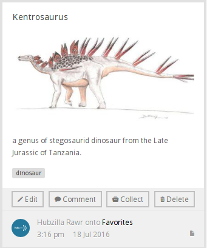

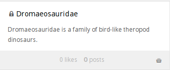

Behind both sits an **item**: the content itself. The same item can be posted
to many collections. The first post of an item is the *original*; the rest
are reposts. That is what happens when you **Collect** something — the item is
re-posted into a collection of yours, and the original is untouched.

Collecting a *collection* works the same way, but the new post is a link back
to the collection you collected.

## Your Collections tab

Go to your profile and open the **Collections** tab. Five tabs run across the
top:

**Recent Posts** — a live feed of posts from the members and collections you
follow. This tab only appears on your own profile.

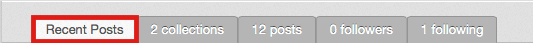

**N collections** — every collection you own. Create, edit and delete them
here.

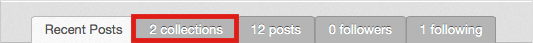

**N posts** — every post you have made, across all your collections.

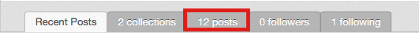

**N followers** — the members who follow you or one of your collections.
Followers never see your private collections.

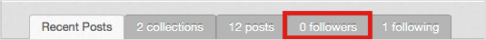

**N following** — the members and collections you follow, each with an
**Unfollow** button.

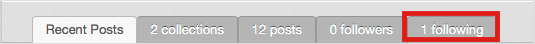

A **Getting started** button at the top right of each tab opens a short
explanation of what the tab is for.

## Creating a collection

1. Open the **Collections** tab on your profile.
2. Select the collections tab, then **New collection**.
3. Set **Privacy**. There are three settings, not two:
   - **Public (anyone can see this collection)**
   - **Registered (logged-in users can see this collection)**
   - **Private (only I can see this collection)** — private collections show
     a padlock on the card.
4. Fill in **Title**. It is the only required field.
5. Add a **Description** and **Tags** if you want them.
6. Choose **Layout of posts** — **Grid** or **List** — and **How posts are
   sorted** — **Created date (newest to oldest)** or **Defined ordering**.
7. Select **Save**.

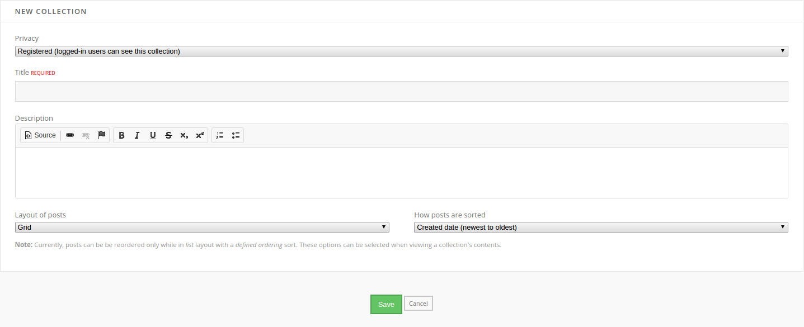

The screenshot above predates the **Tags** field, which now sits between
**Description** and the layout and sort drop-downs; nothing else on that
screen has changed.

> **Note:** Posts can only be dragged into a new order while the collection is
> in **List** layout with a **Defined ordering** sort. The form says so under
> the two drop-downs.

## Editing and deleting a collection

Hover over a collection on your collections tab. **Edit** and **Delete**
appear on the card.

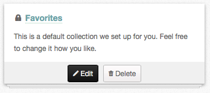

**Edit** opens the same form as **New collection**. **Delete** asks you to
confirm — tick *Yes, I want to delete this collection.* and select **Delete**.
Deleting a collection deletes its posts.

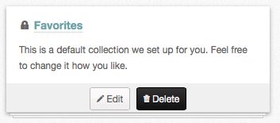

## Creating a post

1. Open a collection, or the posts tab, and select **New post**.
2. Add the content. The form has two drop targets side by side: **Click or
   drop file** on the left uploads a file, and **Click to add link** on the
   right takes a URL. You can add more than one of either.
3. Fill in **Title** and **Description**. A post with no description is
   refused with *Please provide some content.*
4. Pick the collection under **Select collection**. If you have no
   collections yet, the field is replaced by **Create collection**, which
   makes one from the title you type.
5. Add **Tags**, separated by commas.
6. Select **Save**.

## Editing and deleting a post

> **Note:** You can only edit a post you made.

Hover over the post. If it is yours, an **Edit** button appears; if it is
somebody else's, you get **Like** instead. **Edit** opens the post form again.

The last button on a post you own is either **Delete** or **Remove**:

- **Delete** appears on an original post and destroys the item along with
  every repost of it.
- **Remove** appears on a repost and takes it off your collection, leaving
  the original alone.

Both ask you to confirm before anything happens.

## Collecting a post

1. Find a post anywhere on the hub — the hub-wide page, a member's profile, a
   group.
2. Hover over it and select **Collect**.

   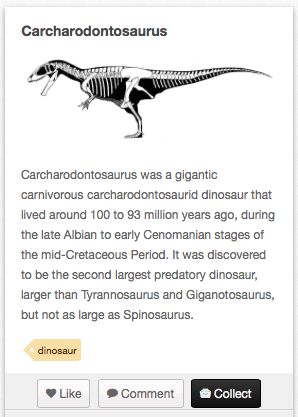

3. Choose a collection from **Select collection**, or type a name in the
   **Create collection** field beside it to make a new one.
4. Add a description, then select **Save**.

The post is re-posted into your collection. Your own collections and the
collections of every group you belong to are listed, grouped by owner.

## Collecting a collection

1. Hover over the collection.
2. Select **Collect**.

   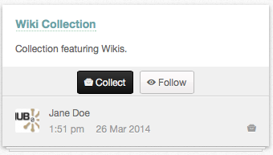

3. Pick or create the collection to save it into, add a description, and
   select **Save**.

You get a new post whose content is a link back to the original collection.

## Liking a post

Hover over a post you did not make. A **Like** button appears; select it and
the post's like count goes up. The button changes to **Unlike**, which takes
the like back.

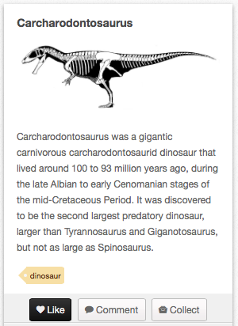

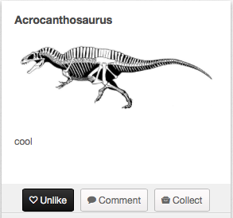

> **Note:** You cannot like your own post. Where other people see **Like**,
> you see **Edit**.

## Commenting on a post

1. Hover over a post and select **Comment**.
2. Type into the box and select **Post comment**.

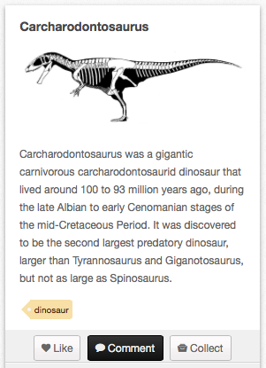

There is no anonymous option on collection comments. Your name and profile
picture are shown against whatever you write.

> **Note:** Comments are switched off hub-wide when an administrator sets
> **Allow comments** to *No* in the component options. When that happens, the
> **Comment** button and the comment counts disappear.

## Following

Following a member puts every new post they make, and every collection they
create, on your **Recent Posts** feed. Following a single collection follows
just that collection.

To follow a member, open their Collections tab and select **Follow All**. The
button sits at the top right, next to **Getting started**.

To follow a collection, open it and select **Follow**, or use the **Follow**
button on the collection's card in a list.

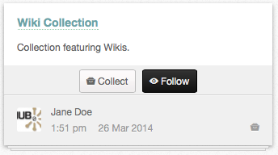

To stop following either one, open your **N following** tab and select
**Unfollow** on the row.

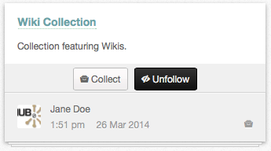

**Unfollow All** on a member's Collections tab drops that member and all of
their collections at once.

## Changing the layout and the order

Open a collection. Four icons sit above the posts, to the right of the tabs:

| Icon | What it does |
|---|---|
| **Sort by created date** | Newest post first |
| **Sort by defined ordering** | The order you dragged the posts into |
| **View as a grid** | Posts tiled |
| **View as a list** | Posts stacked one per row |

These change what you are looking at now. To change what everybody sees by
default, edit the collection and set **Layout of posts** and **How posts are
sorted**.

To reorder posts by hand, switch to **View as a list** and **Sort by defined
ordering**, then drag a post by the handle on its left edge.

## The Collect button on other pages

Collections are not only filled from the collections pages. If an
administrator has published the `mod_collect` module, a **Collect** button
appears on content pages across the hub and posts that page straight into one
of your collections. It works on blog entries, articles, courses, forum
threads, knowledge base articles, publications, resources, wiki pages and
wishes — the nine content types listed in the
[managers' Collections chapter](../managers/09-components/06-collections.md#the-collect-button).
