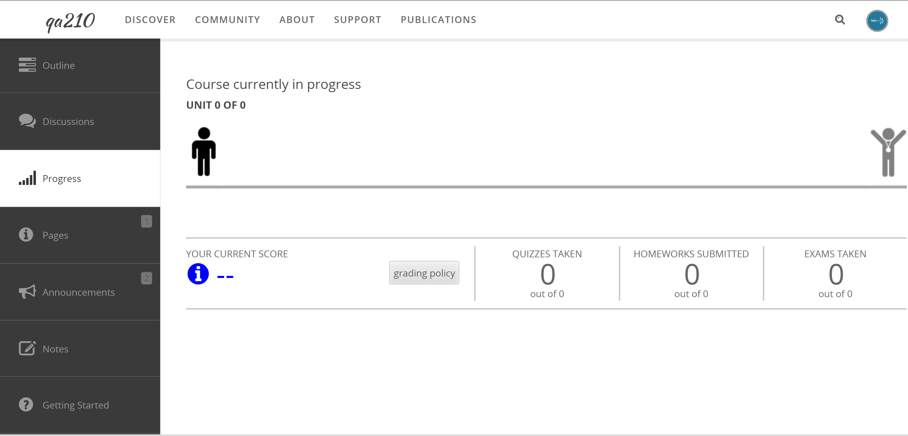

<!--
status: imported
source: https://help.hubzero.org/documentation/240/users/courses/student_features
source-id: 3291
modified: 2014-11-17
imported: 2026-09-09
-->
# Student Features

## Enrolling into a Course

Courses offer instructors and students many features to help facilitate the most engaging and interactive learning experience possible. Many of these features, like in-depth instructor videos, announcements, and more, are available right away, just by browsing the available courses. Some features require an extra level of personalization, and thus require enrollment in the course.

> **Note:** Each course might have different registration constraints such as restricted enrollment dates or required payment.

To enroll into a course:

1. Navigate to **https://yourhub.org/courses**
2. Look for a course either by searching on the search bar in the Courses page, or browsing through the list of courses on that page. To see an extended list of courses, click **Browse the catalog**
3. Once you have found a course you'd like to learn more about, click on the title of the course
4. On the Course’s Overview, click on **Go to Course**
5. Once enrolled, you will be on your way to better your knowledge on topics related to your field of interest

## Tracking Course Progress

As a student, the course will track your personal progress. To view your progress in a course:

1. Navigate to the course and from the course overview, click on the **Go to Course** button
2. Click on the **Progress** tab to view the progress overview page
3. A chart will appear displaying information about your overall progress in the course versus where the course instructor thinks you should be
4. Here is a breakdown of the progress information chart:
   1. **The Running Man:** This figure displays the course’s progress. Course instructors predetermine where students should be by setting dates for each section of the course. The “Running Man” helps indicate what a student has completed in the course.
   2. **The Progress Bubbles:** These blue bubbles that the “Running Man” runs on indicates how much progress a student has completed in each area. The bubble will be all the way filled in blue with a check mark to indicate that all the material has been completed for that section.
   3. **Your Current Score:** This percentage is the student’s current score in the course. The grade is calculated by the ‘grading policy’ that is predetermined by the hub administrators.
   4. **Quizzes Taken:** The number of quizzes taken by a student out of the total amount of quizzes in the course.
   5. **Homework Submitted:** The number of homeworks submitted by a student out of the total amount of homeworks in the course.
   6. **Exams Taken:** The number of exams taken by a student out of the total amount of exams in the course.
   7. **Grade Breakdown:** A list of all the sections in the course. The percentage listed on the right side is the section’s grade percentage.

