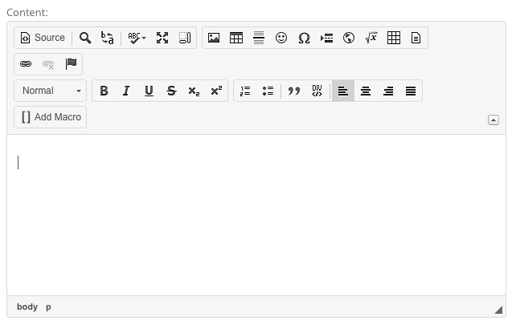
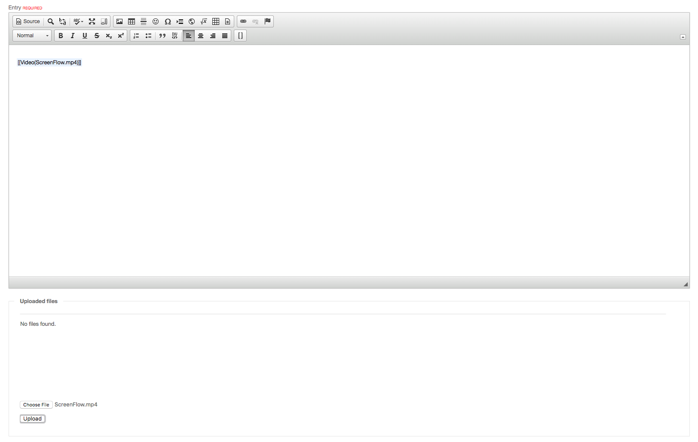

<!--
status: rewritten
reviewed-against: 2.4-main @ 1924c22171
reviewed: 2026-09-09
screenshots: ok
source: https://help.hubzero.org/documentation/240/users/fqas
source-id: 3293
modified: 2014-11-07
imported: 2026-09-09
-->
# Frequently asked questions

Short answers to the things members ask most often. Where an answer belongs to
a bigger subject, it links to the chapter that covers it properly.

## How do I change my email address?

1. Log in and go to your member area at `/members/myaccount`.
2. Select the **Profile** tab.
3. Find the **E-mail** row and select **Edit** beside it.
4. Type the new address.
5. Select **Save**.

> **Important:** Changing your email address un-confirms your account. The hub
> sends a confirmation message to the new address, and you have to follow the
> link in it before the account works again. Do not change the address to one
> you cannot read.

Usernames, by contrast, cannot be changed at all. If yours is genuinely a
problem, raise a support ticket.

## What is CKEditor?

CKEditor is the rich-text editor a hub uses wherever you write content — blog
entries, wiki pages, publication abstracts, forum posts, and the
administrator's own screens. It gives you the usual word-processor controls:
headings, bold and italic, lists, links, tables, and images.



Two of its buttons are specific to a hub:

- **Source** switches between the formatted view and the underlying HTML.
- **Add Macro** inserts a hub macro — a short instruction in double square
  brackets that the page expands when it is displayed. `[[Video(…)]]`,
  `[[Image(…)]]`, and `[[Link(…)]]` are macros. Selecting the button lists the
  ones your hub has, with the arguments each one takes.

It deliberately offers less than a desktop word processor. Font choices and
colours are left out so that content stays consistent with the site's design.

## How do I embed a video?

For a video hosted elsewhere — YouTube, Vimeo, or Kaltura — you do not need to
upload anything. Put the video's URL inside the `Video` macro:

```text
[[Video(https://www.youtube.com/watch?v=FgfGOEpZEOw)]]
```

The macro takes an optional size, either named or positional:

```text
[[Video(https://www.youtube.com/watch?v=FgfGOEpZEOw, width=600, height=338)]]
[[Video(MyVideo.mp4, 640, 380)]]
```

For a video file of your own, upload it first. Wherever the hub gives you an
editor next to an **Uploaded files** area — a blog entry, for instance — you
can attach a file and then refer to it by name:



1. Open the page you are writing.
2. Under **Uploaded files**, select **Choose File**, pick the `.mp4` from your
   computer, and select **Upload**. It appears in the list above.
3. Put the cursor where the video should go and select **Add Macro**, or type
   the macro yourself: `[[Video(MyVideo.mp4)]]`, using the name exactly as it
   appears in the file list.
4. Save the page. The macro is replaced by a player when the page is shown; it
   stays as text while you are editing.

## Why was my post rejected as spam?

Hubs run a set of antispam checks over anything you submit. A post can be
rejected for having too many links in it, for linking to a domain on a public
blocklist, or for matching a filter the hub maintains. Rewording the post,
or dropping the links, usually gets it through.

If it keeps happening, the hub can put an account in "spam jail", which
replaces every page with a notice reading *We've detected spam-like behavior
from your account.* That is not permanent and it is not an accusation — raise
a support ticket and ask for it to be lifted.

> **Note:** The blocklists a hub consults, Spamhaus among them, are checked
> against the **domains you link to**, not against your own address. If you
> believe your own network is wrongly listed, that is a matter between you and
> the list operator; Spamhaus's own lookup is at
> <https://check.spamhaus.org/>. Nothing on the hub can remove an entry from
> it.
