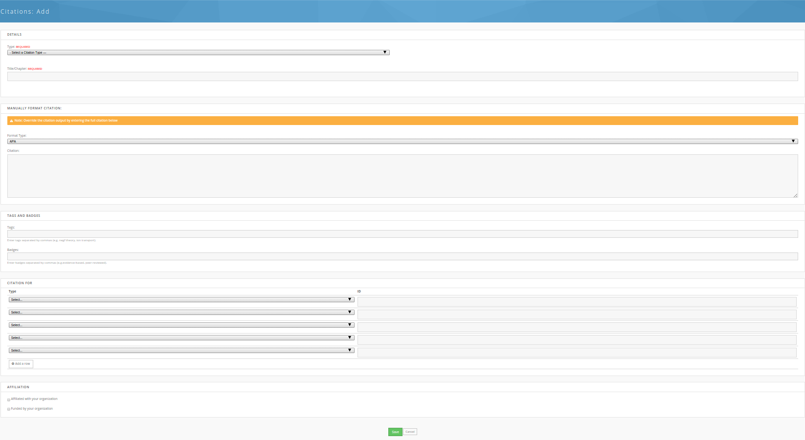

<!--
status: rewritten
reviewed-against: 2.4-main @ 42a7a5b5c7
reviewed: 2026-09-10
source: https://help.hubzero.org/documentation/240/users/citations
-->
# Citations

Citations are the works — papers, books, theses, conference proceedings —
that have cited the hub or something published on it. Each one links to the
hub content it references and can be downloaded in BibTeX or EndNote
format. The catalogue is at `/citations` on the hub.

The catalogue exists because impact has to be evidenced. When a thermal
transport lab writes its next grant renewal, it needs to say who used its
conductivity dataset and what came of it. The hub's citation list answers
that: it is the running record of the papers that cite work hosted here, and
it can be exported in one go and dropped into a reference manager.

Reading it needs no account and no permission. Browsing, reading a citation
and downloading one are open to anyone who can see the hub. Adding to it is
different — see [Submitting a citation](#submitting-a-citation) and
[Importing citations](#importing-citations), both of which a hub can restrict
to administrators or switch off.

## Citations are not publications

A **publication** is work the hub holds and issues a DOI for; see
[Publications](18-publications.md). A **citation** is a record of somebody
else's paper that pointed at that work. The publication is yours; the
citation is the evidence that it was used. A resource page's **Citations**
tab shows the citations attached to that one resource; `/citations` shows
the hub's whole set.

## The citations home page

The home page answers **What are citations?** and **Can I submit a
citation?**, then gives you two ways in: a **Find a citation** box where
you type a **Keyword or phrase** and press **Search**, and a
**Browse the list of available citations** link.

Under **Metrics**, two tables summarise the collection: *Citations per
year*, split into **Affiliated** and **Non-affiliated** counts, and
*Citations by type*, showing each type's share of the total. A citation
counts as affiliated when the author of the citing work was connected to
the hub's parent organization.

Depending on how the hub is set up, **Submit a citation** and
**Import Citations** buttons appear in the top right.

## Browsing

Browse when you want the whole picture rather than one paper — everything
citing the hub in a given year, or everything of one type. The lab preparing
its renewal starts here, filters to the years of the award, and exports the
result.

`/citations/browse` lists the hub's published citations, formatted in the
hub's chosen bibliographic style. Above the list, three tabs narrow it to
**All**, **Affiliated**, or **Non-affiliated** citations, and a
**Search Citations** box matches titles, authors, ISBN, DOI, publisher, and
abstract.

The panel on the right filters and sorts the list. Set any of them and
press **Filter**:

| Filter | Matches |
|---|---|
| Type | One citation type, or **All**. |
| Tags | Hub tags attached to the citation. |
| Keywords | The citation's own keywords field. |
| Author By | Text in the author names. |
| Published In | The journal or book title. |
| Year (from) / Year (to) | The publication year. |
| Sort by | **Cited By**, **Year**, **Created**, **Title**, **Author**, or **Journal**. |
| Reference Type | **Research**, **Education**, **Education/Research**, **Cyberinfrastructure**. |
| Author Geography | **US**, **North America**, **Europe**, **Asia**. |
| Author Affiliation | **University**, **Industry**, **Government**. |

The **Reference Type**, **Author Geography**, and **Author Affiliation**
boxes all start checked; unchecking some of them narrows the results, and
leaving them all checked has no effect.

Each entry may be numbered, labelled with its type, or both, and may show
the abstract, its tags, and its badges — the hub decides. Where the hub has
turned on single citation pages, the title links to the citation's own
page; otherwise it links to the cited work and **BibTex** and **EndNote**
links sit under the entry.

## Reading a citation

A citation's own page is at `/citations/view/<id>`. It shows the title, the
authors, the abstract, and the formatted citation, with
**Download in BibTex format** and **Download in EndNote format** links
below it. If the citation has a URL or e-print link, a **View Article**
button appears; otherwise the button is **Find this Text**.

Four tabs follow:

- **About** — every field the citation has: type, journal, publisher, book
  title, editors, dates, volume and issue, pages, ISBN/ISSN, DOI, series,
  edition, school, institution, address, notes, keywords, tags, badges,
  and who submitted it and when.
- **Cited Resources** — the hub resources this citation is associated with.
  The tab is hidden when there are none.
- **Reviews** — comments and reviews on the citation.
- **Find this Text** — links that help you get hold of a copy: a **DOI
  Resolver** link, advice on borrowing through your **Local Library**, a
  **Google Scholar** search, and other sources.

Where the hub has enabled it, the page also carries hidden COinS data, so
reference managers and browser extensions can pick the citation up
automatically.

> **Note:** Only published citations are readable. An unpublished one
> returns a not-found page.

## Downloading citations

Every citation offers **BibTex** and **EndNote** downloads, on its own page
and, where single citation pages are off, under its entry in the browse
list.

To export several at once, check the box beside each citation in the browse
list, then press **EndNote** or **BibTex** under **Export Multiple
Citations** in the right-hand panel. This is the step that produces the lab's
renewal bibliography in one file. The file downloads as
`citations_export_<format>_<date>.bib` or `.enw`. Only the boxes checked on
the page you are looking at are included, so export a page at a time or
raise the number of results shown before checking them.

Your hub can turn single or bulk downloads off, and can exclude particular
fields from exported records.

## Submitting a citation

Submit when you find a paper that cites hub work and the hub does not know
about it yet — most often your own paper, or one a colleague sent you.

Press **Submit a citation** on the citations home page, or go to
`/citations/add`. You have to be logged in; if you are not, the hub asks
you to sign in first. Hubs can restrict submission to administrators or
turn it off entirely, in which case the button is not shown. If you cannot
see the button and you are logged in, that setting is why; send the reference
to the hub's support team instead. See [Support](12-support.md).

1. Choose a **Type**. The form then shows the fields that type uses.
2. Fill in **Title/Chapter** and the other details that apply — authors,
   journal, year, volume, pages, DOI, abstract, and the rest. **Type**,
   **Title/Chapter**, and **Author(s)** are required.
3. Add authors one at a time: start typing a member's full name or
   username and press **Add**. Names that match a hub member are linked to
   that member's profile; names that do not are stored as plain text.
4. Optionally override the generated citation under **Manually Format
   Citation** by picking a **Format Type** and typing the finished citation
   into the **Citation** box.
5. Where the hub allows them, add **Tags** and **Badges**, both
   comma-separated. Tags are keywords, such as `negf theory, ion
   transport`; badges are labels, such as `peer-reviewed, evidence-based`.
6. Under **Citation for**, record what on the hub this work cites: choose
   **Resource** or **Publication**, enter the item's ID — the number in its
   URL — and set the **Context** to **References this citation** or
   **Referenced by this citation**.
7. Tick **Affiliated with your organization** or **Funded by your
   organization** if either applies.
8. Press **Save**. You are returned to the browse list, where the new
   citation appears straight away.

> **Note:** Citations submitted here are published immediately. There is no
> review step, so check what you typed before pressing **Save**.

An **Edit** link appears beside a citation's title when you are the member
who submitted it, and an **Edit** column appears in the browse list for hub
administrators. Editing is otherwise the same form as submitting, and is
governed by the same setting: on a hub that has closed submission to
administrators, or turned it off, the form is not reachable.

> **Warning:** The edit form itself checks only that you are logged in and
> that the hub allows submissions — it does not check that the citation is
> yours. On a hub where any member may submit, a member who knows a
> citation's ID can open and overwrite somebody else's record even though no
> **Edit** link is shown to them. Treat the catalogue as shared, and tell
> your hub's support team if an entry changes unexpectedly.

## Importing citations

Import instead of submitting when you have more than two or three to add. The
lab that has just collected forty citing papers in a reference manager
exports them as one BibTeX file and uploads that, rather than typing forty
forms.

Press **Import Citations** on the citations home page, or go to
`/citations/import`. You have to be logged in, and the hub can limit
importing to administrators or switch it off — it is a separate setting from
the one that governs single submissions, so a hub may allow one and not the
other.

The import runs in three steps.

1. **Upload citations file.** Choose a file and press **Upload**. The
   accepted formats are listed on the page — BibTeX (`.bib`) and EndNote
   (`.enw`) — and the file must be 4 MB or smaller. A `.txt` file also
   works if what is in it is EndNote records.
2. **Preview imported citations.** Records that look new are listed under
   *Pending Citation(s), ready to be imported*, each with a checkbox that
   starts ticked; untick any you do not want. Records that match something
   already on the hub are listed under *Pending Citation(s) Requiring
   Attention*. Click one to see the uploaded version and the version on
   file side by side, then choose **Replace Old Version with Uploaded
   One**, **Keep Old and Import Uploaded Version**, or **Don't Import
   Uploaded Version**. Press **Submit Imported Citations** when you are
   done.
3. **Browse uploaded citations.** The hub reports how many citations were
   saved, skipped, or failed, and lists the new entries. From here you can
   **Import More Citations** or **Browse all Citations**.

## Your own and your group's citations

The `/citations` catalogue holds the hub's own citations. You also have a
personal list on your profile, and each group has one of its own. There you
can add and import citations the same way, publish and unpublish individual
entries, edit and delete them, and choose the bibliographic format your
list is shown in — including one custom format you build from the same
placeholders the hub uses.

Entries in a personal or group list start unpublished, so only you or the
group can see them; publish an entry to have it counted and shown to
everyone. Deleting an entry moves it to a trashed state rather than
removing it, so a hub administrator can restore it.
