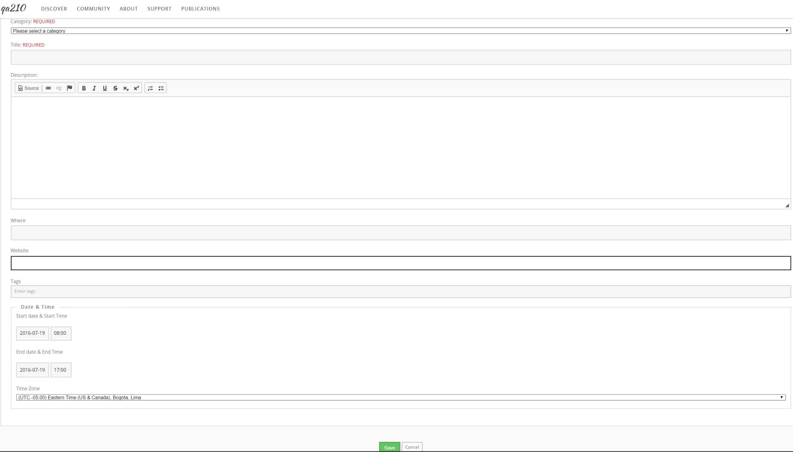

<!--
status: rewritten
reviewed-against: 2.4-main @ 6efbbe32ed
reviewed: 2026-09-09
source: https://help.hubzero.org/documentation/240/users/events
-->
# Events

The hub calendar lists conferences, workshops, seminars, meetings and
anything else the community is organising. It is at `/events`, and most
hubs link it from their community menu. Anyone can read it and register
for an event that accepts registrations; submitting an event needs a
login.

## Browsing the calendar

`/events` opens on whichever view the hub has chosen as its start page.
Four tabs across the top switch between them:

- **Year** — everything in one year, as a list.
- **Month** — everything in one month.
- **Week** — the seven days around the date you are on.
- **Day** — a single day.

Each view has a plain, shareable address: `/events/2026` for a year,
`/events/2026/03` for a month, `/events/2026/03/17` for a day, and
`/events/2026/03/17/week` for that week.

Beside the list is a **Category** drop-down; pick one and press **Go** to
show only that kind of event. Below it, the arrows step to the previous
and next year. An arrow that would land where there are no events is
disabled and says so. The month, week and day views also show a small
calendar you can click to jump to a date.

On the year and month views, past events are collapsed. **Show Past
Events** at the top of the list expands them again.

Each entry shows the date and time, the title, the category, and either
the custom detail fields the hub has chosen to show in listings or the
first 300 characters of the description. Times are always shown in the
event's own time zone, labelled with the zone abbreviation, so an event
in another country reads correctly wherever you are.

## Looking at an event

Click a title to open the event, at `/events/details/<id>`. The
**Overview** tab shows a table of what the organiser filled in:

| Row | What it is |
|---|---|
| Category | The kind of event. |
| Description | The full description. |
| When | The start and end, in the event's time zone. |
| Contact | Who to ask about the event. |
| Where | The location. |
| Website | A link to the event's own site. |
| *Custom fields* | Any extra fields the hub has defined. |
| Submitted by | The member who added it — only if the hub has turned this on. |
| Tags | Click a tag to see everything else on the hub with that tag. |

An event may have extra pages — an agenda, directions, a speaker list —
which appear as tabs next to **Overview**. A **Register** tab appears
while registration is still open.

> **Note:** Events belonging to a group are not shown here. Opening one
> sends you to that group's calendar instead; see
> [Group customization](groups/groupcustom.md).

## Registering for an event

Not every event takes registrations — the tab only exists when the
organiser set a "register by" date, and it disappears once that date has
passed. After it passes, the page says **Registration is closed for this
event.**

Some events are invite-only. Those ask for the password from your
invitation before they show the form.

The form always asks for your **First Name**, **Last Name** and **Email**.
The organiser chooses which of the rest to include: affiliation, title,
city, state, zip and country, phone, fax, website, current position,
highest degree, gender, race, arrival and departure day and time, a
disability-contact checkbox, dietary needs, dinner attendance, an
abstract, and free-form comments. Required fields are marked. If you are
logged in, your name, organisation, email, phone and website are filled
in from your profile.

Press **Submit**. Confirmation email goes to the address you entered and
to the organiser, and the page reports **Thank you for registering for
this event!**

> **Note:** You can register only once per event with a given email
> address. A second attempt is refused with "You have previously
> registered for this event."

## Adding an event

You have to be logged in, and the hub has to allow you to create events.
When it does, an **Add an Event** button sits at the top right of every
calendar page. It leads to `/events/add`.

| Field | Notes |
|---|---|
| Category | Required. Choose from the categories the hub has set up. |
| Title | Required. |
| Description | The details: what the event is, who it is for, what to bring. |
| Where | The location. |
| Website | The event's own page, if it has one. `http://` is added if you leave it off. |
| Tags | Topic tags that connect the event to the rest of the hub. |
| Start date & Start Time | Date as `YYYY-MM-DD`, time as `HH:MM`. Hubs set to 12-hour entry add AM/PM buttons; otherwise use 24-hour time. |
| End date & End Time | The same. An event may span several days. |
| Time Zone | The zone the event happens in. Everyone else sees the times converted and labelled. |

Press **Save**. The end must be later than the start, or the form comes
back with "Event end time cannot be before event start time."

> **Note:** Unless the hub has given you permission to publish, your
> event is saved unpublished and waits for a hub manager to approve it.
> The page you land on after saving will report that the event was not
> found until it is published. Your event is not lost — it is queued.

Registration cannot be set up from this form. If your event needs a
sign-up sheet, extra pages, or an invitation password, ask a hub manager
to add them.

## Changing or removing your event

Open your event. **edit** and **delete** links sit beside its title, and
they appear only for the member who submitted it (or for hub staff).

**edit** reopens the form above. **delete** asks you to confirm, then
takes the event off the calendar and notifies the hub's administrators.
The record itself is kept, so a hub manager can put it back; ask them if
you removed something by mistake.
