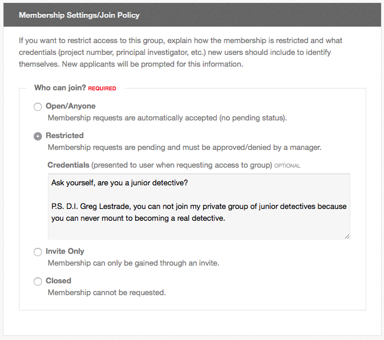

<!--
status: rewritten
reviewed-against: 2.4-main @ 42a7a5b5c7
reviewed: 2026-09-10
screenshots: ok
source: https://help.hubzero.org/documentation/240/users/groups/createdeleteagroup
source-id: 3304
modified: 2011-11-04
-->
# Creating and deleting a group

Any signed-in user may create a group, unless the hub's administrators have
taken the privilege away from your access group. Deleting one needs a group
manager.

## Creating a group

Make a group when a set of people need somewhere on the hub that is theirs:
an address to send collaborators to, a forum that is not everyone's forum, a
file area, a wiki, a list of the papers the work produced. You do not need
permission and you do not need to know how much of it you will use — the tabs
are switches you can turn on later.

This page follows one group the whole way through: `soilcarbon`, a soil
carbon project running across four institutions. Its principal investigator
wants the project's protocols and meeting notes in one place, wants people to
be able to ask to join rather than be chased individually, and does not want
the group turning up in hub searches while the funding is still unannounced.

1. Sign in and go to `/groups`.
2. Select **Create New Group**.
3. Fill in the form and select **Save Group**.

The form is one page, in these sections. Everything on it except the **Group
ID** can be changed afterwards, so it is not a form to agonise over.

### Group Details

| Field | What it is |
|---|---|
| **Group ID** | Required. The group's address: `/groups/<Group ID>`. Lowercase letters, digits and underscores only, no spaces, and not digits alone. A handful of names are reserved. It cannot be changed afterwards |
| **Title** | Required. The name people see |
| **Interests (tags)** | Optional. Comma-separated tags. They make the group findable by search and put it in front of members whose profile interests match |

Those three rows are the only ones Hubzero puts there itself. There is no
description box among them: the fixed **Public Description** and **Private
Description** boxes groups used to have are gone from the form, and the
hub's **custom fields** replaced them. Whatever your hub's administrators
have defined appears beneath **Interests (tags)**, and the answers are what
the group's **Overview** tab shows under **About the Group**.

On most hubs that means the two descriptions are still there, because the
upgrade turns them into custom fields of the same names and moves the old
text across. But they are now ordinary fields: an administrator can rename
them, reorder them, add others — a funding source, a principal investigator,
a department — or take them away entirely. So the questions you are asked
when you create `soilcarbon` are your hub's questions, not a fixed list, and
another hub's form looks different.

Each field also has its own audience, set when it was defined: some are shown
to anyone at all, some only to people signed in to the hub, some only to
members of the group. **Public Description** is the first kind and **Private
Description** the last. The form does not label which is which, so if you
are about to type something you would not want read by a stranger, ask the
hub's support staff before you put it in a field you are unsure of.

> **Note:** The **Logo** section only appears once the group exists. Save the
> group first, then edit it to add a logo. See
> [Customization](03-groupcustom.md#the-group-logo).

### Membership Settings/Join Policy

This is the decision that matters most, and it is not about secrecy — it is
about who does the work of deciding. **Open/Anyone** means nobody does: the
group takes whoever turns up. **Restricted** puts a manager in the loop for
every applicant. **Invite Only** means people cannot even ask. **Closed**
means the membership is fixed as it stands.

`soilcarbon` picks **Restricted**. The project wants collaborators from
outside the four institutions to be able to find it and ask, but it does not
want to end up explaining its unpublished data to a stranger, and somebody
has to read the request either way. That costs a manager a minute per
applicant and nothing else.

Pick one, under **Who can join?**:

| Policy | Effect |
|---|---|
| **Open/Anyone** | Membership requests are automatically accepted |
| **Restricted** | Membership requests are pending and must be approved or denied by a manager |
| **Invite Only** | Membership can only be gained through an invite |
| **Closed** | Membership cannot be requested |

**Credentials** is an optional block of text shown to anyone requesting
membership. Use it on a restricted group to say what an applicant should
tell you — a project number, a principal investigator, and so on. It is the
difference between requests you can act on and requests that say "please add
me". `soilcarbon` uses it to ask for the applicant's institution and the name
of the co-investigator who vouches for them.

You can change the policy at any time afterwards, and changing it does not
disturb anybody who has already joined.

If the hub allows time-limited memberships, a **Membership length** section
follows, where you set a default number of days after which new members are
removed automatically. Leave it at 0 for memberships that never end. Changing
it does not affect anyone who has already joined.

### Privacy Settings

Discoverability and the join policy are separate questions, and it is worth
seeing why. The join policy says who may get in; discoverability says whether
the group can be found at all. A **Visible**, **Restricted** group is the
usual arrangement — findable, but you have to ask. `soilcarbon` starts
**Hidden** instead, because the award is not announced yet, and its manager
switches it to **Visible** the week the press release goes out.

**Discoverability** is one of two values:

| Value | Effect |
|---|---|
| **Visible** | The group can be found in searches and by browsing groups |
| **Hidden** | The group cannot be found through searches and is only viewable by group members |

**Access Permissions** below it is where the group's shape is actually set.
Every tab a group can have is listed, and each one is a separate decision
about a separate audience. `soilcarbon` leaves **Overview** open to **Any HUB
Visitor** so a collaborator can read what the project is before asking to
join, and sets **Files**, **Forum** and **Wiki** to **Group Members Only**
because that is where the unpublished work lives. The tabs it is not going to
use — **Blog**, **Wish List** — go to **Disabled/Off** so the menu stays
short.

The list itself is the hub's, not the group's: a tab you have heard of may be
missing because your hub does not run that plugin. Everything here can be
changed later, from
[Customization](03-groupcustom.md#which-tabs-appear).

The full list of options: Set each one to **Any HUB Visitor**, **Registered HUB Users**, **Group
Members Only** or **Disabled/Off**. **Overview** cannot be set to
Disabled/Off. Anything already selected is the hub's default until you
override it.

### Group Email Settings

One checkbox, **Auto subscribe new group users to discussion email**. Tick it
and new members start subscribed to the group's forum email; each of them can
change it afterwards. See [Group forum](05-groupforum.md).

### Page Settings

| Field | What it does |
|---|---|
| **Comments** | Whether group pages show comments: **No**, **Yes**, or **Lock** (existing comments stay, no new ones). Each page can override it |
| **Author Details** | Whether each group page ends with a line naming its creator, its last editor and the date |

## After you save

The group is created, you become its first member and its first manager, and
you land on the group's page.

That is the end of the form and the start of the work. `soilcarbon` now
exists at `/groups/soilcarbon` with one member in it. Three things usually
follow, in this order: promote a second manager so the group does not depend
on one account, bring the members in, and write something on **Overview** so
that people arriving know what they have found. The first two are in
[Member functions](02-groupmembers.md); the third is in
[Customization](03-groupcustom.md).

Whether the group is visible to anyone else depends on the hub. Most hubs
approve new groups automatically. If yours does not, the group is saved
unapproved: only its managers, members and invitees can reach it, everyone
else gets a "not found", and the group's page carries a warning until an
administrator approves it. Nobody but a manager can open any tab other than
**Overview** in the meantime.

## Deleting a group

Deleting is for a group that should never have existed — a typo in the
**Group ID**, a duplicate, an experiment. It is almost never right for work
that has finished, because a finished project's forum threads and wiki pages
are exactly what somebody wants two years later. Read the alternative below
before you go on.

Any manager can do it, and that is worth saying plainly: it is not reserved
to whoever created the group, and there is no second manager's approval. If
`soilcarbon` has three managers, any one of them can destroy it on their own.
The counterweight is that it cannot be done quietly — **every** member is
emailed that the group has gone and who removed it, and you write the
message they get. So the check on the power is that everyone finds out, not
that you are stopped.

You do not have to be the group's only member, and you do not have to empty
it first.

1. Open the group.
2. Open the **Group Manager** menu and select **Delete Group**.
3. Read what the confirmation page lists. Under **Are you sure you want to
   delete?** it counts what will be lost: the number of members who will be
   notified, and a line from each of the group's plugins counting the blog
   entries, forum posts, wiki pages and other content that go with it. This
   is the only inventory you get, so take it seriously — a group that has
   been running for a year is usually holding more than its managers
   remember.
4. Type the group's **Group ID** in the confirmation box. The page asks for
   it by name: *To prevent accidental actions we ask you to confirm your
   intent by typing "soilcarbon" below.* Nothing else is accepted, and the
   point is that you cannot delete the wrong group by mistyping — you have to
   spell out the one in front of you.
5. Optionally edit **Customize message sent to group member(s)**. Whatever
   you write is inserted into the mail every member receives, beneath a line
   saying the group was deleted by you. A sentence saying where the work went
   is worth the ten seconds.
6. Select **Delete**.

> **Warning:** This is permanent. The group and everything its plugins hold
> are removed, and there is no undo.

The confirmation page offers an alternative worth reading first, under
**Alternative to deleting**: set the join policy to **Closed** and the
discoverability to **Hidden**. The group then takes no new members and is
invisible to everyone else, but its content is still there, and a manager can
still reach it. For work that has simply ended, this is nearly always the
right answer.

> **Note:** **Delete Group** does not appear when the group's membership is
> managed outside the hub — some groups are driven by an external system.
> Neither does **Join Group** or **Cancel Group Membership**.

An administrator can also delete a group from the administrator interface;
see [Groups](../../managers/06-users/05-groups.md#deleting-a-group).
